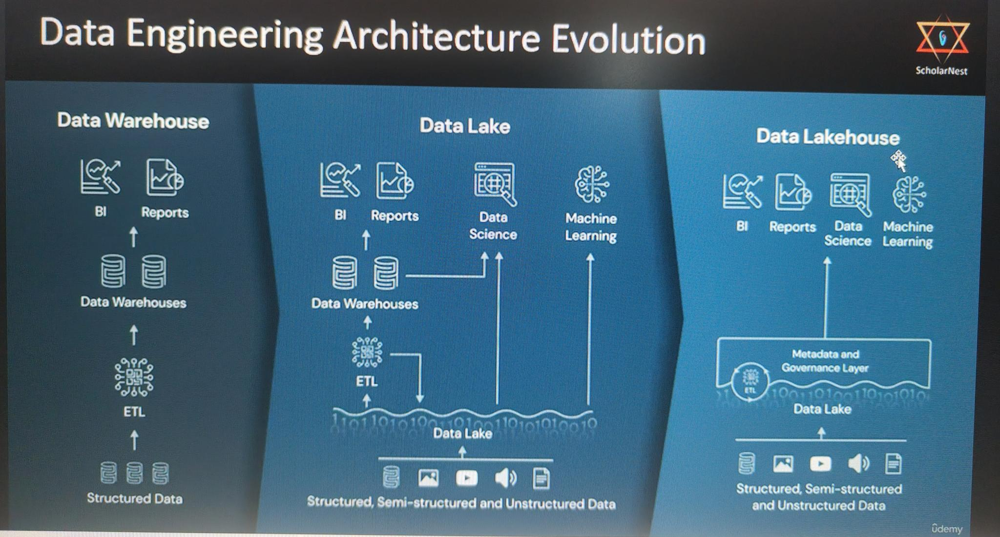

# Section 1 Understanding Big Data and Distributed Data Processing

## Content
1. [What is Big Data and How it Started](#)
2. [Hadoop Architecture, History and Evolution](#)
3. [Data Lake and Lakehouse Architecture](#)


## 1. What is Big Data and How it Started

[⬆ Back to content](#content)

### Big Data problems

- Volume - high volume of data must be saved
- Variety - high variaty of data must be handled
- Velocity - High processing power is needed to process the data


[⬆ Back to content](#content)


## 2. Hadoop Architecture, History and Evolution

[⬆ Back to content](#content)

### What is Hadoop

Hadop is a distributed data processing platform that offers the following core capabilities:

#### YARN - yet another resource manager - Hadoop cluster resource manager, also known as Hadoop cluster OS
- Allows multipal programs to be in memory and run simutaniously by sharing resources like CPU, memory and Disk IO
- Tree main components
    - RM - resource Manager
    - NM - Node Manager
    - AM - Application Master

Installing Hadoop on 5 machines cluster wiil turn one of them to Master Node (with Resource Manager on it) and 4 Worker Nodes (with Node Manager on them).

To use application on the cluster will must submit the application to the YARN Manager of the cluster. After the application is submitted on one of the worker nodes will be deployed Application Master Container with the application. Container is set of resources containing Memory and CPU (example: 4 GB RAM and 2 CPU).

##### Flow of starting an application on the cluster:
We submit our application to the RM (Resource Manager). The RM (Resource Manager) request from NM (Node Manager) to allocate resources for Application Master Container (AMC) and starting the application. If we submit a second application the process is the same, but the application will be deployed on different Application Master Container (AMC).


#### HDFS - Hadoop Distributed File System
Allows us to save and retreive datafiles from the Hadoop cluster.

HDFS Components:
- NN - Name Node
- DN - Data Node

After installing Hadoop on 5 machines, one of them is Master Node (with NN Name Node) and the others are with DN (Data Node).

If we wnat to sace a large datafile on the Hadoop cluster we copy the file on the Master Node (NN Name Node). The Name Node (will redirect the copy command on one or more data nodes - DAs). Let's say we have really lagre file. The Named Node (Master Node) will separate the file into blocks and send them to (for example 3) different Data Nodes.

The process metadata is saved on NN (Named Node - master). The metadata includes:
- File Name
- Directory Location
- File Size
- File Blocks, Block ID, block sequence, Block location

When we want to read from the file we send a request to the NN (Named Node - Master). The NN reassemble the file and we are reading the information we need.


#### Map/Reduce - Distributed Computing
Map/Reduce is a programming Model and Programming Framework
- Map Reduce Programming Model - technique for solving problems
- Programming Framework - set of APIs and services that allow us to apply the Map Reduce programming model - outdated and not used !!!

##### Map Reduce Programming Model

Let's say we have 20 TB of data and we need to count the lines of data in it. We need to solve Storage Capacity and Processing time problems. Hadoop solve both these problems. We have Resource Manager (RM) and Named Node (NN) on the master node and Data Node (DN) and NM (Node Manager) on each worker node. 
Node capacity is as follows:
4 x 2 TB = 8 TB Master Node capacity
4 x Dual Core = 8 CPU Cores
4 x 16 GB RAM = 64 GB RAM

Total cluster storage capacity = 160 TB
Total cluster CPU capacity = 160 CPU cores
Total cluster RAM capacity = 1280 GB RAM

Functions we use to get our line count
```python
def map(file_block):
    open file_block as fb_hd
    for each t_line in fb_hd.get_line()
        n_count = n_count + 1
    
    close fb_hd
    return n_count

def reduce(list_counts):
    for each cnt in list_counts
        total_count = total_count + cnt

    print total_count
```

##### Solving storage problem:
HDFS (Hadoop Distributed File System) will brake the file to small 128 MB blocks and send the macross the cluster worker nodes.

##### Solve processing time problem
Each node will count the lines of the blocks on it. This method will use each node processor to count different blocks (with map function) in parralel and the computing time will be shorter.

Reduce function ran on one node will summarize the coutn of all nodes. It will receive all counts in array. We loop over the array and sum the line counts.

We can use Hive as SQL expression tool to solve different problems with MAP (parallel processing) and reducing functions as in the example above. Hive SQL expressions translate all the code into MAP/Reduce programs. We ussualy use high level applications (Hive is base level application) such as Spark scripts and other similar applications.

##### Map Reduce Framework - not used any more
- First we submit our 2 functions
- The master Node request onw of the RM (Resource Manager) to run an AMC (application master container) on one worker node. We need to start the functions.
- As the container is running the Map Reduce Framework will request the Resource Manager on the master node. The master node will request Node Managers to start more containers for Map function.
- The Map Reduce faramework will take the results from all nodes and craete a list with these results. Then Map Reduce framework will request new container to start the reduce function and send them to sumarize all the line counts.


#### Sumarize Map Reduce Model
- Map Reduce Programming Model
    - Map Function 
        - Reads data block
        - Applies logic at block level
        - Map output is sent to Reduce
    - Reduce Function
        - Receives map output
        - Consolidates the results

- Hadoop M/R framework implement the map-reduce model.
    - YARN manages resources allocation
    - HDFS manages data blocks


### History

#### Big Data problems
- Volume - high volume of data must be saved
- Variety - high variaty of data must be handled
- Velocity - High processing power is needed to process the data

#### Google approach
- Data collection and Ingestion
- Data Storage and management
- Data processing and Transformation
- Data Access and Retrieval

From here Google form the base GFS - Google File System (2004) and MapReduce (2004). After that Hadoop creates HDFS and Hadoop MapReduce

Hive is a database on top of Hadoop that simplifies the work using SQL. Hive capabilities are:
- Create
    - Database
    - Tables
    - Views
- Run SQL Queries

Hadoop has several cons:
- Hive SQL are slower that M/R queries
- Writing M/R code was not popular and hard to write
- Only Java M/R code supported
- Expensive HDFS storage compared to cloud storage
- YARN conainer force Hadoop cluster and container management. Newer container management products like Docker and Kubernetes are wanted by the community.


#### Apache Spark
Apache Spark is the alternative of Hadoop

Advantages
- 10-100 times faster than Hadoop
- Ease of Development - Fast Spark SQL
- Languages - Java, Scala, Python and R
- Storage - HDFS Storage, Cloud Storage (AWS S3, Azure Blob Storage)
- Allow to work with YARN, Mesos, Kubernetes

Apache Spark can work in two modes:
- With Hadoop (Data Lake)
- Without Hadoop (Lakehouse)


[⬆ Back to content](#content)


## 3. Data Lake and Lakehouse Architecture

[⬆ Back to content](#content)



<br>
<br>


### Data Lake
Hadoop native

### Data Lakehouse
Apache Spark native


[⬆ Back to content](#content)

