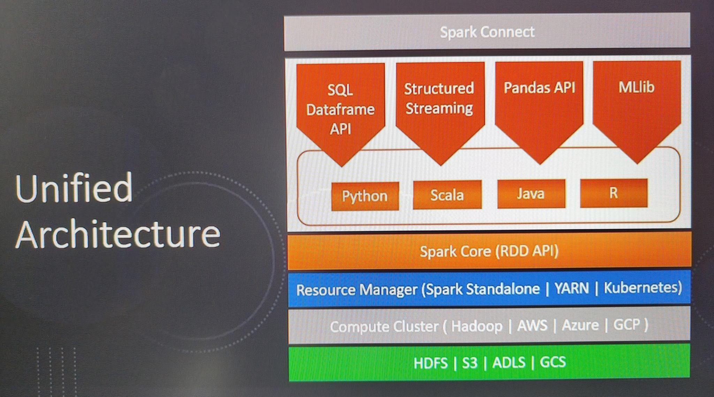
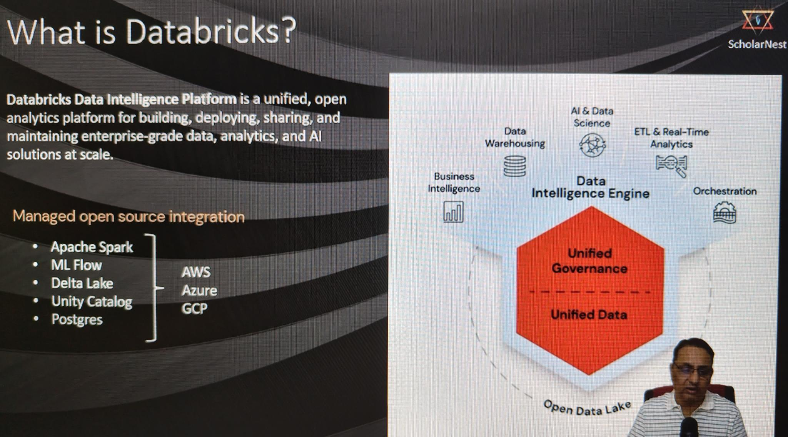

# Section 2 Introduction to Apache Spark Notes

## Content
4. [What is Apache Spark](#4-what-is-apache-spark)
5. [Apache Spark System Architecture](#5-apache-spark-system-architecture#)
6. [Spark Platform and Development Environment](#6-spark-platform-and-development-environment#)
7. [What is Databricks Cloud](#7-what-is-databricks-cloud)
8. [Create Your Databricks Free Account](#8-create-your-databricks-free-account#)
9. [Setuo Your Hands-On Environment](#9-setuo-your-hands-on-environment#)
10. [Download Resources](#10-download-resources)

## 4. What is Apache Spark

[⬆ Back to content](#content)

https://spark.apache.org/

Apache Spark is a multi-language engine for executing data engineering, data science, and machine learning on single-node machines or clusters.

Data engineering is collecting, extracting, preparing data for analysis, and data science is extracting and analyzing information from the data. Machine learning is all about developing systems that learn from data to predict responses.

Capabilities:
- ANSI API - we can use SQL using Apache Spark 
- Batch Processing API - Collect, prepare and process larg volume of data on a distributed cluster
- Stream Processing API - Collect, process, produce data in near real time (seconds, minutes)
- Machine Learning API

[⬆ Back to content](#content)

## 5. Apache Spark System Architecture

[⬆ Back to content](#content)

 
 

Spark Core, also known as spark RDD (Resilient Distributed Data Set) APIs - a set of libraries and APIs written in Scala language
Developed wrappers for different languages - Python, Scala (original), Java and R. We have 4 interfaces:
- SQL and dataframe API
- Structured Streaming - doing the near real time stream processing in terms of data engineering work
- Pandas API - Spark APIs following pandas syntax. Pandas API has a limited support. It is not as extensive as SQL and DataFrame APIs.
- MLlib - ML stands for Machine learning, ML is machine learning, Lib is library.

Spark connect is simply to make spark available in a client server architecture. 

What do we mean by client server architecture? You run your code on the client machine, but it gets connected to a server and processed at the server and you get the result back.

Important thing about all these four different types of libraries are that they are finally converted and compiled by spark into Spark Core RDD API. So Spark system is a kind of compiler.

The resource manager which will facilitate the CPU, the network, the storage, all those things which will manage for the cluster. It can work with three different types of resource managers.
- Spark standalone Resource Manager
- YARN - Yet Another Resource Manager - part of the Hadoop system
- Kubernetes

Most popular setups are GCP/Kubernetes and Azure/Spark Standalone

Storage can be:
- HDFS - Hadoop Distributed Storage
- AWS S3 Storage
- Azure Data Lake Storage - ADLS
- Google Cloud Storage - GCS

[⬆ Back to content](#content)

## 6. Spark Platform and Development Environment

[⬆ Back to content](#content)

So most popular cloud platform for Apache Spark is Databricks. There are a few others like AWS, EMR, Google Dataproc, Azure HD Insights. But most popular and most widely adopted platform for Apache Spark on the cloud is Databricks.

Spark platform is also available for on-premise clusters, on-premise platform and that is mainly offered by the Cloudera Hadoop.

#### Development environments:
For Spark there are two main types of development environments
- Notebook - cloud - Notebook environments are offered by Databricks on the cloud for Spark development.
- IDE - Local Machine - preferred

We will be learning Spark on the notebook environments using Databricks platform on the cloud.

[⬆ Back to content](#content)

## 7. What is Databricks Cloud

[⬆ Back to content](#content)

 
 

Databricks platform is a managed open source integration platform. The core offering of Databricks platform is Apache Spark.
MLflow is a library or a open source tool that helps you to develop, manage, deploy, test machine learning applications.
Delta Lake is a storage open source storage format.
Unity catalog is a open source metadata management system.
Postgres is a relational database.

[⬆ Back to content](#content)

## 8. Create Your Databricks Free Account

[⬆ Back to content](#content)

Go to https://www.databricks.com/learn/free-edition and create a free account

[⬆ Back to content](#content)

## 9. Setuo Your Hands-On Environment

[⬆ Back to content](#content)

Go to Databricks Workspace and import spark_programming.dbc file and go to folder CH02 and open 01-setup-environment

Connect to Serverless cluster

Run the file - Run all

Wait a few minutes and check the results in Catalog/dev/spark_db

[⬆ Back to content](#content)

## 10. Download Resources

[⬆ Back to content](#content)

### Subheader

[⬆ Back to content](#content)