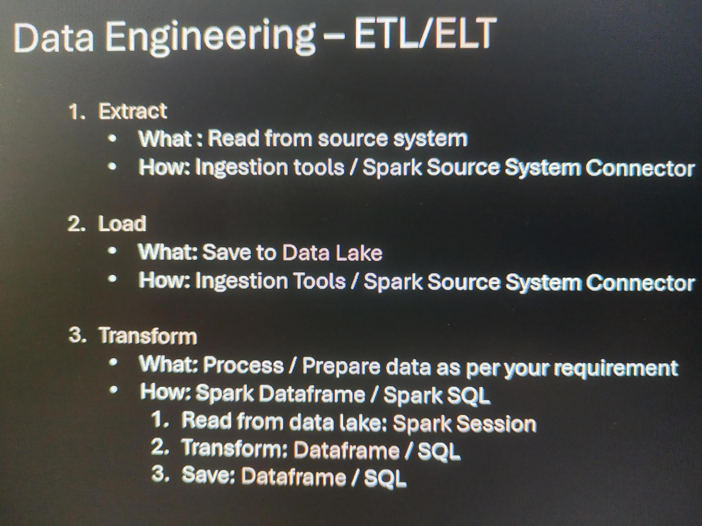
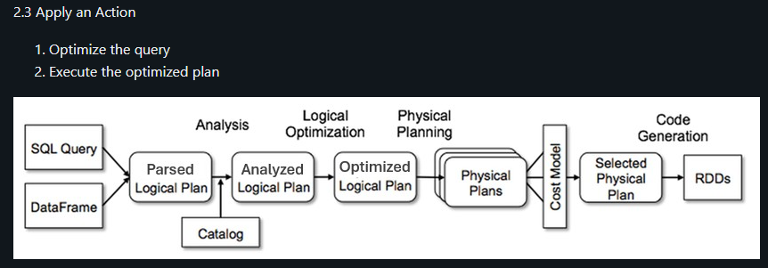

# Section 3 Getting Started with Spark Programming Notes

## Content
11. [Starting Point - Data Engineering, Spark and Spark Session](#11-starting-point---data-engineering-spark-and-spark-session)
12. [Dataframe - A view to Structured Data](#12-dataframe---a-view-to-structured-data#)
13. [Dataframe Transformations and Actions](#13-dataframe-transformations-and-actions#)
14. [Dataframe Concepts](#14-dataframe-concepts#)
15. [Exploring Dataframe Transformations](#15-exploring-dataframe-transformations#)
16. [Creating Spark Dataframe](#16-creating-spark-dataframe)


## 11. Starting Point - Data Engineering, Spark and Spark Session

[⬆ Back to content](#content)



<br>
<br>

### Spark Session
Spark Session is an entry point to programming Spark with the Dataframe API

A Spark Session can be used to but not limited to:
- Connection to Cluster as Driver
- Create Dataframe
- Read Data Files
- Read Data Tables
- Execute SQL over Tables
- Access Runtime Configuration
- Access Spark Context

How to create Spark Session
- Spark Session Builder - Server Side
- Spark Connect Session Builder - Client Server
- Pre-craeted Spark Session - Platform Dependent


### How to create a session

Connect to Serverless cluster

Open CH03-Getting Started/01-spark-session

We can write header as follow:
```python
%md
####1. How to create Spark Session
```
Ctrl + Enter to finish the page

In the file we can run specific cell code with Ctrl + Enter or the Play button on top left in the cell.

This appraoch is craeting a session with Spar Session Builder.

We can run the Pre-created session to check the version

We can use the spark session to read the table we created in the previous section.

[⬆ Back to content](#content)

## 12. Dataframe - A view to Structured Data

[⬆ Back to content](#content)

### Dataframe?

A Dataframe is a two-dimentional labeled In-memory data struccture

Spar Dataframe support a rich set of APIs to
- Select
- Filter
- Join
- Aggregate
- Many others
- Save

Spark Dataframe advantages for big data
- Parallel processing - processing is distributed true many machines
- In-memory processing - fast processing since is in memory
- Schema flexibility - changing labels and data types common action
- Fault tolerance - since the working machines are multiple, the data processing can't be disturbed easily

We should have imported all required files in section 9. Setuo Your Hands-On Environment by executing the spark_programming.dbc notebook.

Login to Spark Free Edition, connect to Serverless cluster and open CH03-Getting Started/02-spark-dataframe notebook Follow the requirements of the task and execute the notebook. We will use sf-fire-calls.csv in Catalog/dev/spark_db/Volumes/datasets/spark_programming/data/sf-fire-calls.csv

We can preview the file structure and check that in the first line are the headers and after that is the actual data. Each field is separated by comma.

```CSV
CallNumber,UnitID,IncidentNumber,CallType,CallDate,WatchDate,CallFinalDisposition,AvailableDtTm,Address,City,Zipcode,Battalion,StationArea,Box,OriginalPriority,Priority,FinalPriority,ALSUnit,CallTypeGroup,NumAlarms,UnitType,UnitSequenceInCallDispatch,FirePreventionDistrict,SupervisorDistrict,Neighborhood,Location,RowID,Delay
20110016,T13,2003235,Structure Fire,01/11/2002,01/10/2002,Other,01/11/2002 01:51:44 AM,2000 Block of CALIFORNIA ST,SF,94109,B04,38,3362,3,3,3,false,"",1,TRUCK,2,4,5,Pacific Heights,"(37.7895840679362, -122.428071912459)",020110016-T13,2.95
```

All steps are presented in the file CH03-Getting Started/02-spark-datafram


[⬆ Back to content](#content)


## 13. Dataframe Transformations and Actions

[⬆ Back to content](#content)

### What is Spark Dataframe?

Runtime in-memory data object (Data and Methods)

These methods can be classified into four different categories. Technically, they are all methods, but they are logically classified into four categories for easy understanding and for easy learning.

1. Tranformations - Transformation methods offers you all the capability or the methods that allow us to transform the data frame from one state to another state.
2. Actions - Action methods are to execute those transformations and perform some actions.
3. DataFrameWriter - Data Frame writer method gives you approaches for writing the processed or transformed data frame to the storage 
4. Auxiliary Methods - doing some additional work, like setting configurations or performing some other operations which are neither transformations or actions and they are not even writing the output or the result to the storage layer.


### Tranformations and Actions

Login to Databricks account and connect to serverless cluster.

Open notebook CH03-Getting Started/03-transformations-and-actions

Requirements: What are top 3 zip codes that accounted for most calls?

Importnat comments:
Step 1 is to read the data and craete a dataframe
Step 2 is to make a selection
Step 3 show results

```SQL
-- Answer using a SQL query
select CallType, Zipcode, count(*) as count     -- step 2
from dev.spark_db.sf_fire_calls                 -- step 1: read from the table and create dataframe
where CallType is not null                      -- step 2
group by CallType, Zipcode                      -- step 2
order by count desc                             -- step 2
limit 3                                         -- step 3
```


**We will go true additional example step by step**

Step 1 - read data and craete dataframe

```sql
fire_df = spark.read.table("dev.spark_db.sf_fire_calls")
```
We can't modify dataframes. We can only transform dataframe to different (new) dataframe. A dataframe is immutable!

Step 2 - Apply Transformations

```sql
# Apply necessory transformations
df_1 = fire_df.select("CallType", "Zipcode")                -- select columes
df_2 = df_1.where("CallType is not null")                   -- select not empty cells
df_3 = df_2.groupBy("CallType", "Zipcode").count()          -- group by count selection
df_4 = df_3.orderBy("count", ascending=False)               -- set descending order
df_5 = df_4.limit(3)                                        -- limit result lines
```

And after executing we can see there are five data frames that are created and all are created progressively one after another.

Step 3 - Action - Show results

Before executing the query and show the result, Spark will trace all steps to the beggining of the dataframe logic (read the data), take all steps and optimize the query. Before executing it it will make a plans and choose the most efficient one and then execute it. It will execute the most optimized query.

Spark is working with one dataframe true all tranforamtions (one intermediate dataframe) and will save dataframe in memory only after the execution if the final optimized query.


<br>
<br>

```sql
df_5.show()
```

Result:
+----------------+-------+-----+
|        CallType|Zipcode|count|
+----------------+-------+-----+
|Medical Incident|  94102|16130|
|Medical Incident|  94103|14775|
|Medical Incident|  94110| 9995|
+----------------+-------+-----+

We can see the action performance after the result is shown in Databriks


[⬆ Back to content](#content)


## 14. Dataframe Concepts

[⬆ Back to content](#content)

### Spark Dataframe API concepts
1. Spark creates optimized query plan
- How to see the optimized query plan
    1. Use explain method
    2. Check the query runtime profile

```sql
df_5.explain(mode="extended")
```
1. Dataframes are immutable
- You can see or use any intermediate dataframe
  
```sql
fire_df.display()
```
1. Every Transformation returns a dataframe
2. Dataframe offers composable API - With this aaproach we craete final dataframe with all tranformers in one operation set. Internally after all method an internal df is created but hte result is the final df.
- Example of composable API

```sql
result_df = (
    fire_df.select("CallType", "Zipcode")
            .where("CallType is not null")
            .groupBy("CallType", "Zipcode")
            .count()
            .orderBy("count", ascending=False)
            .limit(3)
)

result_df.display()
```

Result:
        CallType	Zipcode	count
Medical Incident	94102	16130
Medical Incident	94103	14775
Medical Incident	94110	9995


We can show plan for the final df

```sql
result_df.explain(mode="extended")
```
Result will be the plan of the execution of the optimized query for this result_df.

We can check the same data into result_df =(...)/Performance/See query text/Diagram order from bottom to top


[⬆ Back to content](#content)


## 15. Exploring Dataframe Transformations

[⬆ Back to content](#content)

**Hands-On Experience**

We should have imported all required files in section 9. Setuo Your Hands-On Environment by executing the spark_programming.dbc notebook.

We will practice some tranformations on dartaframes. 

Login to Databricks, connect to serverless cluster and open CH03-Getting Started/04-exploring-transformations notebook

### Answer the following questions using sf_fire_calls table

We can run SQL code and compare the results with the result of the Python code.

Create Dataframe from the table to start answering
```sql
fire_df = spark.read.table("dev.spark_db.sf_fire_calls")
```

Q1. How many distinct types of calls were made to the Fire Department?
```sql
    select count(distinct CallType) as distinct_call_type_count
    from dev.spark_db.sf_fire_calls
```

```python
q1_df = (
    fire_df.selectExpr("count(distinct CallType) as distinct_call_type_count")
)

q1_df.show()
```


Q2. What were distinct types of calls made to the Fire Department?
```sql
  select distinct CallType as distinct_call_types
  from dev.spark_db.sf_fire_calls
  where CallType is not null
```

```python
q2_df = (fire_df.where("CallType is not null")
               .selectExpr("CallType as distinct_call_type")
               .distinct()
)

q2_df.display()
```

Q3. Find out all response for delayed times greater than 5 mins?
```sql
  select CallNumber, Delay
  from dev.spark_db.sf_fire_calls
  where Delay > 5
```

```python
(fire_df.where("Delay > 5")
       .select("CallNumber", "Delay")
       .display()
)
```


Q4. What were the most common call types?
```sql
  select CallType, count(*) as count
  from dev.spark_db.sf_fire_calls
  where CallType is not null
  group by CallType
  order by count desc
```

```python
(fire_df.select("CallType")
    .where("CallType is not null")
    .groupBy("CallType")
    .count()
    .orderBy("count", ascending=False)
    .show()
)
```

Q5. What zip codes accounted for most common calls?
```sql
  select CallType, ZipCode, count(*) as count
  from dev.spark_db.sf_fire_calls
  where CallType is not null
  group by CallType, Zipcode
  order by count desc
```

```python
(fire_df.select("CallType", "ZipCode")
    .where("CallType is not null")
    .groupBy("CallType", "Zipcode")
    .count()
    .orderBy("count", ascending=False)
    .display()
)
```

Q6. What San Francisco neighborhoods are in the zip codes 94102 and 94103
```sql
  select distinct Neighborhood, Zipcode
  from dev.spark_db.sf_fire_calls
  where Zipcode== 94102 or Zipcode == 94103
```

```python
(fire_df.select("Neighborhood", "Zipcode")
    .where("Zipcode== 94102 or Zipcode == 94103")
    .distinct()
    .display()
)
```

Q7. What was the sum of all calls, average, min and max of the response times for calls?
```sql
  select sum(NumAlarms), avg(Delay), min(Delay), max(Delay)
  from dev.spark_db.sf_fire_calls
```

```python
(fire_df.selectExpr("sum(NumAlarms)", "avg(Delay)", "min(Delay)", "max(Delay)")
        .show()
)
```


Q8. How many distinct years of data is in the CSV file?
```sql
  select distinct year(CallDate) as year_num
  from dev.spark_db.sf_fire_calls
  order by year_num
```

```python
(fire_df.selectExpr("year(CallDate) as year_num")
    .distinct()
    .orderBy("year_num")
    .show()
)
```


Q9. What week of the year in 2018 had the most fire calls?
```sql
  select weekofyear(CallDate) as week_year, count(*) as count
  from dev.spark_db.sf_fire_calls
  where year(CallDate) == 2018
  group by week_year
  order by count desc
```

```python
(fire_df.selectExpr("weekofyear(CallDate) as week_year")
    .where("year(CallDate) == 2018")
    .groupBy('week_year')
    .count()
    .orderBy('count', ascending=False)
    .display()
)
```


Q10. What neighborhoods in San Francisco had the worst response time in 2018?
```sql
  select Neighborhood, Delay
  from dev.spark_db.sf_fire_calls
  where year(CallDate) == 2018
```

```python
(fire_df.select("Neighborhood", "Delay")
    .filter("year(CallDate) == 2018")    
    .show()
)
```

[⬆ Back to content](#content)


## 16. Creating Spark Dataframe

[⬆ Back to content](#content)

We will go over 5 approaches to create a Spark Dataframe

Login to Databricks, connect to serverless cluster and open CH03-Getting Started/05-creating-dataframe notebook

We should have imported all required files in section 9. Setuo Your Hands-On Environment by executing the spark_programming.dbc notebook.

### 1. Create a Dataframe using a connector

- CSV Connector:
```python
file_df = (                         # name of the frame
    spark.read.format("csv")        # spark - precreated session, read - give us access to spark connector, csv - type of the connector
        .option("header", "true")           # header line is expected - the first line
        .option("inferSchema", "true")      # inferSchema - make a intelligent quess for each data type in each column
        .load(path="/Volumes/dev/spark_db/datasets/spark_programming/data/sf-fire-calls.csv")   # path to data file
)
```

- JSON Connector:
```python
json_file_df = (
    spark.read.format("json")   # spark - precreated session, read - give us access to spark connector, json - type of the connector
         .load(path="/Volumes/dev/spark_db/datasets/spark_programming/data/diamonds.json")  # path of the data file
)
```

We can set many more different connectors like RDBS, videos, music etc. Each connector has its own options, so we need to know what connectior and what options we need to use. Path to source is required.

We can check the official Apache Spark documentation about connectors - https://spark.apache.org/docs/latest/sql-data-sources.html. If we Do not find the connector we need we can search and install custom connector for the data type we are working with (including Kafka).


### 2. Create a Dataframe reading a Spark table

```python
table_df = spark.table("dev.spark_db.sf_fire_calls")
```


### 3. Create a Dataframe reading the result of a SQL query

```python
table_name  = "dev.spark_db.sf_fire_calls"

# spark. - session
sql_df = spark.sql(f"""select * 
                   from {table_name} 
                   limit 5""")
```


### 4. Create a dataframe from a Python list - used mostly as a testing approach

```python
from datetime import datetime, date

# define data schema
data_list_schema = 'id long, name string, joining_date date, salary double, created_at timestamp'

# smiulate a data with puthon list
data_list = [(1, "Prashant", date(2018, 1, 1), 924.0, datetime(2022, 1, 1, 9, 0)),
             (2, "Sushant", date(201, 2, 1), 1260.50, datetime(2022, 1, 2, 11, 0)),
             (3, "David", date(2022, 3, 1), 765.0, datetime(2022, 1, 3, 10, 0))]

# create a dataframe from the schema and the list
list_df = spark.createDataFrame(data_list, data_list_schema) 
```


### 5. Create a single column dataframe from a range

Used for custom or safisticated solution. We need to prefix or sufix something, using an icremental number and this is the approach we go with.

```python
# creating dataframe from range with starting point, end point (excluded) and step
range_df = spark.range(1000, 1010, 2)
```

We can display the dataframe

```python
range_df.display()
```

Result:
id
1000
1002
1004
1006
1008

[⬆ Back to content](#content)

