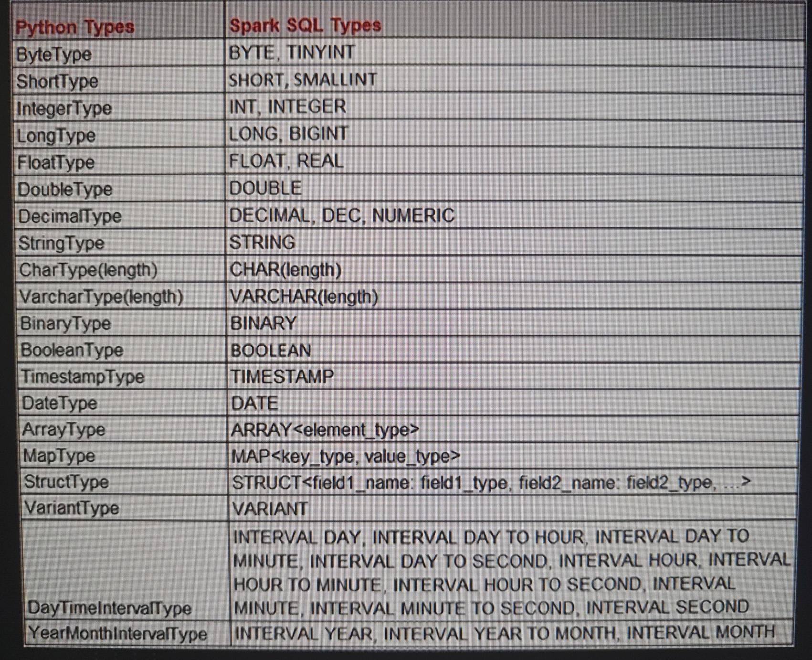
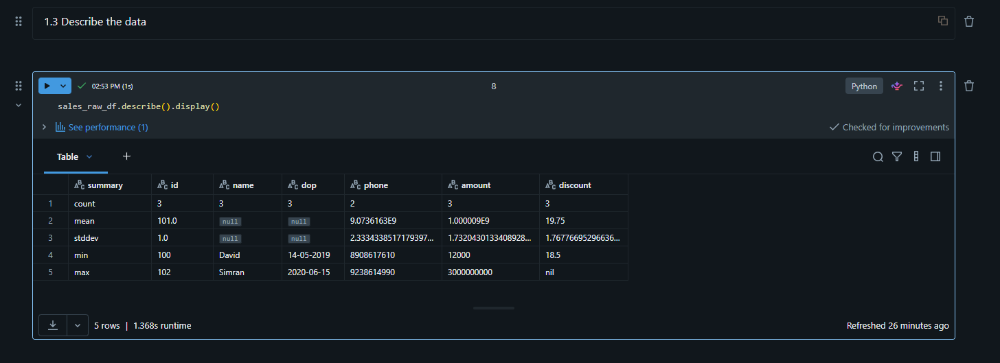
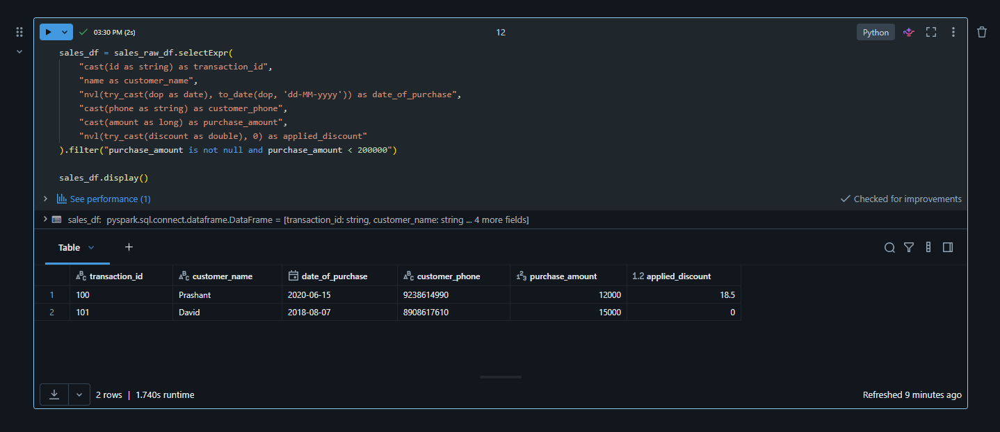
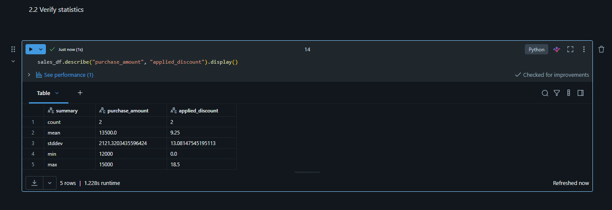

# Section 4 Spark Data Types and Schema Notes

## Content
17. [Spark Data Types](#17-spark-data-types)
18. [Schema on Read in Spark](#18-schema-on-read-in-spark)
19. [Correcting Data Types](#19-correcting-data-types)
20. [Exploratory nalysis and data types conversion](#20-exploratory-nalysis-and-data-types-conversion)


filename.py

```python


```

Run the file
    terminal --> python filename.py

Result:


<br>
<br>


## 17. Spark Data Types

[⬆ Back to content](#content)

Almost a complete list of data types and key words in Python compared with Spark/SQL:

Multiple types are compatible, we don't need to choose one of two. Example ByteType(Python) equals BYTE and TINYINT in Spark/SQL


<br>
<br>

### Data Types Description
- BYTE/TINYINT (1 byte) and SHORT/SMALLINT (-127, +128) are with too small ranege. By using them there is a risk of going out of range and causing a runtime exception.
- INT/Integer - good range, Not much saving sapce
- LONG/BIGINT - takes more disk space, and memory space when loaded, recommended for numeric values         MOSTLY USED FOR INT
- FLOAT/REAL - used for floating point values, take less storage, but smaller range than DOUOBLE.
- DOUOBLE - bigger storage and bigger range. Usually used for floating values                               MOSTLY USED FOR FLOAT
- DECIMAL, DEC, NUMERIC - huge floating point, usually used in scientific values (0.0000000001)
- STRING, CHAR, VARCHAR - Used for strings with different character length                                  MOSTLY USED FOR STRINGS
- BINARY - Used for audio or video files and binary data                                                    MOSTRLY USED FOR BINARY
- BOOLEAN, TIMESTAMP C, DATE - Used for boolean, date&time and date                       MOSTLY USED FOR DATE DATA AND BOOLEAN VALUES
  
Semy structured data:
- ARRAY(element_type) - numbers, strings and complex data of same type
- MAP(key_type, value_type) - key value pair object
- STRUCT(file1_name: field1_type, field2_name: field2_type...) - store complete record
- VARIANT - store semy structured data types like JSON, CSV etc.
  
Interval DAta Types:
- DayTimeIntervalType & YearMonthIntervalType - calculations with date and time (intervals)


[⬆ Back to content](#content)


## 18. Schema on Read in Spark

[⬆ Back to content](#content)

**Hands-On Experience**

We should have imported all required files in section 9. Setuo Your Hands-On Environment by executing the spark_programming.dbc notebook.

Login to Databricks, connect to serverless cluster and open CH04-Data Types and Schema/01-schema-on-read notebook


Requirement
1. Load data from flight-time.json into a table
2. Table structure is given below

```sql
    FL_DATE DATE, 
    OP_CARRIER STRING, 
    OP_CARRIER_FL_NUM STRING, 
    ORIGIN STRING, 
    ORIGIN_CITY_NAME STRING, 
    DEST STRING, 
    DEST_CITY_NAME STRING, 
    CRS_DEP_TIME LONG, 
    DEP_TIME LONG, 
    WHEELS_ON INT, 
    TAXI_IN INT, 
    CRS_ARR_TIME LONG, 
    ARR_TIME LONG, 
    CANCELLED INT, 
    DISTANCE INT
```

Approach: 
- Read data from the JSON file and create a data frame.
- Verify if your data frame and the target table structure are matching. If there are mismatches in the schema or in the data structure, we will try to fix them. This is necessary to avoid errors or to avoid data going into different fields.
- Save the data frame into the table.


1. Read data from the flight-time.json file

```python
flight_time_raw_df = (
    # spark - session, read - connector configuration
    spark.read
        # connector - we can check options for JSON connector here - https://spark.apache.org/docs/latest/sql-data-sources-json.html
        .format("json")
        # options of the connector
        .option("mode", "FAILFAST")     # when corrupt error is found rise an error. Default is PERMISSIVE - set corrupt data to a null
        .option("dateFormat", "M/d/yyyy")   # set date format to identify the date in the data file
        # path to the data file
        .load("/Volumes/dev/spark_db/datasets/spark_programming/data/flight-time.json")
)
```

Official documentation for all default isntalled connectors to Spark - https://spark.apache.org/docs/latest/sql-data-sources.html

Result:

```sql
ARR_TIME:long
CANCELLED:long
CRS_ARR_TIME:long
CRS_DEP_TIME:long
DEP_TIME:long
DEST:string
DEST_CITY_NAME:string
DISTANCE:long
FL_DATE:string
OP_CARRIER:string
OP_CARRIER_FL_NUM:long
ORIGIN:string
ORIGIN_CITY_NAME:string
TAXI_IN:long
WHEELS_ON:long
```

We can see that there are field order and data type mismatches between the rquirements and our dataframe.
- The field order mismatch is consequence of the JSON connector soring the results alphabetically by default.
- Data types mismatch is commonly faced issue. Connectors don't always infer/recognize data correctly even if we set a data schema for specific field as we did in this example.


2. Investigate the dataframe data and schema for problems

We will print few lines of the dataframe and check if the data is saved correctly in the right fields.

```python
flight_time_raw_df.limit(3).display()
```

In the result we can see that no ther mismatches are present except the 2 already found in step 1.
Next we will define detailed schema and set it to the connecto so the dataframe is craeted correctly.


3. Define Dataframe schema before reading it

```python
# import used data types, DataType is the base class for all data types, do not import it
from pyspark.sql.types import StringType, LongType, IntegerType, DateType, StructType, StructField

# define the schema, StructType() - defines the structure of the record with list of fields
flight_schema = StructType([
    StructField("FL_DATE", DateType()),
    StructField("OP_CARRIER", StringType()),
    StructField("OP_CARRIER_FL_NUM", StringType()),
    StructField("ORIGIN", StringType()),
    StructField("ORIGIN_CITY_NAME", StringType()),
    StructField("DEST", StringType()),
    StructField("DEST_CITY_NAME", StringType()),
    StructField("CRS_DEP_TIME", LongType()),
    StructField("DEP_TIME", LongType()),
    StructField("WHEELS_ON", IntegerType()),
    StructField("TAXI_IN", IntegerType()),
    StructField("CRS_ARR_TIME", LongType()),
    StructField("ARR_TIME", LongType()),
    StructField("CANCELLED", IntegerType()),
    StructField("DISTANCE", IntegerType())
])
```


4. Read datafile with schema-on-read

```python
flight_time_raw_with_schema_df = (
    # spark - session, read - set connector
    spark.read
        # JSON connector documrntation here - https://spark.apache.org/docs/latest/sql-data-sources-json.html
        .format("json")
        # options of the connector
        .option("mode", "FAILFAST")     # when corrupt error is found rise an error. Default is PERMISSIVE - set corrupt data to a null
        .option("dateFormat", "M/d/yyyy")   # set date format to identify the date in the data file
        # set the defined schema
        .schema(flight_schema)
        # path to the data file
        .load("/Volumes/dev/spark_db/datasets/spark_programming/data/flight-time.json")
)
```

Result:

```sql
FL_DATE:date
OP_CARRIER:string
OP_CARRIER_FL_NUM:string
ORIGIN:string
ORIGIN_CITY_NAME:string
DEST:string
DEST_CITY_NAME:string
CRS_DEP_TIME:long
DEP_TIME:long
WHEELS_ON:integer
TAXI_IN:integer
CRS_ARR_TIME:long
ARR_TIME:long
CANCELLED:integer
DISTANCE:integer
```

We can see now that the result schema is matching the requirements.

Whatever type of file we are reading is recommended to set a schema. 
- The first advantage is we are telling our connector this is the correct schema for reading the data. Read the data using this schema, otherwise throw me an error so I can fix it.
- The second benefit, our connector will not guess the schema. Reading the data only for guessing the data type takes double time. For inferring the schema our connector will read data twice. It will first read it once to read the data and make a guess about the schema and prepare the schemaat runtime. And once that schema is prepared, then it will use that schema to read the data file again and create a data frame for us.


5. Investigate the Dataframe data and schema for problems

```python
flight_time_raw_with_schema_df.limit(3).display()
```

We can check the table for mismatches and wrong data types. Everithing looks fine but dates in the table can be presented in different fomrat from as we set in the schema. This is not a problem because the presentation format is not connected to the input/read format. It can be confusing.


6. Save the Dataframe to the table flight_time_raw
   
```python
# we overwrite the existing dataframe. We didn't made any data transformation to the dataframe yet.
flight_time_raw_with_schema_df.write.mode("overwrite").saveAsTable("dev.spark_db.flight_time_raw")
```

Print 3 lines from the dataframe to see the final result:

```sql
select * from dev.spark_db.flight_time_raw limit 3
```


[⬆ Back to content](#content)


## 19. Correcting Data Types

[⬆ Back to content](#content)

Data types are very critical, so we must know how to convert data types from one data type to another data type in spark, or how to implement data type correction for our data so we can perform SQL operations or do analysis without any problem.

We should have imported all required files in section 9. Setuo Your Hands-On Environment by executing the spark_programming.dbc notebook.

Login to Databricks, connect to serverless cluster and open CH04-Data Types and Schema/02-correcting-data-types notebook

**Hands-On Experience**

- Requirement
    1. Read raw data from flight_time_raw table
    2. Apply transformations to time values as hour to minute interval
       1. CRS_DEP_TIME - scheduled departure time
       2. DEP_TIME - actual departure time
       3. WHEELS_ON - 
       4. CRS_ARR_TIME - scheduled arrival time
       5. ARR_TIME - actual arrival time
    3. Apply transformation to TAXI_IN to make it a minute interval


Show the data format

```sql
select * from dev.spark_db.flight_time_raw
```

First step was to collecting data and loading it into a raw table.
Second step is to look at the table and make it usable for analysis.

We can see that some of the fiealds are not presented as we want them to be. For example CRS_DEP_TIME is 4 digit number. We need to transform this digit to a time interval as in the requirements.


1. Read data to create a dataframe

```python
flight_time_raw_df = spark.read.table("dev.spark_db.flight_time_raw")
```


2. Develop logic to transform CRS_DEP_TIME to an interval

```python
# import expression
from pyspark.sql.functions import expr

step_1_df = (
    # withColumns - allows us to modify or give a logic to transform a single column
    flight_time_raw_df.withColumns({
    # if count of the digit in the column CRS_DEP_TIME is not 4, add 0 on the left and take 2 digit from left for hours
    # if the column CRS_DEP_TIME_HH already exist, the function will overwrite it, otherwise will create a new one
    # in this case we will create additional columns for hours and minutes and the original will remain unchanged
    "CRS_DEP_TIME_HH": expr("left(lpad(CRS_DEP_TIME, 4, '0'), 2)"),
    # if count of the digit in the column CRS_DEP_TIME is not 4, add 0 on the left and take 2 digit from right for minurtes (minutes are alwais 2 digits)
    "CRS_DEP_TIME_MM": expr("right(lpad(CRS_DEP_TIME, 4, '0'), 2)"),
    })
)

step_2_df = (
    step_1_df.withColumns({
        # concatinate the newly created columns woth semiclomun as a separator for hours and minutes
        # And that's why we separated it again if we are going to concat hours and minutes together why we separated it? Because for casting a value to an interval the components of the interval should be separated by a colon, and then only we can cast it.
        # INTERVAL HOUR TO MINUTE is a data type in Spark
        "CRS_DEP_TIME_NEW": expr("cast(concat(CRS_DEP_TIME_HH, ':', CRS_DEP_TIME_MM) AS INTERVAL HOUR TO MINUTE)")
    })
)
```

The beautiful part of the withColumns() transformation is that if our table has got or if our data frame got 20 columns and we are transforming only two columns, the new data frame that we will get after transformation will remain with 18 columns as it is without any transformation and two columns after transformation.

And that's why we separated it again if we are going to concat hours and minutes together why we separated it? Because for casting a value to an interval the components of the interval should be separated by a colon, and then only we can cast it.

In the expression we can write SQL functions. We can find Spark SQl built in functions here - https://spark.apache.org/docs/latest/api/sql/index.html

We can check Python API references with Spark SQL functions - https://spark.apache.org/docs/latest/api/python/reference/pyspark.sql/functions.html

Some of the Python and Spark SQL functions are overlapping.


```python
step_2_df.limit(2).display()
```


3. Develop a reusable function

We will use this function to transform all required fields.

```python
def get_interval(hhmm_value):
    from pyspark.sql.functions import expr

    return expr(f"""
            cast(concat(left(lpad({hhmm_value}, 4, '0'), 2), ':', 
                        right(lpad({hhmm_value}, 4, '0'), 2)) 
                        AS INTERVAL HOUR TO MINUTE)
            """)
```


4. Apply function to dataframe

Use the created function on the dataframe and overwrite the filed that are required to be transformed.
Only the last requirement is with different requirement transformation - make TAXI_IN to a minute interval

```python
result_df = (
    flight_time_raw_df.withColumns({
        "CRS_DEP_TIME": get_interval("CRS_DEP_TIME"),
        "DEP_TIME": get_interval("DEP_TIME"),
        "WHEELS_ON": get_interval("WHEELS_ON"),
        "CRS_ARR_TIME": get_interval("CRS_ARR_TIME"),
        "ARR_TIME": get_interval("ARR_TIME"),
        "TAXI_IN": expr("cast(TAXI_IN AS INTERVAL MINUTE)")
    })
)
```


5. Save results to the table

```python
result_df.write.mode("overwrite").saveAsTable("dev.spark_db.flight_time")
```

Check the result data

```sql
select * from dev.spark_db.flight_time
```


[⬆ Back to content](#content)


## 20. Exploratory analysis and data types conversion

[⬆ Back to content](#content)

Data types and schema in Spark data frame and in Spark SQL are so important, so critical concepts that learning or having a solid understanding of these concepts and how we use these concepts, these things in our data engineering project is super critical.

EDA - exploratory data analysis

We take the data, explore it, and analyze to identify correctness or problems within the data or understand the nature of the data and then identify what you want to do.

We should have imported all required files in section 9. Setuo Your Hands-On Environment by executing the spark_programming.dbc notebook.

Login to Databricks, connect to serverless cluster and open CH04-Data Types and Schema/03-eda-and-type-correction notebook

**Hands-On Eperience**

Requirements:
1. Read data from the sales_sample.csv file and analyse to identify problems
   
- 1.1. Define schema. How Spark will read the data.

```sql
file_schema = """
id int,
name string,
dop string,
phone long,
amount string,
discount string
"""
```

- 1.2. Read data

```python
sales_raw_df = (
    # spark - session, read - use connector, format("csv") - the connector type
    spark.read.format("csv")
        # options fot he specific connector
        .option("header", "true")
        # pass the defined schema
        .schema(file_schema)
        # specify the path to the data file
        .load("/Volumes/dev/spark_db/datasets/spark_programming/data/sales_sample.csv")
)

# display the data to check the result
sales_raw_df.display()
```

- 1.3. Describe the data

We run describe on a data frame. It will give a new data frame which describes our data.

```python
sales_raw_df.describe().display()
```


<br>
<br>

Observabilities:
- In the result we can see that the phone column has count = 2. This means that there is a null value in ine if the recors.
- min/max for id are numerical values. So we suggest that the values are integers.
- min/max in dop column we have mixed date formats. So we will have to apply more than one transformars for the date column.
- max for ammount is too big number. This is exception. We need to remove some additional layers of zeros.
- max for discount column is 'nil' nad not 'null'. How we understand this value and how we need to transform it to be correct?


- 1.4 List down the problems you want to fix
    1. Convert id from integer to string and rename it as transaction_id.
    2. Rename the name column to customer_name.
    3. Convert the dop to date format and rename the column to date_of_purchase.
    4. Rename the phone column to customer_phone
    5. Convert the amount to a long value and filter out nulls and outlier values.
    6. Rename the column to purchase_amount
    7. Convert discount to double, converting nil and null values to zero. rename the column to applied_discount


2. Prepare and clean the Dataframe using appropriate transformations

- 2.1 Transform
  
```python
# selectExpr - give us the options to work with all the columns in the dataframe with expression logic
sales_df = sales_raw_df.selectExpr(
    # set values to string type and rename the name of the column
    "cast(id as string) as transaction_id",
    # rename the name of the column
    "name as customer_name",
    # we need to handle multiple formats for this column.
    # try to transform (cast) dop column into date format if the value is correct (yyyy-MM-dd) and if not correct - convert it to to_date(dop, 'dd-MM-yyyy') format. This is how we handled two types of date foramt into one.
    # rename the name of the column
    "nvl(try_cast(dop as date), to_date(dop, 'dd-MM-yyyy')) as date_of_purchase",
    # change phone column values to string and rename the name of the column
    "cast(phone as string) as customer_phone",
    # conver amount values to long and change the name of the column
    "cast(amount as long) as purchase_amount",
    # try to set discount to double data type or 0 if not a valid value and rename column name
    "nvl(try_cast(discount as double), 0) as applied_discount"
    # filter amounts that are not null and smaller than 200000 (business rule)
).filter("purchase_amount is not null and purchase_amount < 200000")

# display the dataframe to check the result
sales_df.display()
```


<br>
<br>

We can find infmration about Spark SQL date time patterns here - https://spark.apache.org/docs/latest/sql-ref-datetime-pattern.html
Here we can see what symbols to use for specifying date and time formats.


- 2.2 Verify statistics

Describe transformation by default describes all the fields of the data frame. If we want to describe only few fields, we can use a list of those fields.

```python
sales_df.describe("purchase_amount", "applied_discount").display()
```


<br>
<br>


[⬆ Back to content](#content)

