# Section 5 Dataframe Transformations Notes

## Content
21. [Adding, Removing and Renaming Columns](#21-adding-removing-and-renaming-columns)
22. [Dataframe Column Expressions](#22-dataframe-column-expressions)
23. [Filtering and Removing Duplicates](#23-filtering-and-removing-duplicates)
24. [Sorting, Limiting and Collecting](#24-sorting-limiting-and-collecting)
25. [Transforming Unstructured Data](#25-transforming-unstructured-data)
26. [Transforming Data With LLM](#26-transforming-data-with-llm)


## 21. Adding, Removing and Renaming Columns

[⬆ Back to content](#content)


We should have imported all required files in section 9. Setuo Your Hands-On Environment by executing the spark_programming.dbc notebook.

Login to Databricks, connect to serverless cluster and open CH05-Transformations/01-add-remove-rename-columns notebook

1. Create a dataframe as below
  +---+--------+---+------+
  | id|    name|age|salary|
  +---+--------+---+------+
  |100|Prashant| 45| 45000|
  |101|   Tarun| 36| 33000|
  |102|   David| 48| 28000|
  +---+--------+---+------+


Create the dataframe:

```python
# define the schema for the dataframe
schema = "id int, name string, age short, salary double"

# define test data list
data_list = [(100, "Prashant", 45, 45000),
             (101, "Tarun", 36, 33000),
             (102, "David", 48, 28000)]

# when schema is not passed, the created dataframe result in suggested data types
#sample_df = spark.createDataFrame(data=data_list)

# when we specify and pass only column names and not data types, it results in suggested data types
#sample_df = spark.createDataFrame(data=data_list).toDF("id", "name", "age", "salary")

# when we pass the defined schema the process is faster and errors are not expected. Recommended approach !!!
sample_df = spark.createDataFrame(data=data_list, schema=schema)
```

2. Add following columns to your Dataframe
   - increment: 10% of the salary up to 3000 maximum increment
   - revised_salary: salary + increment 

```python
# import expression lbirary for % calculation
from pyspark.sql.functions import expr

salary_df = (
    # withColumns() allows us to add or modify only specific columns
    sample_df.withColumns({
        # add increment column with case expression logic
        "increment": expr("case when salary > 30000 then 3000 else salary * 10/100 end"),
        # add another column with the result. 
        # We can use the newly created field/column "increment" from the same transformation only if we craete new column with it
        # When we modifying/changing an existing column, this usage of newly created column is not allowed
        "revised_salary": expr("salary + increment")
    })
)

# display the results
salary_df.display()
```

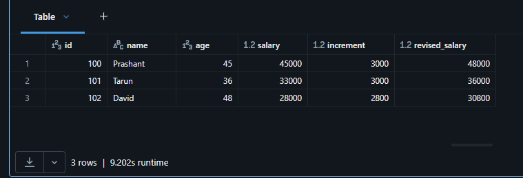
<br>
<br>


3. Add following columns to your Dataframe
   - increment: 10% of the salary up to 3000 maximum increment
- Replace the following column in your dataframe
   - salary: current salary + increment

```python
# import expression lbirary for % calculation
from pyspark.sql.functions import expr

salary_df = (
    # here we use two separate tranformations to calculate the "increment" column and "salary" column which is allowed action
    # It is not allowed to use newly craeted field/column to modify existing column in the same tranformation
    # making actions in the same transformation is faster but tricky - we are allowed to create fields/columns but not to modify existing ones as in the example above (step 2 - adding column to dataframe, current example - modify existing column)
    sample_df.withColumn("increment", expr("case when salary > 30000 then 3000 else salary * 10/100 end"))
        .withColumn("salary", expr("salary + increment"))
)

# display the result
salary_df.display()
```

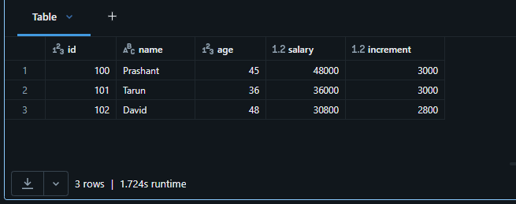
<br>
<br>


4. Add a batch number (uuid) column to your dataframe

```python
# import required libraries
# uuid is used for generating unique batch number for each run of the transformation as a separate column in the dataframe
import uuid
# lit is used to add a constant value to the dataframe column
from pyspark.sql.functions import lit

# generate a unique batch number for this run of the transformation
batch_id = str(uuid.uuid4())

# add the batch number to the dataframe as a new column
salary_batch_df = sample_df.withColumn("batch_id", lit(batch_id))

# display the result
salary_batch_df.display()
```

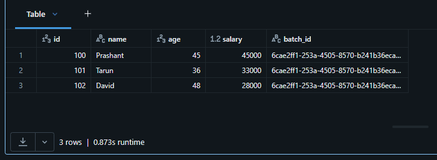
<br>
<br>


5. Rename the dataframe colums as listed below
    - increment - annual_increment
    - salary - incremented_salary


```python
new_salary_df = (
    # withColumnsRenamed() allows us to rename only specific columns in one transformation
    salary_df.withColumnsRenamed({
        "increment": "annual_increment",
        "salary": "incremented_salary"
    })
)

# display the result
new_salary_df.display()
```

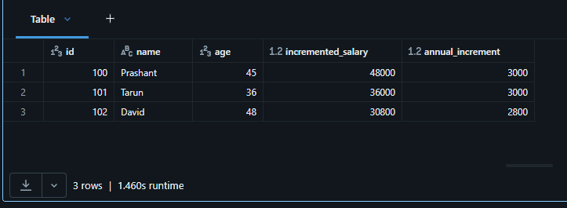
<br>
<br>


6. Remove the following colums from your dataframe
    - age
    - annual_increment

```python
# drop() will remove the specified columns from the dataframe if found in the dataframe. If the column is not found, it will silently ignore it.
small_salary_df = new_salary_df.drop("age", "annual_increment")

# display the result
small_salary_df.display()
```

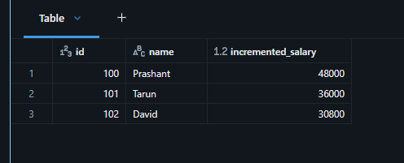
<br>
<br>


[⬆ Back to content](#content)


## 22. Dataframe Column Expressions

[⬆ Back to content](#content)


We should have imported all required files in section 9. Setuo Your Hands-On Environment by executing the spark_programming.dbc notebook.

Login to Databricks, connect to serverless cluster and open CH05-Transformations/02-dataframe-column-expressions notebook


**Requirement**

Read data from flight_time and transform as below
1. Rename fl_date to dep_date
2. Compute arr_date
3. Following fields to represent full timestamp
     1. crs_dep_time
     2. dep_time
     3. crs_arr_time
     4. arr_time

Print the dataframe in descending order of DISTANCE
```sql
select * from dev.spark_db.flight_time order by DISTANCE desc
```


### 1. Can we do it using select() or selectExpr() transformations?

```python
# create dataframe from flight_time table, spark - session, read - method to read data, table - method to read table from database
flight_time_df = spark.read.table("dev.spark_db.flight_time")

# create a new dataframe with the required transformations using selectExpr()
flight_time_1_df = (
    # selectExpr() allows us to use SQL expressions to transform the dataframe columns
    flight_time_df.selectExpr(
        # rename fl_date to dep_date
        "fl_date as dep_date",
        # compute arr_date by adding dep_date, dep_time, wheels_on and taxi_in
        "to_date(dep_date + dep_time + wheels_on + taxi_in) as arr_date",
        # compute full timestamp fields by adding dep_date and arr_date to the respective time fields
        "dep_date + crs_dep_time as crs_dep_time",
        # compute full timestamp fields by adding dep_date and arr_date to the respective time fields
        "dep_date + dep_time as dep_time",
        # compute full timestamp fields by adding dep_date and arr_date to the respective time fields
        "arr_date + crs_arr_time as crs_arr_time",
        # compute full timestamp fields by adding dep_date and arr_date to the respective time fields
        "arr_date + arr_time as arr_time",
        # keep the other columns as is
        "op_carrier"
    )
)

# display the result with filtering for a specific flight number and departure date
flight_time_1_df.where("op_carrier_fl_num = 1451 and dep_date = '2000-01-01'").display()
```

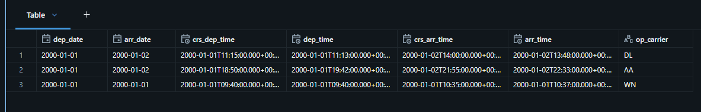
<br>
<br>

We can see that the selectExpr() modify only the columns we specify in the transformation. The other columns are not included in the result dataframe. This is not acceprable if we want to modify columns and keep the other columns as is. We can use selectExpr() transformation to modify only the columns we want and keep the other columns as is.

We can use withColumn() or withColumns() transformations to modify only the columns we want and keep the other columns as is.


### 2. Can we do it using withColumn() or withColumns()?

```python
# import expression library for SQL expressions
from pyspark.sql.functions import expr

flight_time_2_df = (
  # withColumnsRenamed() allows us to rename only specific columns in one transformation
  flight_time_df.withColumnRenamed("fl_date", "dep_date")
      # withColumn() allows us to add or modify only one specific column
      # calculate arr_date by adding dep_date, dep_time, wheels_on and taxi_in and rename it to arr_date
      .withColumn("arr_date", expr("to_date(dep_date + dep_time + wheels_on + taxi_in) as arr_date"))
      # withColumns() allows us to add or modify multiple columns
      .withColumns({
        "crs_dep_time": expr("dep_date + crs_dep_time"),
        "dep_time": expr("dep_date + dep_time"),
        "crs_arr_time": expr("arr_date + crs_arr_time"),
        "arr_time": expr("arr_date + arr_time"),
      })
)

# display the result with filtering for a specific flight number and departure date
flight_time_2_df.where("op_carrier_fl_num = 1451 and dep_date = '2000-01-01'").display()
```

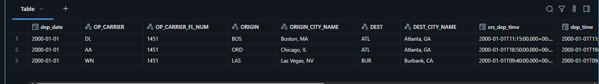
<br>
<br>

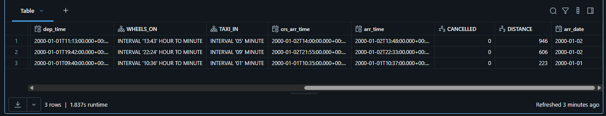
<br>
<br>

We can see that the withColumn() and withColumns() modify only the columns we specify in the transformation. The other columns are kept as is in the result dataframe. This is acceptable if we want to modify columns and keep the other columns as is.


### 3. Alternative approach to write expressions 
  - Why to use it?
    - It gives access to column functions


```python
# import required libraries
# we use column expressions, because they give us access to some additional functions which are available as column methods.
# all of the column methods and functions return a column object which can be used in the withColumn() or withColumns() transformations
# to_date() is used to convert a string to date format, col() is used to access a column in the dataframe
from pyspark.sql.functions import to_date, col

flight_time_2_df = (
    # withColumnsRenamed() allows us to rename only specific columns in one transformation
  flight_time_df.withColumnRenamed("fl_date", "dep_date")
      # withColumn() allows us to add or modify only one specific column
      # calculate arr_date by adding dep_date, dep_time, wheels_on and taxi_in
      .withColumn("arr_date", to_date(col("dep_date") + col("dep_time") + col("wheels_on") + col("taxi_in")))
      # withColumns() allows us to add or modify multiple columns
      .withColumns({
        # calculate full timestamp fields by adding dep_date and crs_dep_time to the respective time fields
        "crs_dep_time": col("dep_date") + col("crs_dep_time"),
        # calculate full timestamp fields by adding dep_date and dep_time to the respective time fields
        "dep_time": col("dep_date") + col("dep_time"),
        # calculate full timestamp fields by adding dep_date and crs_arr_time to the respective time fields
        "crs_arr_time": col("arr_date") + col("crs_arr_time"),
        # calculate full timestamp fields by adding dep_date and arr_time to the respective time fields
        "arr_time": col("arr_date") + col("arr_time"),
      })
)

# display the result with filtering for a specific flight number and departure date
flight_time_2_df.where((col("op_carrier_fl_num") == 1451) & (col("dep_date") == '2000-01-01')).display()
```

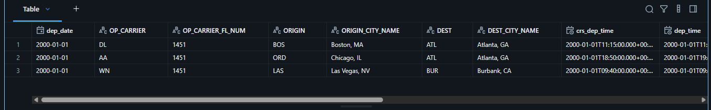
<br>
<br>

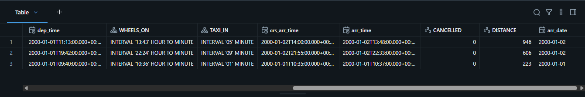
<br>
<br>

**Summarize**

We learned we can develop expressions like we develop [SQL expressions](#1-can-we-do-it-using-select-or-selectexpr-transformations). This approach can be used anywhere in data frame transformations, wherever expressions are expected.

We learned that we can use string like expressions using [expr function](#2-can-we-do-it-using-withcolumn-or-withcolumns) by evaluating these expressions using expr function.

And we can develop expressions directly. We don't need to get it evaluated through expr function. We can just wrap every column name with a call function and [build our own expression](#3-alternative-approach-to-write-expressions), which is evaluated by a spark at the time of compilation. It doesn't need to go and get it evaluated at runtime using the SQL engine. This approach gives us access to some of the additional column methods, but there are some critical column methods that are available to work with the semi-structured data.

[⬆ Back to content](#content)


## 23. Filtering and Removing Duplicates

[⬆ Back to content](#content)


We should have imported all required files in section 9. Setuo Your Hands-On Environment by executing the spark_programming.dbc notebook.

Login to Databricks, connect to serverless cluster and open CH05-Transformations/03-Filtering and removing duplicates notebook

**Requirement**
### 1. Create a test Dataframe as shown below

  +---+---------+-----------+--------+
  | id|   source|destination|distance|
  +---+---------+-----------+--------+
  |101|   Mumbai|        Goa|     587|
  |102|   Mumbai|  Bangalore|     985|
  |102|   Mumbai|  Bangalore|     985|
  |103|    Delhi|    Chennai|    2208|
  |104|    Delhi|    Chennai|    2208|
  |105|Bangalore|    Kolkata|    1868|
  |105|Bangalore|    Kolkata|    1865|
  +---+---------+-----------+--------+


### 2. Select records that satisfy the follwing criteria
    1. Source is Mumbai and destination is Bangalore
   
Show the following approaches
    1. Using a single filter
    2. Using two filters
    3. Using a col function expression
    4. Using a dataframe qualifier expression
   

```python
# define the schema for the dataframe
data_schema = "id int, source string, destination string, distance int"

# define test data list
data_list = [(101, "Mumbai", "Goa", 587),
             (102, "Mumbai", "Bangalore", 985),
             (102, "Mumbai", "Bangalore", 985),
             (103, "Delhi", "Chennai", 2208),
             (104, "Delhi", "Chennai", 2208),
             (105, "Bangalore", "Kolkata", 1868),
             (105, "Bangalore", "Kolkata", 1865)
             ]

# create the dataframe with the defined schema and data
df = spark.createDataFrame(data=data_list, schema=data_schema)

# display the dataframe
display(df) 
```


#### 2.1 Using a single filter

Create single filter with expression. Preffered as a simple and easy to read approach. It is also faster as it is a single transformation.

```python
df.filter("source = 'Mumbai' and destination='Bangalore'").display()
```

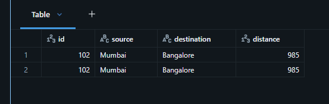
<br>
<br>

#### 2.2 Using two filters

Using two filters is not preffered as it is not a simple and easy to read approach. It is also slower as it is two transformations.

```python
df.filter("source = 'Mumbai'").filter("destination = 'Bangalore'").display()
```


<br>
<br>


#### 2.3 Using a col function expression

Using col() function expression is preffered as it is a simple and easy to read approach. It is also faster as it is a single transformation. It gives access to some of the additional column methods, but there are some critical column methods that are available to work with the semi-structured data.

```python
# import required libraries, col() is used to access a column in the dataframe
from pyspark.sql.functions import col

# filter the dataframe using col() function to access the columns and apply the filter conditions
df.filter((col("source") == 'Mumbai') & (col("destination") == 'Bangalore')).display()
```


<br>
<br>


#### 2.4 Using a dataframe qualifier expression

So this approach is same as the approach we used to write the expression with the help of call function but instead of qualifying the column with the col() function, we are qualifying the column with the dataframe variable itself. This approach is sometimes helpful when we are trying to join two data frames and there are columns with the same name in both the data frames, so that time specifying data frame becomes mandatory to avoid confusion.

```python
df.filter((df.source == 'Mumbai') & (df.destination == 'Bangalore')).display()
```


<br>
<br>


### 3. Remove duplicate records from your dataframe

#### 3.1 what do you mean by duplicate?

```python
df.display()
```

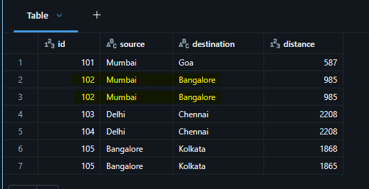
<br>
<br>


#### 3.2 Remove all the duplictes based on all the column values

The simplest meaning of duplicate is when the entire row is exactly same. That's the one and easiest and the most commonly understood definition of duplicate.

Display the dataframe and check that we have one duplicate record. 

```python
# distinct() will remove all the duplicate records from the dataframe based on all the column values. It will keep only one record for each unique combination of column values.
df.distinct().display()
```

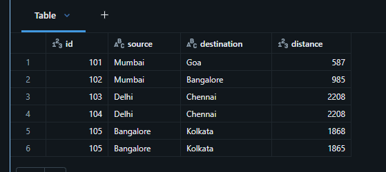
<br>
<br>


#### 3.3 Remove duplicates based on the specified column values

Even if there are 100 columns, look at only three or four columns of my choice and remove duplicates based on that.

```python
df.dropDuplicates(["id", "source", "destination"]).display()
```

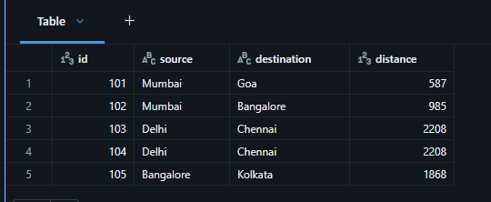
<br>
<br>

**Summarize**

We learned four different approaches for writing your expression. And we also revisited filter condition or where method. And we learned how to remove duplicates.


[⬆ Back to content](#content)


## 24. Sorting, Limiting and Collecting

[⬆ Back to content](#content)


We should have imported all required files in section 9. Setup Your Hands-On Environment by executing the spark_programming.dbc notebook.

Login to Databricks, connect to serverless cluster and open CH05-Transformations/04-Sorting Limiting and Collecting notebook


1. Read data from flight_timetable

```python
flight_time_df = spark.read.table("dev.spark_db.flight_time")
flight_time_df.display()
```


2. Find the top 3 most delayed flights on 2000-01-16 from AUS to ORD

Collect the results into a list and display the output as the following.
- AA flight delayed by 5.0 minutes
- AA flight delayed by 2.0 minutes
- UA flight delayed by 2.0 minutes

```python
# import expression library for SQL expressions. it allows us to use SQL expressions to transform the dataframe columns
from pyspark.sql.functions import expr

top_3_df = (
    # where() allows us to filter the dataframe based on the specified condition
    # name of the columns are not case sensitive but the values are.
    flight_time_df.where("FL_DATE = '2000-01-16' and origin = 'AUS' and dest = 'ORD'")
        # withColumn() allows us to add or modify only one specific column
        .withColumn("delayed_arrival", expr("arr_time - crs_arr_time"))
        # orderBy() allows us to sort the dataframe based on the specified column(s) and order
        .orderBy("delayed_arrival", ascending=False)
        # limit() allows us to limit the number of rows in the dataframe to the specified number
        .limit(3)
)

# collect() allows us to collect the dataframe rows into a list of Row objects into a Python variable. It is not recommended to use collect() on large dataframes as it can cause memory issues. It is recommended to use collect() only on small dataframes or after filtering the dataframe to a small number of rows.
top_3_list_of_rows = top_3_df.collect()
```

We know that spark data frames are distributed. They are processed on a cluster of computers. We collect the data into a Python variable. Pulling records from DataFrame to Python will bring it from multiple computers in a cluster to a single machine in the cluster, and that machine is working as a driver, or it is available on the client machine because spark also supports client server architecture where our data is on the server. We want to pull the records (results) back to our client in a Python variable and do the processing there. Normally these collect() actions are used for a small set of final results.


#### 2.2 Make a list of dictionary from a list of rows

```python
# convert the list of Row objects into a list of dictionaries
# row() allows us to access the column values of the Row object as a dictionary. We can use the asDict() method to convert the Row object into a dictionary.
top_3_list = [row.asDict() for row in top_3_list_of_rows]
```

We can check the documentation for row() here: https://spark.apache.org/docs/latest/api/python/reference/pyspark.sql/api/pyspark.sql.Row.asDict.html


#### 2.3 Print the result in desired format

```python
for i in top_3_list:
    print(i["OP_CARRIER"] 
          + " flight delayed by "
          + str(i["delayed_arrival"].total_seconds()/60)
          + " minutes")
```

Result:

AA flight delayed by 5.0 minutes
AA flight delayed by 2.0 minutes
UA flight delayed by 2.0 minutes


3. Find the third most delayed flights on 2000-01-16 from AUS to ORD

```python
top_3rd_df = (
    # where() allows us to filter the dataframe based on the specified condition
    # name of the columns are not case sensitive but the values are.
    flight_time_df.where("FL_DATE = '2000-01-16' and origin = 'AUS' and dest = 'ORD'")
        # we create a new column "delayed_arrival" which is the difference between the actual arrival time and the scheduled arrival time 
        .withColumn("delayed_arrival", expr("arr_time - crs_arr_time"))
        # we order the filterred results in descending order
        .orderBy("delayed_arrival", ascending=False)
        # limit the results to 3 rows and then offset the results by 2 rows to get the third most delayed flight
        .limit(3)
        .offset(2)
)

# display the result
top_3rd_df.display()
```


[⬆ Back to content](#content)


## 25. Transforming Unstructured Data

[⬆ Back to content](#content)


We should have imported all required files in section 9. Setup Your Hands-On Environment by executing the spark_programming.dbc notebook.

Login to Databricks, connect to serverless cluster and open CH05-Transformations/05-Transforming Unstructured data notebook


1. Read data from the apache-logs.txt file

1.1 Load and display the data

```python
file_df = (
    # spark - session, read - method to read data
    spark.read
        # connector to read the data from the specified file format
        .format("text")
        # load the data from the specified file path
        .load("/Volumes/dev/spark_db/datasets/spark_programming/data/apache-logs.txt")
)

# print the schema of the dataframe to check the structure of the data
display(file_df)
```

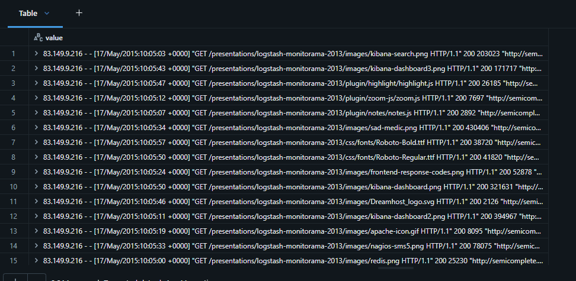
<br>
<br>


Every line of text in the file is presented as a single line in column named "value" in the dataframe. The data is unstructured and we need to parse it to extract the required fields.


1.2 Print the schema

```python
file_df.printSchema()
```

Result:

root
 |-- value: string (nullable = true)


2. Develop a strategy to extract the following fields
    1. ip_address: It is the IP address of the site visitor.
    2. visit_timestamp: It is the date and time of the site visit. Parse and format the timestamp to YYYY-MM-DD HH:MI:SS Z
    3. visit_resource: Which resource from our website was accessed
    4. referring_url: It is the clean URL of the referring website.


2.1 Develop a regular expression

```python
# regular expression to parse the apache log file record
log_reg = r'^(\S+) (\S+) (\S+) \[([\w:/]+\s[+\-]\d{4})\] "(\S+) (\S+) (\S+)" (\d{3}) (\S+) "(\S+)" "([^"]*)'
```

2.2 Apply regular expression to parse the record

```python
# import required libraries
# regexp_extract() allows us to extract specific groups from the regular expression match and create new columns in the dataframe
from pyspark.sql.functions import regexp_extract

logs_df = (
    # select() allows us to select specific columns from the dataframe and apply transformations to them
    file_df.select(
        # regexp_extract() allows us to extract specific groups from the regular expression match and create new columns in the dataframe
        # the first argument is the column name, the second argument is the regular expression, and the third argument is the group number to extract, alias() is used to rename the new column. Every field is formed after space in the text record.
        regexp_extract("value", log_reg, 1).alias("ip_address"),
        regexp_extract("value", log_reg, 4).alias("visit_timestamp"),
        regexp_extract('value', log_reg, 6).alias('visit_resource'),
        regexp_extract('value', log_reg, 10).alias('referring_url')
    )
)

# display the result
logs_df.display()
```

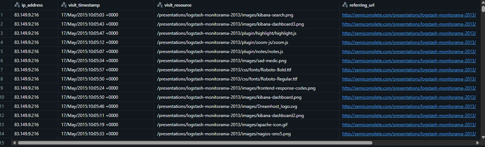
<br>
<br>


2.3 Refine results with further transformations

```python
# to_timestamp() is used to convert a string to timestamp format, substring_index() is used to extract the domain name from the referring URL
from pyspark.sql.functions import to_timestamp, substring_index

test_df = (
    # withColumns() allows us to add or modify multiple columns in one transformation
    logs_df.withColumns({
        # transform the visit_timestamp column to timestamp format
        "visit_timestamp": to_timestamp("visit_timestamp", "dd/MMM/yyyy:HH:mm:ss Z"),
        # transform the referring_url column to extract only the root URL from the string. For example, if the referring URL is "https://www.google.com/search?q=databricks", the root URL will be "https://www.google.com"
        "referring_url": substring_index("referring_url", "/", 3)
    })
)

# display the result
test_df.display()
```

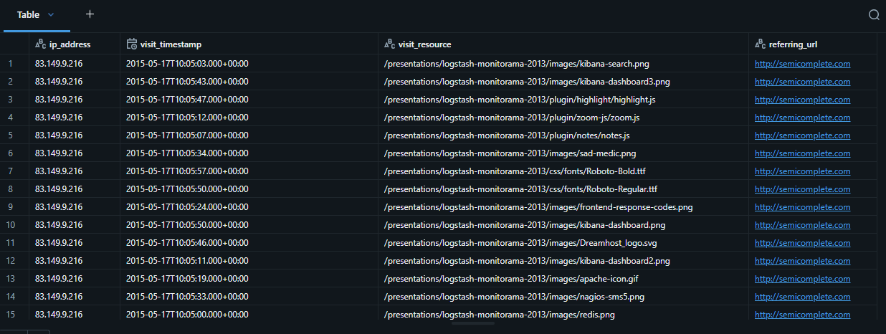
<br>
<br>


## 26. Transforming Data With LLM

[⬆ Back to content](#content)

3. Use AI to parse and extract the required information from unstructured data

3.1 Prepare an AI prompt to extract the required information

```python
prompt = """
You will be provided with an Apache log file record. It is an unstructured text record. 
Each record represents some information for our website visits, such as what is the IP address of the visitor, 
What is the date and time of the visit, which resource was requested, and the URL of the referring website? 
You are asked to parse the log file record and extract the following fields.
ip_address: It is the IP address of the site visitor.
visit_timestamp: It is the date and time of the site visit. Parse and format the timestamp to YYYY-MM-DD HH:MI:SS Z
visit_resource: Which resource from our website was accessed?
referring_url: It is the clean URL of the referring website. When the actual referring URL is not given, 
you can extract the URL from the user agent. For cleaning the URL, you should take the values only up to the domain extension, 
such as .com, .in, .uk, etc.
Give only the final answer in the JSON format.
Record:
"""
```


3.2 Develop an AI query expression

```python
# import required libraries
# concat() is used to concatenate multiple columns into a single column, col() is used to access a column in the dataframe, lit() is used to add a constant value to the dataframe column, expr() allows us to use SQL expressions to transform the dataframe columns
from pyspark.sql.functions import concat, col, lit, expr

result_df = (
    # limit the number of rows to 20 for testing and debugging
    file_df.limit(20)
        # add a new column "prompt" which is the concatenation of the prompt and the value column 
        .withColumn("prompt", concat(lit(prompt), col("value")))
        # add a new column "json_extract" which is the result of the AI query to extract the required information from the unstructured data
        .withColumn("json_extract", expr("""
            ai_query(
                endpoint=> 'databricks-llama-4-maverick',
                request=> prompt,
                responseFormat=> 'struct<extract: struct<
                ip_address: string,
                visit_timestamp: string,
                visit_resource: string,
                referring_url: string
                >>')"""))
)

# display the result
result_df.display()
```

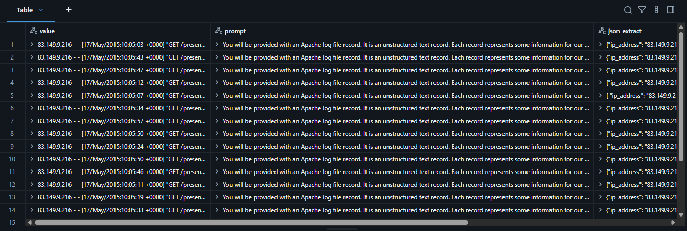
<br>
<br>


3.3 Parse the JSON extract to individual columns

```python
# import required libraries
# from_json() is used to parse a JSON string and convert it into a struct type column, col() is used to access a column in the dataframe, to_timestamp() is used to convert a string to timestamp format
from pyspark.sql.functions import from_json, col, to_timestamp

# define the schema for the JSON extract
extract_schema = "ip_address string, visit_timestamp string, visit_resource string, referring_url string"

final_result_df = (
    # withColumn() allows us to add or modify only one specific column
    result_df.withColumn("json_extract", from_json(col("json_extract"), extract_schema))
            # selectExpr() allows us to select specific columns from the dataframe and apply transformations to them
            .selectExpr("json_extract.*")
            # transform the visit_timestamp column to timestamp format
            .withColumn("visit_timestamp", to_timestamp(col("visit_timestamp"), "yyyy-MM-dd HH:mm:ss Z"))
)

# display the result
final_result_df.display()
```

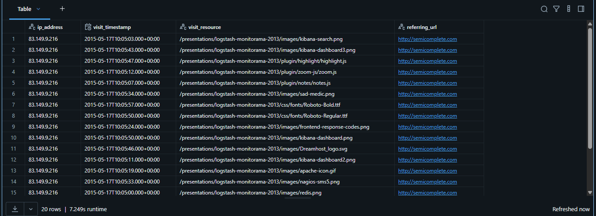
<br>
<br>

We can find Spark functions here - https://spark.apache.org/docs/latest/api/python/reference/pyspark.sql/functions.html

[⬆ Back to content](#content)
