# Section 6 Working with Different Data Types Notes

## Content
27. [Working with Nulls](#27-working-with-nulls)
28. [Working with Numbers](#28-working-with-numbers)
29. [Manuipulating Strings](#29-manuipulating-strings)
30. [Working with Date](#30-working-with-date)
31. [Working with Timestamps](#31-working-with-timestamps)
32. [Handling Time Zone Information](#32-handling-time-zone-information)
33. [Working with Complex Data Types](#33-working-with-complex-data-types)
34. [Working with JSON Data](#34-working-with-json-data)
35. [Working with Variant Type](#35-working-with-variant-type)


```python


```

Run the file
    terminal ⇾ python filename.py

Result:


<br>
<br>


## 27. Working with Nulls

[⬆ Back to content](#content)

We should have imported all required files in section 9. Setup Your Hands-On Environment by executing the spark_programming.dbc notebook.

Login to Databricks, connect to serverless cluster and open CH06-Working with Data Types/01-Working with nulls notebook


There a few things to understand when working with null values in Spark. The following topics will be covered in this section.

**Handling Null values**
- Equality check
- Null in expressions
- Conditional functions for Null - https://spark.apache.org/docs/latest/api/python/reference/pyspark.sql/functions.html#conditional-functions
- Null in aggregations


### 1. Create a data frame to demo some scenarios

This is a simple data frame with 5 records. The age column has some null values. We will use this data frame to demo some scenarios.

```python
person_list = [(100, "Prashant", 30),
             (101, "David", None),
             (102, "Sushant",None),
             (103, "Abdul", 45),
             (104, "Shruti", 28)]
             
person_df = spark.createDataFrame(person_list).toDF("id", "name", "age")
display(person_df)
```

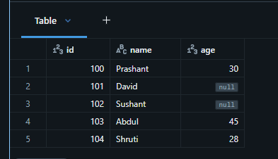
<br>
<br>


### 2. How null equality is executed.
- 2.1 Find all records where age is 28.
- 2.1 Find all records where age is not given or unknown.

```python
# Find all records where age is 28
# person_df.where("age == 28").display()

# Find all records where age is not given or unknown.
person_df.where("age IS null").display()
```

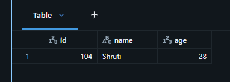
<br>
<br>


person_df.where("age == null").display() is not a valid way to check for null values. Instead, you should use the IS NULL operator as shown above.


- 2.2 Create a boolean column to investigate/troubleshoot null values. 
  - The new column will have True if the age is null and False if the age is not null.

```python
# expr is a function that allows you to use SQL expressions in PySpark DataFrame operations. It can be used to create new columns based on existing columns, perform calculations, and apply conditional logic.
from pyspark.sql.functions import expr

# Create a boolean column to investigate null values
person_df.withColumn("age_null_expr", expr("age IS null")).display()
```

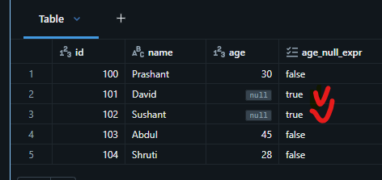
<br>
<br>


- 2.3 Use case for null equality 
  - Select only those persons having a valid age information


```python
# Select only those persons having a valid age information
person_df.where("age IS NOT null").display()
```

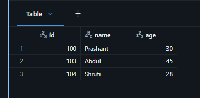
<br>
<br>


### 3. How operators work on null values

- 3.1 Check the result of > operator on null values

```python
# Create a new column with boolean values for age greater than 29. The new column will have True if the age is greater than 29, False if the age is less than or equal to 29, and null if the age is null.
person_df.withColumn("age_gt_29", expr("age > 29")).display()
```

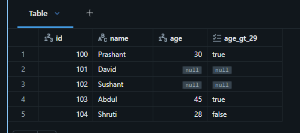
<br>
<br>


- 3.2 How the comperison operator behaves in answering business questions. 
  - Find all employees where age is greater than 29

```python
person_df.where("age > 29").display()
```

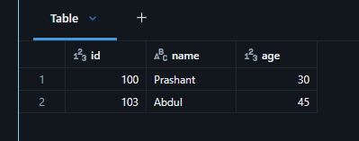
<br>
<br>


- 3.3 How mathametical operators work on null.
  - Calculate experience for every employee using the following formula.
  - experience = age - 23

Mathematical operators return null if any of the operands is null. So, if age is null then experience will also be null.

```python
# Calculate experience for every employee using the following formula: age - 23.
person_df.withColumn("experience", expr("age - 23")).display()
```

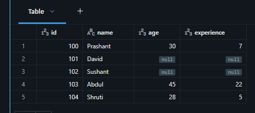
<br>
<br>


- 3.4. Calculate the experience knowing that age could be null.
  - If age is null then assume 23 years for experience calculation.

```python
# nvl() handles null values by replacing them with a specified value. In this case, if age is null, it will be replaced with 23 for the experience calculation. After the formula calculation the result will be zero for those employees whose age is null.
person_df.withColumn("experience", expr("nvl(age, 23) - 23")).display()
```

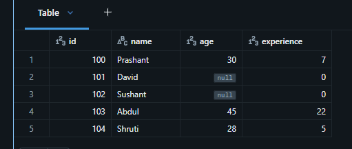
<br>
<br>


### 4. How aggregates work on null values

- 4.1 What is the average age?

```python
person_df.selectExpr("avg(age)").display()
```

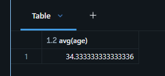
<br>
<br>


- 4.2 What if we filter out null values before aggregation

```python
# Filter out null values before aggregation. The result is the same but the query is more efficient because it does not have to process null values during the aggregation. It takes only 3 records instead of 5 records for the aggregation.
person_df.where("age is not null").selectExpr("avg(age)").display()
```

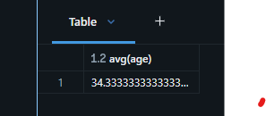
<br>
<br>


[⬆ Back to content](#content)


## 28. Working with Numbers

[⬆ Back to content](#content)

We should have imported all required files in section 9. Setup Your Hands-On Environment by executing the spark_programming.dbc notebook.

Login to Databricks, connect to serverless cluster and open CH06-Working with Data Types/02-Working with numbers notebook


**Working with numbers**
- Using mathematical expressions
- Using mathematical functions - https://spark.apache.org/docs/latest/api/python/reference/pyspark.sql/functions.html#mathematical-functions
- Using aggregate functions - https://spark.apache.org/docs/latest/api/python/reference/pyspark.sql/functions.html#aggregate-functions


1. Load invoices data to a dataframe

```python
# create dataframe from csv file
retail_df = (
    # spark - session, read.format() - connector for CSV file
    spark.read.format("csv")
    # option() - specific connector options, header - first row is header, inferSchema - automatically detect data types
    .option("header", "true")
    .option("inferSchema", "true")
    # data file path
    .load("/Volumes/dev/spark_db/datasets/spark_programming/data/invoices.csv")
)

# display the dataframe
display(retail_df)
```

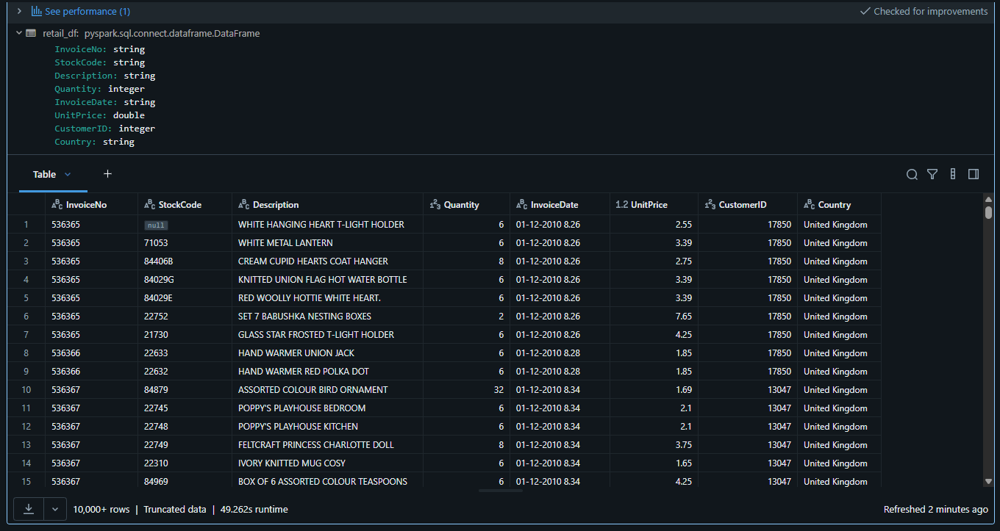
<br>
<br>

For doing any mathematical operation the field should be numeric whether integer, decimal, double float, whatever. But it should be numerical.


2. Calculate total_value for each invoice line item - total value is quantity multiplied by unit price
- 2.1. Simple approach of creating expressions

```python
# expr is used to create a new column based on an expression.
from pyspark.sql.functions import expr

# withColumn() - creating a new column called "total_value" which is the product of "quantity" and "unitprice", rounded to 2 decimal places.
retail_df.withColumn("total_value", expr("round(quantity * unitprice, 2)")).display()
```

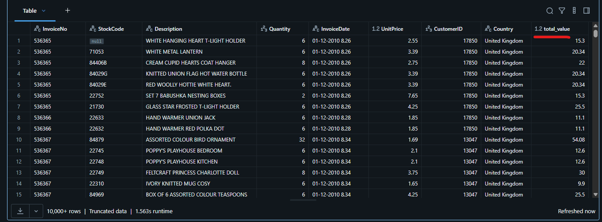
<br>
<br>


- 2.2 Using column expressions

We want to create total value field and while defining the expression we don't want to use expr, иnstead we want to say column quantity multiplied by column unit price.

```python
# col() is used to refer to a column in the DataFrame. It allows you to perform operations on columns without using SQL expressions. round() is used to round the result of the multiplication to 2 decimal places.
from pyspark.sql.functions import col, round

# withColumn() - creating a new column called "total_value" which is the product of "quantity" and "unitprice", rounded to 2 decimal places using column expressions.
retail_df.withColumn("total_value", round(col("quantity") * col("unitprice"), 2)).display()
```


<br>
<br>


- 2.3 Using expression variable - 1

We can create exrpession variable with column functions and use it in dataframe tranformation.

```python
# create expression variable
total_value_expr_1 = round(col("quantity") * col("unitprice"), 2)

# tranform the dataframe with the created expression variable and display it
retail_df.withColumn("total_value", total_value_expr_1).display()
```

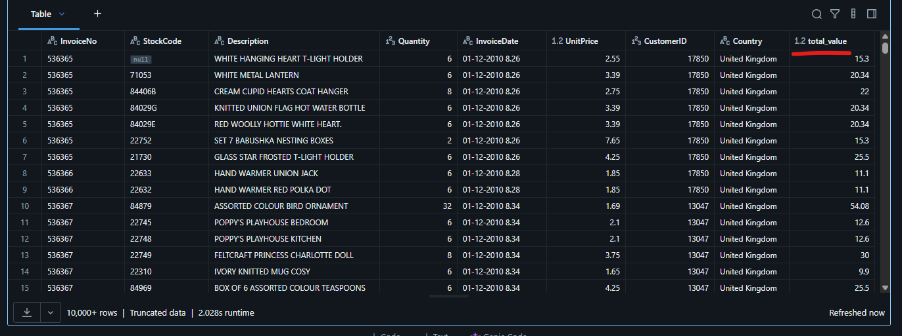
<br>
<br>

The results are identical with the previous examples, but the transformation is successful.


- 2.4 Using expression variable - 2

We can create expression variable with expression function and use it to transform the dataframe.

```python
# create expression variable with expression function
total_value_expr_2 = expr("round(quantity * unitprice, 2)")

# transform the dataframe with the craeted expression variable and display it
retail_df.withColumn("total_value", total_value_expr_2).display()
```

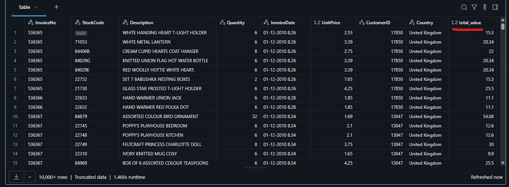
<br>
<br>

This is quite a powerful approach. It allows us to break our logic into smaller variables. Smaller chunks of code - smaller chance for mistakes.


3. Perform the following exploratory analysis on invoices data
- Can we make invoice numbers a numeric field?
- Analyize quantity to identify potentially invalid records
- Analyze unit price to identify potentially invalid records


- 3.1 Analyze using dataframe summary

Available statistics are:
  count - mean - stddev - min - max - approximate percentiles

```python
# retail_df.describe(['InvoiceNo', 'Quantity', 'UnitPrice']).display()

# summarize the specified fields
retail_df.summary().select('summary', 'InvoiceNo', 'Quantity', 'UnitPrice').display()
```

So the point is describe is one good way to get some statistics about your fields and do some exploratory analysis to analyze and understand some patterns in your data.

summary() gives us a little more information compared to describe. 
  - Min value is negative which indicates some invalid records
  - Max is also huge number which is also not normal record. Comparing the numners with 25%, 50% and 75%.

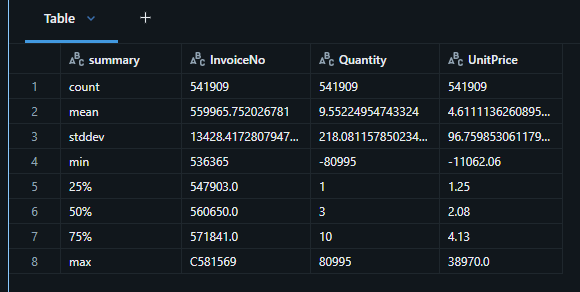
<br>
<br>


- 3.2 Using sql functions

```python
# import used functions
from pyspark.sql.functions import min, max, percentile

# we use mixed approach with expr, functions and select() to summarize imformation
retail_df.select(min("unitprice"), expr("max(unitprice)"), percentile("unitprice", 0.99)).display()
```

We can do your own kind of statistical or exploratory data analysis using aggregation functions offered by spark.

And we also learned that you can write these expressions also in the Select clause. We can write simply function and pass the column name. Or we can write our Function, call or expression using a string, but wrap it around expr or we can directly use functions.

percentage() functions are designed in a way that they expect a column or just column name. But if you do that percentile(col("unitprice"), 0.99) it doesn't throw an error.

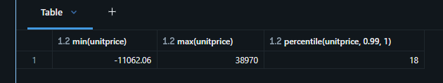
<br>
<br>

[⬆ Back to content](#content)


## 29. Manuipulating Strings

[⬆ Back to content](#content)


We should have imported all required files in section 9. Setup Your Hands-On Environment by executing the spark_programming.dbc notebook.

Login to Databricks, connect to serverless cluster and open CH06-Working with Data Types/03-Manipulating strings notebook


**Working with String**
String Manipulation Functions - https://spark.apache.org/docs/latest/api/python/reference/pyspark.sql/functions.html#string-functions


1. Requirement
You are given a dataframe below
  ```python
  df = spark.createDataFrame([("25","07","1982")]).toDF("day", "month", "year")
  ```
Create a date from day, month, and year.

```python
# insert used functions
# concat_ws() concatinates multiple input strings with a specified separator - date to string format
# to_date() converts a string column to a date column using the specified format
from pyspark.sql.functions import concat_ws, to_date

# create a dataframe
df = spark.createDataFrame([("25","07","1982")]).toDF("day", "month", "year")
#df.display()

# create a date_expr column and convert day, month and year to a date format
date_expr = to_date(concat_ws("-", "year", "month", "day"))

# select the date expression and display the result
df.select(date_expr.alias("date")).display()
```

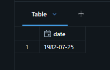
<br>
<br>


2. Requirement

You are given a dataframe below

```python
  df = (spark.createDataFrame([("Sanjay", "Kalra", 25, "July", 1982, 19408.98)])
  .toDF("fist_name", "last_name", "day", "month", "year", "salary"))
```

Create the following output
```text
  +-----------------------------------------------+----------+
  |fun_text                                       |salary    |
  +-----------------------------------------------+----------+
  |Mr. Sanjay Kalra was born on 25th July of 1982.|$19,408.98|
  +-----------------------------------------------+----------+
```


```python
# imoprt functions
# format_number() - formats a number as a string with a specified number of decimal places and optional thousands separator.
# format_string() - formats a string
# col() =- returns a column as a string based on the column name or expression
from pyspark.sql.functions import format_number, format_string, col

# create a dataframe with hte given data
df = (spark.createDataFrame([("Sanjay", "Kalra", 25, "July", 1982, 19408.98)])
           .toDF("first_name", "last_name", "day", "month", "year", "salary"))

# create formatted columns for salary and fun_text
# first propertie is the column name, second is the number format 
# alias() renames the column in the output dataframe
# https://spark.apache.org/docs/latest/api/python/reference/pyspark.sql/api/pyspark.sql.functions.format_number.html?highlight=format_number#pyspark-sql-functions-format-number
salary_fmt = format_number("salary", "$###,###.##").alias("salary")

# create formatted string for fun_text
# %s is a placeholder for a string and %d is a placeholder for a number. The values for the placegolders are set in the order they are provided in the second argument of the function format_string()
# alias() renmaes the column in the output dataframe
# https://spark.apache.org/docs/latest/api/python/reference/pyspark.sql/api/pyspark.sql.functions.format_string.html#pyspark-sql-functions-format-string
text_fmt = format_string("Mr. %s %s was born on %dth %s of %d.",
                         "first_name", "last_name", "day", "month", "year").alias("fun_text")

# select formatted columns and display the result dartaframe
df.select(text_fmt, salary_fmt).display()
```

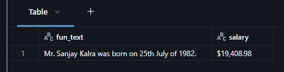
<br>
<br>


3. Requirement

You are given a dataframe below

```python
df = spark.createDataFrame([("Benga`li Market", "110001"),("Adu~godi", "560030")]) \
          .toDF("address", "pin")
```


Write code to fix the data problem in the address field

```python
# rtanslate() - replaces all occurrences of a set of characters in a string with another set of characters
from pyspark.sql.functions import translate

# use the given dataframe
df = spark.createDataFrame([("Benga`li Market", "110001"),("Adu~godi", "560030")]) \
          .toDF("address", "pin")

# Select the column "address" with withColumn(), replace the character ` and ~ empty string in the address column and display the result
# https://spark.apache.org/docs/latest/api/python/reference/pyspark.sql/api/pyspark.sql.functions.translate.html?highlight=translate#pyspark-sql-functions-translate
df.withColumn("address", translate("address", "`~", "")).display()
```

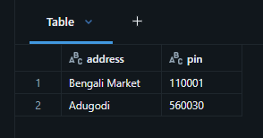
<br>
<br>

How translate() works:
- Every character found in from_str gets replaced by the character at the same position in to_str.
- If from_str is longer than to_str, the "leftover" characters (those past the length of to_str) are deleted entirely (mapped to nothing).
- Characters not listed in from_str are left untouched.

- Substitute each letter:
t → deleted (no mapping target)
r → 1
a → a (unchanged)
n → 2
s → s (unchanged)
l → 3
a → a (unchanged)
t → deleted
e → e (unchanged)

(deleted) 1 a 2 s 3 a (deleted) e = "1a2s3ae"


[⬆ Back to content](#content)


## 30. Working with Date

[⬆ Back to content](#content)

We should have imported all required files in section 9. Setup Your Hands-On Environment by executing the spark_programming.dbc notebook.

Login to Databricks, connect to serverless cluster and open CH06-Working with Data Types/04-Working with dates notebook

**Working with dates**

Date functions - https://spark.apache.org/docs/latest/api/python/reference/pyspark.sql/functions.html#date-and-timestamp-functions


1. Requirement
You are given a dataframe as below

```python
# concat_ws() concatinates multiple input strings with specific separator - date to string format
from pyspark.sql.functions import concat_ws

# set list with tuples with date data. Each tuple has year, month and day values. Some of the values are invalid dates.
data_list = [(2022, 5, 18) , (9999, 12, 31), (-9999, 1, 1), (10000, 1, 1), 
             (-10000, 1, 1), (193, 5, 25),   (99, 5, 25),   (1000, 2, 29)]

# create a dataframe with the given data and create a new column date_str with string representation with format YYYY-MM-DD
df = (spark.createDataFrame(data_list).toDF("Y", "M", "D")
     .withColumn("date_str", concat_ws("-", "Y", "M", "D")))

# display the result dataframe
df.display()
```

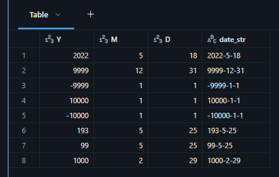
<br>
<br>


2. Convert strings to date
- Spark validates the date against the Proleptic Gregorian calendar - pretty much standard for all DBs
- The negative years are BC, and the positive values are AD in Gregorian calander.
- Valid dates are taken, and invalid dates throw an exception or taken as null

We know that we can use cast() to convert a string to date but the problem with the cast() do not accept format. We cannot tell what is the input string format. If all strings are in format yyyy-mm-dd we can use cast(). We can use to_date() but if invalid data is processed we will revceive an error. Our case is with different input formats so we will use try_to_date(). It will try to convert the strings to date and return null in case of invalid data. The second argument is the target data format.

```python
# expr allows us to use SQL expressions in PySpark DataFrame operations.
# try_to_date() is inside a string expression so we don't have to import it
from pyspark.sql.functions import expr

# try_to_date() tries to converts a string column to a date column. If invalid data is processed returns null instead of error. 
# The second argument is the target date format. Single y or M or d represents one or more digits. If we specify more than one y or M or d then it will expect exactly that number of digits in the input string.
# drop() removes the processed column Y, M and D from the dataframe
df = (
    # create a new dataframe and replace the old one with the speecified columns
    df.withColumn("valid_date", expr("try_to_date(date_str, 'y-M-d')"))
        .drop("Y", "M", "D")
)

# display the result dataframe
df.display()
```

Whatever values are shown here are valid dates as per Proleptic Gregorian calendar. 
The last record is not a leap year and February has 28 days only.

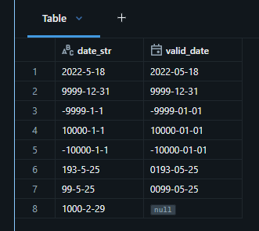
<br>
<br>

We can check all date reference here - https://spark.apache.org/docs/latest/sql-ref-datetime-pattern.html

3. Add, Subtract days and months to date

```python
# date_add() adds number of days to the date column
# date-sub() subtract number of days from date column
# add_months() adds number of months to the date column
# date_diff() returns the difference in the days between two date columns 
from pyspark.sql.functions import date_add, date_sub, add_months, date_diff

# create new columns with withColumns() in the dataframe with date_add, date-sub, add_months and date_diff functions
df = (
    df.withColumns({
        "add_5_days": date_add("valid_date", 5),
        "sub_5_days": date_sub("valid_date", 5),
        "add_5_months": add_months("valid_date", 5),
        "sub_5_months": add_months("valid_date", -5)
    })
)

# print the result dataframe
df.display()
```

We can check the results in the output dataframe. Operations with null results in null.

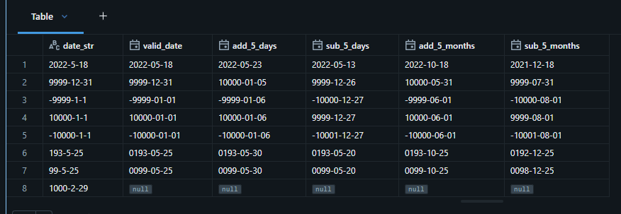
<br>
<br>


4. Current date, date difference, and interval

```python
# current_date() returns the current date as a date column
# date_diff() returns the differents in days betwen two date columns
# col() returns a column as a string based on its name or expression
from pyspark.sql.functions import current_date, date_diff, col

# create new columns with the imported functions
df = (
    df.withColumns({
        "current_date": current_date(),
        # date_diff() work as expression that process two date columns. The result is in days. The first argument is the end date and the second argument is the start date.
        "delta_date_days": date_diff("add_5_months", "valid_date"),
        # we cannot use mathematical operations with strings so we need to use col() to convert the used columns to date type and process them
        "delta_date_interval": col("current_date") - col("valid_date")
    })
)

# display the result dataframe
df.display()
```

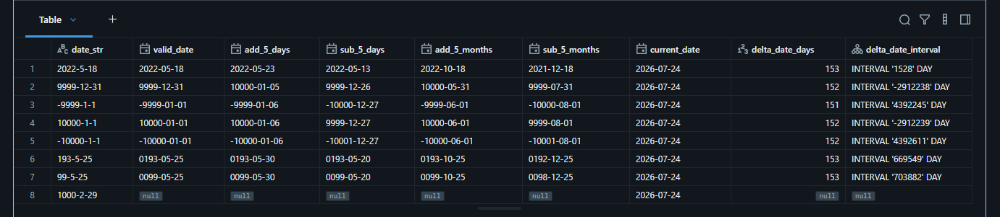
<br>
<br>


5. Format date

```python
from pyspark.sql.functions import date_format

df = (
    # craete a new coluymn fmt_date with the formatted date using format_date() function. The second argument is the target data format. The format is case sensitive. M is for month and m is for minutes. We use MMM for 3 letter month name and MMMM for full month name.
    df.withColumn("fmt_date", date_format("valid_date", "dd MMM yyyy"))
)

# print the result dataframe
df.display()
```

This date_format() is returning a string format and not a date format. We can use this function to format the date for display purposes.
We need to use to_date(), cast() or try_to_date() to convert the string back to date format in order to use it in other calculations.


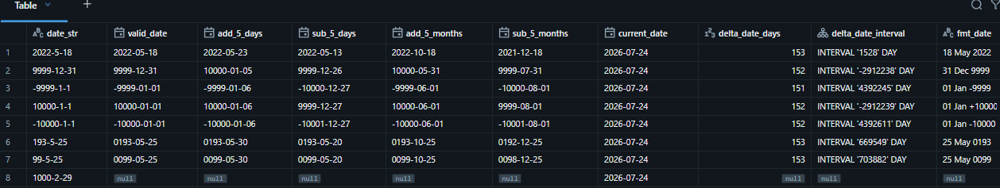
<br>
<br>


[⬆ Back to content](#content)


## 31. Working with Timestamps

[⬆ Back to content](#content)

We should have imported all required files in section 9. Setup Your Hands-On Environment by executing the spark_programming.dbc notebook.

Login to Databricks, connect to serverless cluster and open CH06-Working with Data Types/05-Working with timestamps notebook


**Working with timestamp**

Timestamp functions - https://spark.apache.org/docs/latest/api/python/reference/pyspark.sql/functions.html#date-and-timestamp-functions


### 1. How Spark stores the timestamp
  - Timestamp is internally stored as 12 byte integer known as INT96
  - Timestamp is made up of 7 fields
    - Year
    - Month
    - Day
    - Hour
    - Minute
    - Second
      - Up to 6 decimal places
      - Microsecond precision
    - Timezone


### 2. Requirement
  
You are given the below dataframes

```python
# lists of tuples with id and timestamp strings in different formats.
data_list_1 = [(1, "2022-05-18T10:30:30.0000"), (2, "2022-05-19T11:30:10.0000")]
data_list_2 = [(1, "18-05-2022 10:30:30.0000"), (2, "19-05-2022 10:30:10.0000")]
data_list_3 = [(1, "2022-05-18 10:30:30.0000"), (2, "19-05-2022 10:30:10.0000")]

# create dataframes with the lists
df_1 = (spark.createDataFrame(data_list_1).toDF("id", "string_time"))
df_2 = (spark.createDataFrame(data_list_2).toDF("id", "string_time"))
df_3 = (spark.createDataFrame(data_list_3).toDF("id", "string_time"))

# display the created dataframes
df_1.display()
df_2.display()
df_3.display()
```

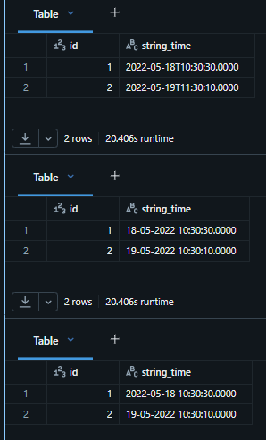
<br>
<br>


#### 2.1 covert the df_1 to timestamp

When spark converts your string to timestamp, it creates all seven essential components - Year, Month, Day, Hour, Minute, Second and Timezone. Spark assumes that the last 4 zeros represents the UTC timezone information. This is the default Spark behavior.

Recommended is not to rely on the default format whenever we are using two timestamps. Best practice is to always put the format as a second argument, and we use "yyyy-MM-dd'T'HH:mm:ss.SSSS" as a reference.

```python
# to_timestamp() converts a string column to a timestamp column using the specified format.
from pyspark.sql.functions import to_timestamp

# select() the column string_time and converts it into a timestamp column with alias() to name the newly created column
df_1.select("string_time",
             to_timestamp("string_time", "yyyy-MM-dd'T'HH:mm:ss.SSSS").alias("valid_time")
             ).display()
```


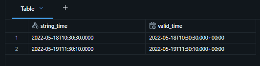
<br>
<br>


#### 2.2 Convert the df_2 to timestamp with selectExpr()

```python
# We are using selectExpr() and working with expression to convert the data to the specified time format
df_2.selectExpr(
    "string_time",
    "to_timestamp(string_time, 'dd-MM-yyyy HH:mm:ss.SSSS') as valid_time"
).display()
```

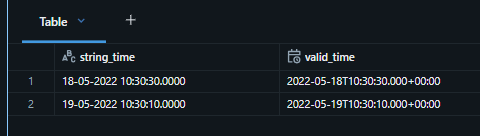
<br>
<br>


#### 2.3 Convert the df_3 to timestamp

```python
# We are using selectExpr() and working with expression to convert the data to the specified time format
# We use try_to_timestamp(), specify the format we need to convert to and other formats are going to result in null and not error
# if we use to_timestamp() and we have not matching input data we will receive an error
df_3.selectExpr(
    "string_time",
    "try_to_timestamp(string_time, 'yyyy-MM-dd HH:mm:ss.SSSS') as valid_time"
).display()
```

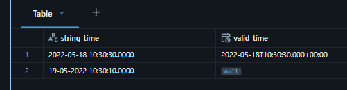
<br>
<br>


[⬆ Back to content](#content)


## 32. Handling Time Zone Information

[⬆ Back to content](#content)

We should have imported all required files in section 9. Setup Your Hands-On Environment by executing the spark_programming.dbc notebook.

Login to Databricks, connect to serverless cluster and open CH06-Working with Data Types/05-Working with timestamps notebook

### 3. Timezone information
- A timestamp without timezone information is incomplete.
- Spark offers two data types for timestamp
  - TIMESTAMP - if timezone is not provided Spark uses the timezone of the session
  - TIMESTAMP_NTZ - no time zone specified
- For TIMESTAMP, Spark assumes session timezone as the default when timezone is not specified
- Session timezone is specified as spark.sql.session.timeZone

When we use data with Timezone provided we use TIMESTAMP
When we use data without Timezone provided we use TIMESTAMP_NTZ


#### Craete stimestam from with the data below

```sql
select to_timestamp('18-05-2022 10:30:30.0000', 'dd-MM-yyyy HH:mm:ss.SSSS')
```

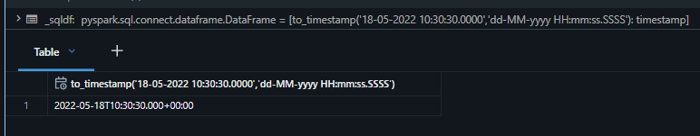
<br>
<br>

The four zeros at the end are the default timezone of Spark session.


#### 3.1 What is your default session timezone?

```python
spark.conf.get("spark.sql.session.timeZone")
```

Result: 'Etc/UTC'

'Etc/UTC' is the default Time Zone


#### 3.2 Change your session timezone to IST

```python
spark.conf.set("spark.sql.session.timeZone", 'IST')
```


Check the result of the changed timezone:   
```python
spark.conf.get("spark.sql.session.timeZone")
```

Result: 'IST'


Convert the data with the session timezone.   
```sql
select to_timestamp('18-05-2022 10:30:30.0000', 'dd-MM-yyyy HH:mm:ss.SSSS')
```

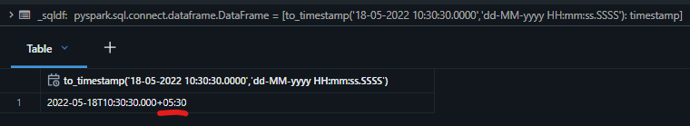
<br>
<br>

We can see that the last 4 digits are in IST timezone


We will change the timezone of the session back to UTC

```python
spark.conf.set("spark.sql.session.timeZone", 'Etc/UTC')
```

Check the result of the changed timezone:   
```python
spark.conf.get("spark.sql.session.timeZone")
```   
Result: 'Etc/UTC'


### 4. Working with NTZ data

For the examples we will use file Catalog/dev/spark_db/datasets/spark_programming/data/datasetsmachine-events-no-tz.csv

```csv
component,event_time,reading
AXT594,17-05-2022 06:14:10.359,23
AXT594,17-05-2022 06:14:25.380,25
AXT594,17-05-2022 06:14:35.346,21
AXT594,17-05-2022 06:14:45.381,22
AXT594,17-05-2022 06:14:55.356,25
AXT594,17-05-2022 06:15:05.372,23
AXT594,17-05-2022 06:15:15.355,24
AXT594,17-05-2022 06:16:25.326,24
AXT594,17-05-2022 06:17:35.345,21
AXT594,17-05-2022 06:18:45.365,22
```

#### 4.1 Load machine-events-no-tz.csv file and show the data

```python
# We read all fields as a string and later we will convert them
# Loading event time as timestamp automatically will set the data with the default session timezone (UTC) and we do not want this
event_ntz_schema = "component string, event_time string, reading string"

# Create dataframe
event_ntz_df = (
    # spark - session, read.format('csv') - connector for csv format
    spark.read.format("csv")
        # use option for header line
        .option("header", "true")
        # use the created schema
        .schema(event_ntz_schema)
        # set the data file path
        .load("/Volumes/dev/spark_db/datasets/spark_programming/data/machine-events-no-tz.csv")
)

# display the dataframe
event_ntz_df.display()
```

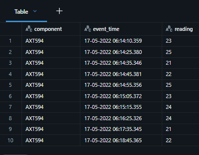
<br>
<br>


#### 4.2 Parse te event_time to a TIMESTAMP_NTZ value

```python
# import used functions 
# to_timestamp_ntz - https://spark.apache.org/docs/latest/api/python/reference/pyspark.sql/api/pyspark.sql.functions.to_timestamp_ntz.html#pyspark.sql.functions.to_timestamp_ntz
# lit - convert string into a column
from pyspark.sql.functions import to_timestamp_ntz, lit

# create new dataframe
event_valid_ntz_df = (
    event_ntz_df.withColumn("event_time_valid_ntz", to_timestamp_ntz("event_time", lit("dd-MM-yyyy HH:mm:ss.SSS")))
)

# display the new dataframe
event_valid_ntz_df.display()
```

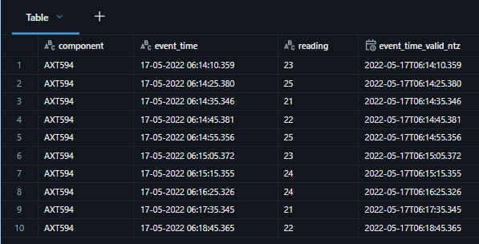
<br>
<br>


#### 4.3 event_time_ntz field to a valid timestamp value
- Assume the event_time_ntz is IST time

```python
# import functions
# convert_timezone - convert timestamp/_ntz records to specific datazone - https://spark.apache.org/docs/latest/api/python/reference/pyspark.sql/api/pyspark.sql.functions.convert_timezone.html#pyspark.sql.functions.convert_timezone
# lit - convert string into a column
# to_timestamp() - https://spark.apache.org/docs/latest/api/python/reference/pyspark.sql/api/pyspark.sql.functions.to_timestamp.html#pyspark.sql.functions.to_timestamp
from pyspark.sql.functions import convert_timezone, lit, to_timestamp

# get current session timezone - UTC in our case
stz = spark.conf.get("spark.sql.session.timeZone")

# create new dataframe
events_df = (
    # we assume event_time is in IST tomezone (we should have the information about it or find it)
    # we already converted event_time_tz to taimestamp_ntz format in the previous task - step 1
    # now we convert "event_time_valid_ntz" into timestamp with IST timezone - step 2
    # lit("IST") - source timezone, lit(stz) - target timezone - session timezone, "event_time_valid_ntz" - column we working with
    event_valid_ntz_df.withColumn("event_time_tz", to_timestamp(convert_timezone(lit("IST"), lit(stz), "event_time_valid_ntz")))
)

# display the result dataframe
events_df.display()
```

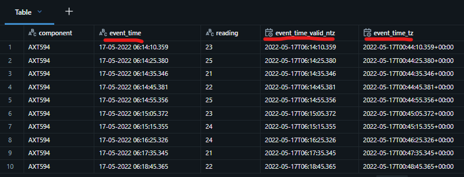
<br>
<br>

In practice, we convert event timezone to our session default or specific timezone.

**Good practices**
- When we work with big data we convert all data into UTC or the default session timezone and then we cprocess is further.

We can see that the 


### 5. Working with TZ data

#### 5.1 Load machine-events-with-tz.csv file and show the data

```python
# create dataframe schema
# timestamp is string because if we converti it with to_timestamp() it will take the session default timezone
event_tz_schema = "component string, event_time_tz_str string, reading string"

# create new dataframe
events_tz_df = (
    # spark - session, read.format("csv") - connector
    spark.read.format("csv")
    # option of the connector for header line
    .option("header", "true")
    # specify the created schema
    .schema(event_tz_schema)
    # set the path of the data file
    .load("/Volumes/dev/spark_db/datasets/spark_programming/data/machine-events-with-tz.csv")
)

# display the result dataframe
display(events_tz_df)
```

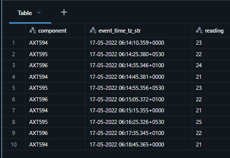
<br>
<br>


#### 5.2 Parse the event_time field to a valid timestamp value
- Timezone information is provided in the data file

```python
# to_timestamp() - https://spark.apache.org/docs/latest/api/python/reference/pyspark.sql/api/pyspark.sql.functions.to_timestamp.html#pyspark.sql.functions.to_timestamp
from pyspark.sql.functions import to_timestamp

# create new dataframe
event_data_df = (
    # create new column "event_time_tz" from event_time_tz_str string columns to timestamp with the specified format, Z - timezone
    # data in the "event_time_tz_str" column is in different timezones and the result data in "event_time_tz" column is in UTC timezone
    # the result data is UTC timezone because the session default timezone is UTC
    events_tz_df.withColumn("event_time_tz", to_timestamp("event_time_tz_str", "dd-MM-yyyy HH:mm:ss.SSSZ"))
)

# display the dataframe
event_data_df.display()
```

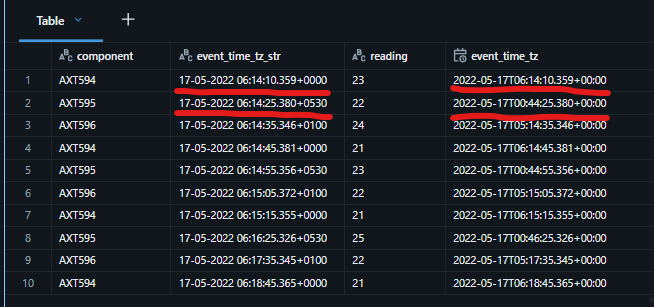
<br>
<br>


[⬆ Back to content](#content)


## 33. Working with Complex Data Types

[⬆ Back to content](#content)

We should have imported all required files in section 9. Setup Your Hands-On Environment by executing the spark_programming.dbc notebook.

Login to Databricks, connect to serverless cluster and open CH06-Working with Data Types/06-Working with complex data types notebook


### 1. Requirement

Read data from students_offline.csv file and load into offline_students_raw table.

This is the data structure:

students_offline.csv

```csv
ID,FirstName,LastName,Address,Skills,Contacts
101,Prashant,Pandey,"{""AddressLine1"":""D104 Gopalan Squire"",""AddressLine2"":""Whitefield"",""City"":""Bangalore"",""Country"":""India"",""Pin"":""560001"",""State"":""Karnataka""}","[{""Skill"":""Apache Spark"",""YearsOfExperience"":""5""},{""Skill"":""Apache Kafka"",""YearsOfExperience"":""6""}]","{""email"":""xyz@abc.com"",""phone"":""9823128923""}"
102,David,Turner,"{""AddressLine1"":""109 Park Street"",""AddressLine2"":""Richmond"",""City"":""London"",""Country"":""Engaland"",""Pin"":""EC1A"",""State"":""London""}","[{""Skill"":""Java"",""YearsOfExperience"":""12""},{""Skill"":""Spring Boot"",""YearsOfExperience"":""6""}]","{""phone"":""9873145698""}"
103,Katie,Mcloskey,"{""AddressLine1"":""9th Avenue"",""AddressLine2"":""Dorsy Road"",""City"":""Belfast"",""Country"":""Northern Ireland"",""Pin"":""BT1 1BG"",""State"":""Belfast""}","[{""Skill"":""SQL"",""YearsOfExperience"":""12""},{""Skill"":""PL/SQL"",""YearsOfExperience"":""8""}]","{""email"":""ert89@abc.com""}"
104,Nasima,Khatun,"{""AddressLine1"":""G105 MG Tower"",""AddressLine2"":""Bregade Road"",""City"":""Kolkata"",""Country"":""India"",""Pin"":""7000001"",""State"":""West Bengal""}","[{""Skill"":""Hadoop"",""YearsOfExperience"":""3""},{""Skill"":""Apache Spark"",""YearsOfExperience"":""2""}]","{""email"":""magt23@abc.com"",""office"":""7896524689""}"
105,Pritam,Jain,"{""AddressLine1"":""M206 Richmond Tower"",""AddressLine2"":""Electronic City"",""City"":""Bangalore"",""Country"":""India"",""Pin"":""560001"",""State"":""Karnataka""}","[{""Skill"":""Python"",""YearsOfExperience"":""10""},{""Skill"":""SQL"",""YearsOfExperience"":""15""},{""Skill"":""Apache Spark"",""YearsOfExperience"":""3""},{""Skill"":""Databases"",""YearsOfExperience"":""15""}]","{""phone"":""6984753281"",""whatsapp"":""6924587322""}"
```

```python
# create schema with string format for all columns
offline_students_schema = "ID string, FirstName string, LastName string, Address string, Skills string, Contacts string"

# create dataframe
offline_students_raw_df = (
    # spark - session, read.format("csv") - connector
    spark.read.format("csv")
        # options for the connector for header line, quota and escape 
        .option("header", "true")       # skip header row
        .option("quote", "\"")          # skip the first double quote because each line is represented as a single string
        .option("escape", "\"")         # skip the first double quote for each object in the data
        # use the created schema
        .schema(offline_students_schema)
        # path to the data file
        .load("/Volumes/dev/spark_db/datasets/spark_programming/data/students_offline.csv")
)

# display the dataframe
offline_students_raw_df.display()
# save/overwrite the dataframe as a table
offline_students_raw_df.write.mode("overwrite").saveAsTable("dev.spark_db.offline_students_raw")
```

Everithing is string as planned

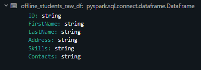
<br>
<br>

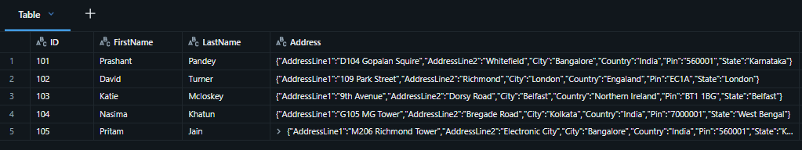
<br>
<br>

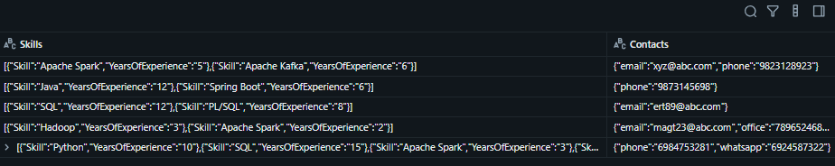
<br>
<br>


### 2. Analysis Requirement

We want to know country wise student count.

Spark gives us three complex data types to handle such kind of situations. One is struct, the second data type is array and third data type is map. Simple record is considered as struct - like in the first line in the schema.

fromom_json() - pars the data from offline_students_raw table in separate structure - address with specified schema. This is slow operation.

So one approach to handle complex data, something like JSON data, is to save it or store it in your table as a string. And at the time of query or at the time of analysis, parse it from string to a complex data type. For example, struct type or into an array type or into a map type. There is no harm in that, but we have a performance problem, a potential performance problem for large tables. So this is not a very good approach.

So what we can do as a data engineer we should not be loading data, a complex data like JSON strings as a string in our table. 
We can create a raw table to load a string into that table, but we should parse it once for all and create a final table. Go to 3. Requirements

```sql
with offline_students(
  select id, from_json(address,
      """struct<AddressLine1 string,
        AddressLine2 string,
        City string,
        Country string,
        Pin string,
        State string>
      """) as address
  from dev.spark_db.offline_students_raw
)
select address.country, count(*) as count
from offline_students
group by address.country
```


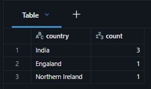
<br>
<br>


### 3. Requirement

Prepare an offline_students table which is ready for analysis

Complex Data Types in Spark
  - Struct - consistent data
  - Array
  - Map - not consistent data - key : value pairs


```python
# import libraries
from pyspark.sql.functions import from_json

# define schemas for the all complex data types
# struct - consistent data 
address_schema = "struct<AddressLine1 string, AddressLine2 string, City string, Country string, Pin string, State string>"
# define two data types schema from nested structure
skills_schema = "array<struct<Skill string, YearsOfExperience string>>"
# key - value pair of strings - not consistent data
contacts_schema = "map<string, string>"

# create newdf from the raw we craeted earlier
offline_students_df = (
    offline_students_raw_df.withColumns({
        # transform all columns from json fomrat as defined schemas
        "address": from_json("address", address_schema),
        "skills": from_json("skills", skills_schema),
        "contacts": from_json("contacts", contacts_schema)
    })
)

# display the created dataframe
offline_students_df.display()
# create a table from the created dataframe
offline_students_df.write.mode("overwrite").saveAsTable("dev.spark_db.offline_students")
```

We can check the the data is as we defined the schemas:

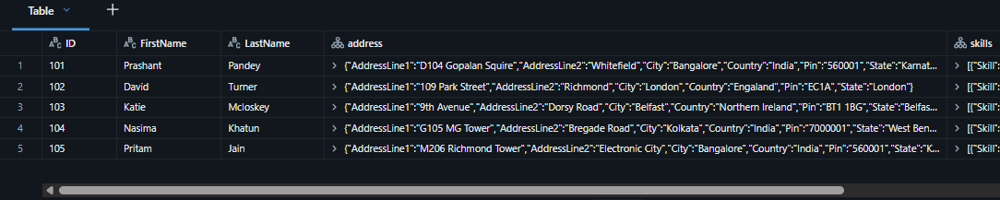
<br>
<br>

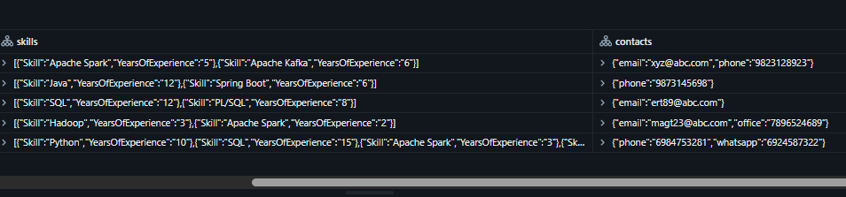
<br>
<br>

And this is what we wanted to do - write a table offline_students with a complex data type so that our analytics team can easily use queries for doing the analysis.


### 4. Requirement

Perform the following analysis
  - What is country wise student count.
  - Find all students with more than 1 year of Spark knowledge
  - Find all students who didn't provide phone or whatsapp


#### 4.1 What is country wise student count.

```sql
select address.Country, count(*) as count
from dev.spark_db.offline_students
group by address.Country
```

This is the benefit of complex data type over the string data type - analytics team can directly use this data. They don't have to parse the address again and again for each query.

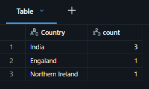
<br>
<br>


#### 4.2 Find all students with more than 1 year of Spark knowledge

```sql
-- create new table offline_students_skills
with offline_students_skills(
   -- set columns id, FirstName, LastName and separate each skill and years of experience
   select id, FirstName, LastName, explode(skills) as skills
   -- load the data from the existing table
   from dev.spark_db.offline_students
)

-- select data from the new table
select id, firstname, lastname, skills.*
from offline_students_skills
-- filter records for 'Spark' skill and more than one year of experience for this specific skill
where skills.Skill like "%Spark%" and skills.YearsOfExperience > 1
```

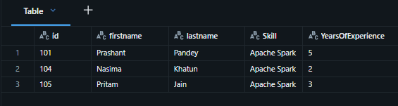
<br>
<br>


#### 4.3 Find all students who didn't provide phone or whatsapp

```sql
-- select fields from the table
select ID, FirstName, LastName, contacts['email']
from dev.spark_db.offline_students
-- filter the records by empty phone and whatsapp
where contacts['phone'] is null and contacts['whatsapp'] is null
```


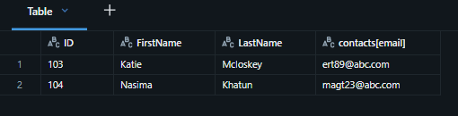
<br>
<br>


In this lecture we learned that we should not be keeping JSON or complex values as a string. But if we do that, then we have to parse those strings every time we want to query that table. And that is a performance overhead for your tables.

So ideally we have an option to parse it once for all. Keep it as a complex data type either struct or array or map wherever whatever fits. Design the data model accordingly and prepare our tables for easy and fast analysis.


[⬆ Back to content](#content)


## 34. Working with JSON Data

[⬆ Back to content](#content)

We should have imported all required files in section 9. Setup Your Hands-On Environment by executing the spark_programming.dbc notebook.

Login to Databricks, connect to serverless cluster and open CH06-Working with Data Types/07-Working with JSON data notebook


### 1. Requirement

Read data from students_online.json file and load into online_students table.

students_online.json

```json
{"ID":"101","FirstName":"Prashant","LastName":"Pandey","Address":{"AddressLine1":"D104 Gopalan Squire","AddressLine2":"Whitefield","City":"Bangalore","State":"Karnataka","Country":"India","Pin":"560001"},"Skills":[{"Skill":"Apache Spark","YearsOfExperience":"5"},{"Skill":"Apache Kafka","YearsOfExperience":"6"}],"Contacts":{"phone":"9823128923","email":"xyz@abc.com"}}
{"ID":"102","FirstName":"David","LastName":"Turner","Address":{"AddressLine1":"109 Park Street","AddressLine2":"Richmond","City":"London","State":"London","Country":"Engaland","Pin":"EC1A"},"Skills":[{"Skill":"Java","YearsOfExperience":"12"},{"Skill":"Spring Boot","YearsOfExperience":"6"}],"Contacts":{"phone":"9873145698"}}
{"ID":"103","FirstName":"Katie","LastName":"Mcloskey","Address":{"AddressLine1":"9th Avenue","AddressLine2":"Dorsy Road","City":"Belfast","State":"Belfast","Country":"Northern Ireland","Pin":"BT1 1BG"},"Skills":[{"Skill":"SQL","YearsOfExperience":"12"},{"Skill":"PL/SQL","YearsOfExperience":"8"}],"Contacts":{"email":"ert89@abc.com"}}
{"ID":"104","FirstName":"Nasima","LastName":"Khatun","Address":{"AddressLine1":"G105 MG Tower","AddressLine2":"Bregade Road","City":"Kolkata","State":"West Bengal","Country":"India","Pin":"7000001"},"Skills":[{"Skill":"Hadoop","YearsOfExperience":"3"},{"Skill":"Apache Spark","YearsOfExperience":"2"}],"Contacts":{"email":"magt23@abc.com","office":"7896524689"}}
{"ID":"105","FirstName":"Pritam","LastName":"Jain","Address":{"AddressLine1":"M206 Richmond Tower","AddressLine2":"Electronic City","City":"Bangalore","State":"Karnataka","Country":"India","Pin":"560001"},"Skills":[{"Skill":"Python","YearsOfExperience":"10"},{"Skill":"SQL","YearsOfExperience":"15"},{"Skill":"Apache Spark","YearsOfExperience":"3"},{"Skill":"Databases","YearsOfExperience":"15"}],"Contacts":{"whatsapp":"6924587322","phone":"6984753281"}}
```


How do we load this data file. We have two options :

1. Read it as a text file And load each record as a string - single column and one value for the column, which is your JSON string. Then next row - single column one value called JSON string. So first option is to read it as a text file where we have entire JSON string loaded as a single field. And then we can use from_json() to parse this JSON and extract different columns the id, first name, last name, address, etc. as an appropriate data type, ID could go as a string, first name, last name can be converted to string fields, address is a complex data type, so this can be converted into a struct, skills is an array, so it can be converted into a complex data type - array type. Similarly, contacts looks like a key value pair, so this can be converted into a map.

2. We have a JSON connector for spark which internally does all the tranformations we need. It internally reads the JSON string and converts it into a complex data type, or converts all the fields into appropriate data type. if we have a JSON file which contains complete JSON record and it's not with mixed fields We can directly use the JSON connector. It will do everything in the single step - JSON connector will read these files and load it as an appropriate data type, so we don't have to manually parse the JSON string using the from_json().

So we are going to use option #2 and that's the preferred approach for working with JSON files.

First we need to define the schema and defining a schema is super simple. We need to know what are the fields, so easier way is to copy one value as a reference and then use it to define the schema.

```python
# reference line:
# {"ID":"101","FirstName":"Prashant","LastName":"Pandey","Address":{"AddressLine1":"D104 Gopalan Squire","AddressLine2":"Whitefield","City":"Bangalore","State":"Karnataka","Country":"India","Pin":"560001"},"Skills":[{"Skill":"Apache Spark","YearsOfExperience":"5"},{"Skill":"Apache Kafka","YearsOfExperience":"6"}],"Contacts":{"phone":"9823128923","email":"xyz@abc.com"}}
# define schema
online_students_schema = """
    ID string, FirstName string, LastName string,
    Address struct<AddressLine1 string, AddressLine2 string, City string, State string, Country string, Pin string>,
    Skills array<struct<Skill string, YearsOfExperience string>>,
    Contacts map<string, string>
    """

# create dataframe from the table with the specified schema
online_students_df = (
    # spark - session, read.format(json) - connector
    spark.read.format("json")
        # use the created schema
        .schema(online_students_schema)
        # path to the source data file
        .load("/Volumes/dev/spark_db/datasets/spark_programming/data/students_online.json")
)

# display the dataframe
online_students_df.display()
# craete new table with the dataframe
online_students_df.write.mode("overwrite").saveAsTable("dev.spark_db.online_students")
```


<br>
<br>


<br>
<br>


<br>
<br>


### 2. Requirement
Perform the following analysis
   1. What is country wise student count
   2. Find all students with more than 1 year of Spark knowledge
   3. Find all students who didn't provide phone or whatsapp


#### 2.1. What is country wise student count

So we know that this can be fulfilled by simple query group by country and take the count. But country is sitting inside the address field. But that's not a problem. Address is already an object and we have country here so we can directly access the country easily. It's not a string. It's a complex data type, very well represented by different fields in an object.

```sql
-- select address.coutry records from table online_students and count them
select Address.Country, count(*) as count
from dev.spark_db.online_students
group by Address.Country
```


<br>
<br>


#### 2.2 Find all students with more than 1 year of Spark knowledge

```sql
-- create new table online_students_skills
with online_students_skills(
  -- set the table columns - id, firstname, LastName and all skills and their years of experience 
  -- firstname or FirstName - not case sensitive, Same extends to the object fields for complex data types.
  select id, firstname, LastName, explode(Skills) as skills
  -- from where to read
  from dev.spark_db.online_students)
-- select the columns we need to read and skills.* will give us separate fields for each field in the complex data types
select id, firstname, lastname, skills.*
-- set the source table
from online_students_skills
-- filter the required skill (all skills containing 'Spark') and years of experience
-- object field names are not case sensitive - it means we don't have to worry about case sensitive skill - capital S and K.
where skills.skill like "%Spark%" and skills.YearsOfExperience > 1

```


<br>
<br>


#### 2.3 Find all students who didn't provide phone or whatsapp

```sql
-- select fields we want to read and emails for reaching them and ask for phone number
select id, FirstName, LastName, Contacts['email'] as email
-- specify the table we read from
from dev.spark_db.online_students
-- filters for the target records - empty records for phone nad whatapp
where Contacts['phone'] is null and Contacts['whatsapp'] is null

```


<br>
<br>


[⬆ Back to content](#content)


## 35. Working with Variant Type

[⬆ Back to content](#content)

We should have imported all required files in section 9. Setup Your Hands-On Environment by executing the spark_programming.dbc notebook.

Login to Databricks, connect to serverless cluster and open CH06-Working with Data Types/08-Working with VARIANT data notebook


Spark latest version has introduced a new data type called variant type. Variant is going to be the data type for handling complex data, JSON, etc. so in this lecture we want to learn what is variant type, how to use it, and when we should be using it.


### 1. Requirement

Read data from students_offline.csv file and load into offline_students_raw table.

students_offline.csv

```csv
ID,FirstName,LastName,Address,Skills,Contacts
101,Prashant,Pandey,"{""AddressLine1"":""D104 Gopalan Squire"",""AddressLine2"":""Whitefield"",""City"":""Bangalore"",""Country"":""India"",""Pin"":""560001"",""State"":""Karnataka""}","[{""Skill"":""Apache Spark"",""YearsOfExperience"":""5""},{""Skill"":""Apache Kafka"",""YearsOfExperience"":""6""}]","{""email"":""xyz@abc.com"",""phone"":""9823128923""}"
102,David,Turner,"{""AddressLine1"":""109 Park Street"",""AddressLine2"":""Richmond"",""City"":""London"",""Country"":""Engaland"",""Pin"":""EC1A"",""State"":""London""}","[{""Skill"":""Java"",""YearsOfExperience"":""12""},{""Skill"":""Spring Boot"",""YearsOfExperience"":""6""}]","{""phone"":""9873145698""}"
103,Katie,Mcloskey,"{""AddressLine1"":""9th Avenue"",""AddressLine2"":""Dorsy Road"",""City"":""Belfast"",""Country"":""Northern Ireland"",""Pin"":""BT1 1BG"",""State"":""Belfast""}","[{""Skill"":""SQL"",""YearsOfExperience"":""12""},{""Skill"":""PL/SQL"",""YearsOfExperience"":""8""}]","{""email"":""ert89@abc.com""}"
104,Nasima,Khatun,"{""AddressLine1"":""G105 MG Tower"",""AddressLine2"":""Bregade Road"",""City"":""Kolkata"",""Country"":""India"",""Pin"":""7000001"",""State"":""West Bengal""}","[{""Skill"":""Hadoop"",""YearsOfExperience"":""3""},{""Skill"":""Apache Spark"",""YearsOfExperience"":""2""}]","{""email"":""magt23@abc.com"",""office"":""7896524689""}"
105,Pritam,Jain,"{""AddressLine1"":""M206 Richmond Tower"",""AddressLine2"":""Electronic City"",""City"":""Bangalore"",""Country"":""India"",""Pin"":""560001"",""State"":""Karnataka""}","[{""Skill"":""Python"",""YearsOfExperience"":""10""},{""Skill"":""SQL"",""YearsOfExperience"":""15""},{""Skill"":""Apache Spark"",""YearsOfExperience"":""3""},{""Skill"":""Databases"",""YearsOfExperience"":""15""}]","{""phone"":""6984753281"",""whatsapp"":""6924587322""}"
```

We have multiple records, but records are mixed. We have simple fields, ID, first name, last name. Then we have JSON string for address, skills and contacts.

Read the data:

```python
# define dataset schema
offline_students_schema = "id string, first_name string, last_name string, address string, skills string, contacts string"

# create dataframe
offline_students_raw_df = (
    # spark - session, read.format("csv") - connector
    spark.read.format("csv")
        # read first line as a header line
        .option("header", "true")
        # ignore first double quote from the strings
        .option("quote", "\"")
        # ignore the second double quote from the string
        .option("escape", "\"")
        # use the defined schema
        .schema(offline_students_schema)
        # set the path to the data file
        .load("/Volumes/dev/spark_db/datasets/spark_programming/data/students_offline.csv")
)

# display the dataframe
offline_students_raw_df.display()
# save/overwrite existing table "offline_students_raw" with the dataframe - option("overwriteSchema", "true")
offline_students_raw_df.write.mode("overwrite").option("overwriteSchema", "true").saveAsTable("dev.spark_db.offline_students_raw")
```


<br>
<br>


<br>
<br>


<br>
<br>


### 2. Requirement

Prepare an offline_var_students table which is ready for analysis.

Earlier we used from_json() which expect 2 arguments - 1st: which field we want to parse and 2nd: schema of the JSON string
The approach where we push all the semi-structured data into a field called variant data type. And then we are we don't have to worry about the schema of the complex data type model.


```python
# import libraries for parsing json to variant datatype
from pyspark.sql.functions import parse_json

# create new dataframe
offline_students_df = (
    # use the craeted dataframe from previous step and craete columns
    # parse_json() - creates columns from complex data fields whitout schema
    offline_students_raw_df.withColumns({
        "address": parse_json("address"),
        "skills": parse_json("skills"),
        "contacts": parse_json("contacts")
    })
)

# display the dataframe
offline_students_df.display()
# save the dataframe in new table "offline_var_students"
offline_students_df.write.mode("overwrite").saveAsTable("dev.spark_db.offline_var_students")
```


<br>
<br>


<br>
<br>


<br>
<br>

And from data engineering perspective, we prepared a table for our analytics team. And the queries on this data should be fast enough. As fast as when we use a struct or array or map or a complex data type, because those are also binary variant is also binary. Complex data types also do not need parsing at the time of query, and variant data type also do not need parsing at the time of query, so they perform fast.

The advantage is we do not even need parsing with the schema at the time of creating the table. We simply create the table with the field name without telling the schema, and that gives us flexibility to load data without knowing the schema and support schema evolution or schema changes.


### 3. Requirement

Let's learn how we can query the variant data types.

Perform the following analysis

  1. What is country wise student count.
  2. Find all students with more than 1 year of Spark knowledge
  3. Find all students who didn't provide phone or whatsapp

So we know kind of what kind of SQL queries can be written. But uh variant has some changes. Dealing with variant data type Requires a little more learning about the spark SQL.


#### 3.1 What is country wise student count.

```sql
-- Variant object element names are case sensitive
-- From a variant we extract any object inside the variant that still remains variant, so we need to cast it as a string
select cast(address:Country as string), count(*) as count
from dev.spark_db.offline_var_students
group by cast(address:Country as string)
```


<br>
<br>


#### 3.2 Find all students with more than 1 year of Spark knowledge

```sql
-- create table offline_students_skills
with offline_students_skills(
  -- set simple fields and cast skills as strings and YearsOfExperience as integer from variant data type
  -- Variant field names and variant field object elements are all case sensitive
  select id, first_name, last_name, cast(value:Skill as string), cast(value:YearsOfExperience as int)
  -- separate all skills from variant complex data type
  -- lateral variant_explode_outer() show ID and name even if there si no skills or years of experience - shown as null
  -- variant_explode() exclude the records with no skills or years of experience
  from dev.spark_db.offline_var_students, lateral variant_explode_outer(skills)
)
-- select all from offline_students_skills table
select *
from offline_students_skills
-- filter skills that include "Spark" with more than one year of experience
-- These fields are converted to are taken out and cast it to a string so they are no longer variant, so their names are not case sensitive
where skill like "%Spark%" and yearsofexperience>1
```


<br>
<br>


#### 3.3 Find all students who didn't provide phone or whatsapp

```sql
-- select simple fields and email from contacts
select id, first_name, last_name, contacts:email
-- specify the table
from dev.spark_db.offline_var_students
-- set filters - no phone and no whatapp info
where contacts:phone is null and contacts:whatsapp is null
```


<br>
<br>


[⬆ Back to content](#content)


