# Section 7 Joins in Spark Dataframe Notes

## Content
36. [Introduction to Joins in Spark](#36-introduction-to-joins-in-spark)
37. [Inner Joins](#37-inner-joins)
38. [Outer Joins](#38-outer-joins)
39. [Lateral Join](#39-lateral-join)
40. [Other Types of Joins](#40-other-types-of-joins)


filename.py

```python


```


<br>
<br>


## 36. Introduction to Joins in Spark

[⬆ Back to content](#content)

We should have imported all required files in section 9. Setup Your Hands-On Environment by executing the spark_programming.dbc notebook.

Login to Databricks, connect to serverless cluster and open CH07-Spark Joins/01-Assinment Data Preparation notebook

Run all code sections once so that data is loaded, write code is written, it will execute and all the three tables will be created.


### Join types in Apache Spark
  1. Inner Join - Return only the rows that have matching values on both sides
  2. Outer Joins
    - Left - Returns all rows from the left side and matching rows from the right side
    - Right - Returns all rows from the right side and matching rows from the left side
    - Full - Return all matching and non-matching rows from both sides
  3. Natural Join - Automatically create join criteria on the same column names (Applies to Inner and Outer Joins)
  4. Cross Join - Join without any join criteria (all possible combinations)
  5. Self Join - Join a table with itself (Applies to Inner, Outer, and Cross Joins)
  6. Semi Join - Take records from the left side when it matches with the right side - Simply checks a condition. If the record is found on the right side, then return the records from the left side.
  7. Anti Join - Take records from the left side when it does not match with the right side - Antijoin is opposite to semi join. Take records from the left side when it does not match with the right side semi join will take when it matches with the right side and anti join will take when it does not match with the right side.
  Semi and anti join are also known as left semi join or left anti join. There is no right semi join or right anti join supported in spark.
  8. Lateral Join - Each row from the driving table is used to subquery the derived table - So there is one driving table we can think of it as a left table and right table is the derived table. So lateral join will query the derived table using some values in the driving table.


### 1. Load data from files and create the following tables.
  1. facilities -> facilities.csv
  2. members -> members.csv
  3. bookings -> bookings.csv
   
Choose appropriate data types to best represent the data fields.

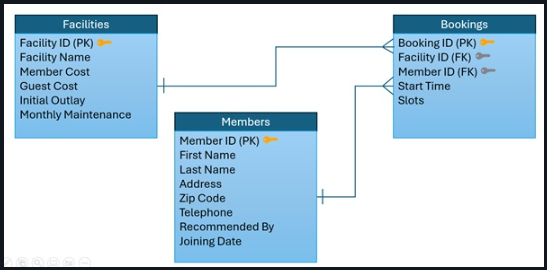
<br>
<br>

These are the fields and these are related. So facilities table has a key facility ID, which is related with the bookings in the facility. ID and members table has got a key called member ID, which is also related to the member ID in the bookings.

these three tables represent a club where there are facilities like they have lawns, they have party halls, they have pool tables. And uh, there are members of that club. Members can make bookings for the facilities and bookings can be made in slots. And each slot has a start time. Each slot has a fixed duration.


### 2. Define schema
   
```python
facilities_schema = """facility_id INT, facility_name STRING, member_cost DOUBLE, guest_cost DOUBLE, 
    initial_outlay DOUBLE, monthly_maintainance DOUBLE"""

members_schema = """member_id INT, last_name STRING, first_name STRING, address STRING, zip_code STRING, 
    telephone STRING, recommended_by STRING, joining_date DATE"""

bookings_schema = "booking_id INT, facility_id INT, member_id INT, start_time TIMESTAMP, slots INT"
```


### 3. Load facilities table

```python
facilities_df = (
    spark.read.format("csv")
        .option("header", "true")
        .schema(facilities_schema)
        .load("/Volumes/dev/spark_db/datasets/spark_programming/data/facilities.csv")
)

facilities_df.write.mode("overwrite").saveAsTable("dev.spark_db.facilities")
```


### 4. Load members table

```python
members_df = (
    spark.read.format("csv")
        .option("header", "true")
        .schema(members_schema)
        .load("/Volumes/dev/spark_db/datasets/spark_programming/data/members.csv")
)

members_df.write.mode("overwrite").saveAsTable("dev.spark_db.members")
```


### 5. Load bookings table

```python
bookings_df = (
    spark.read.format("csv")
        .option("header", "true")
        .schema(bookings_schema)
        .load("/Volumes/dev/spark_db/datasets/spark_programming/data/bookings.csv")
)

bookings_df.write.mode("overwrite").saveAsTable("dev.spark_db.bookings")
```


<br>
<br>


[⬆ Back to content](#content)


## 37. Inner Joins

[⬆ Back to content](#content)

We should have imported all required files in section 9. Setup Your Hands-On Environment by executing the spark_programming.dbc notebook.

Login to Databricks, connect to serverless cluster and open CH07-Spark Joins/02-Inner Joins notebook

We should have executed the first notebook from this section - 01-Assinment Data Preparation so we have requierd tables for the labs.


### Q1. Prepare a facility booking reporting dataset as the following.

member_id | first_name | last_name | facility_id | slots | start_time
---------------------------------------------------------------------------
The report must meet the following criteria.    
- Facility bookings made by a person whose last name is Smith
- He has booked more than 5 slots in a single booking
- Report should be sorted by first name of the member in ascending order and number of slots in descending order


#### 1.1 Try answering with SQL

  - Join Expression - on m.member_id = b.member_id
  - Join type - inner join
  - Column name ambiguity - if columns exist in more than one table we need to spcify the table we want the values from

These three things are also applicable when working with the data frame.

```sql
-- select specific columns with name ambiguity and resulted join column: m.member_id
select m.member_id, first_name, last_name, facility_id, slots, start_time
-- set the join criteria and alias. Join expression is: on m.member_id = b.member_id, Join type: inner join
from dev.spark_db.bookings as b inner join dev.spark_db.members as m on m.member_id = b.member_id
-- specify the additional name condition
where m.last_name = "Smith" and b.slots > 5
-- set ascending and descending order for the result join
order by m.first_name asc, b.slots desc
```

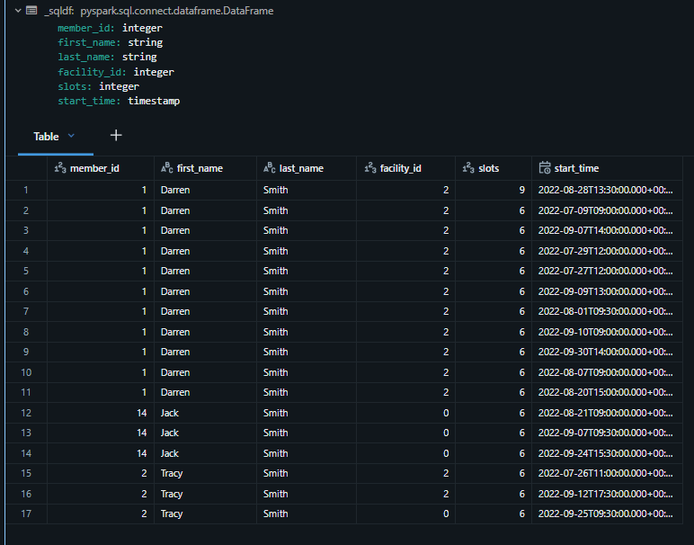
<br>
<br>


#### 1.2 Try answering with dataframe api

  - Join Expression
  - Join type
  - Column name ambiguity

```python
# import used libraries
from pyspark.sql.functions import expr, col

# set alias of dataframes
members_df = spark.table("dev.spark_db.members").alias("m")
bookings_df = spark.table("dev.spark_db.bookings").alias("b")

# define join expression
#join_expr = expr("m.menber_id == b.member_id")
join_expr = col("m.member_id") == col("b.member_id")

# create new dataframe
reports_df = (
    # using transformation join() with specific table, expression and type of the join
    members_df.join(bookings_df, join_expr, "inner")
        # set filter as in the requirements
        .filter("m.last_name == 'Smith' and b.slots > 5")
        # select columns
        .select("m.member_id", "m.first_name", "m.last_name", "b.facility_id", "b.slots", "b.start_time")
        # define order sequence as in the requirements
        .orderBy("m.first_name", col("b.slots").desc())
)

# display the dataframe
reports_df.display()
```

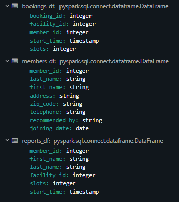
<br>
<br>

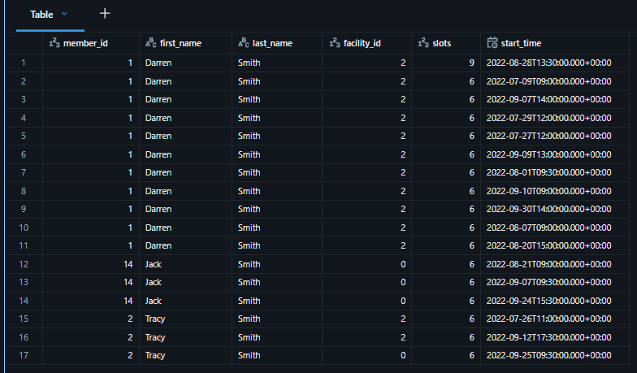
<br>
<br>


### Q2. Show me a facility bookings report as the following.

member_id | first_name | last_name | facility_name | slots | booking_amount | start_time    
--------------------------------------------------------------------------------------------

The report must meet the following criteria.
  1. Facility bookings made by a person whose last name is Smith
  2. He has booked more than 5 slots in a single booking
  3. Report should be sorted by first name of the member in ascending order and booking amount in descending order

```python
# import used libraries
from pyspark.sql.functions import col, expr

# define dataframes alias
bookings_df = spark.table("dev.spark_db.bookings").alias("b")
members_df = spark.table("dev.spark_db.members").alias("m")
facilities_df = spark.table("dev.spark_db.facilities").alias("f")

# create new dataframe
report_df = (
    # use existing dataframe
    bookings_df
        # define the join configs - used dataframe, join expression and join type
        .join(members_df, expr("b.member_id == m.member_id"), "inner")
        # define second join config - used dataframe, expression, and join type
        .join(facilities_df, col("b.facility_id") == col("f.facility_id"), "inner")
        # set filters
        .filter("m.last_name == 'Smith' and b.slots > 5")
        # set calculation expression
        .selectExpr("m.member_id", "m.first_name", "m.last_name", "f.facility_name", "b.slots",
            "b.slots * f.member_cost as booking_amount", "b.start_time")
        # set ordering
        .orderBy(col("m.first_name").asc(),
                 col("booking_amount").desc())
)

# display the result dataframe
report_df.display()
```

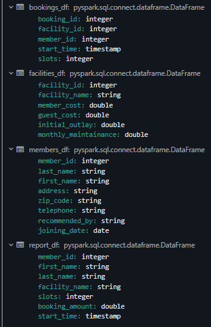
<br>
<br>


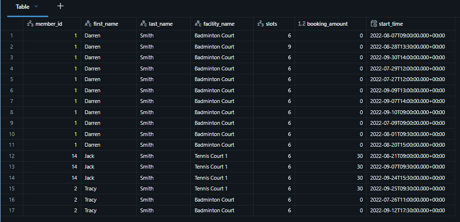
<br>
<br>


[⬆ Back to content](#content)


## 38. Outer Joins

[⬆ Back to content](#content)

We should have imported all required files in section 9. Setup Your Hands-On Environment by executing the spark_programming.dbc notebook.

Login to Databricks, connect to serverless cluster and open CH07-Spark Joins/03-Outer Joins notebook

We should have executed the first notebook from this section - 01-Assinment Data Preparation so we have requierd tables for the labs.


### Q1. List all bookings made by a person named Darren Smith as the following. 

```text
member_id | first_name | last_name | address | facility_id | slots
```

Ensure the following
  1. Show the details of all persons named Darren Smith even if they have not made any bookings
  - If we keep member on the left side of the join, we can use left join. If we keep member on the right side of the join, we can use right outer join. So we will be using outer join for sure either left or right.
  2. Sort the result by number of slots (highers first)
  3. List the person with no bookings at the top
  - We can put up sorting details once we have the data set.


```python
# import linbraries
from pyspark.sql.functions import expr, col

# create dataframes and set alias
members_df = spark.table("dev.spark_db.members").alias("m")
bookings_df = spark.table("dev.spark_db.bookings").alias("b")

# create result dataframe
result_df = (
    # use join() with used dataframe, expression and join type
    # We need all records from members_df even if a corresponding or a matching record doesn't exist in the bookings table.
    members_df.join(bookings_df, expr("m.member_id=b.member_id"), "left")
        # filter conditions
        .where("m.first_name == 'Darren' and m.last_name == 'Smith'")
        # select columns
        .select("m.member_id", "m.first_name", "m.last_name", "m.address", "b.facility_id", "b.slots")
        # set sorting
        # Usually we specify order by using col() because that gives us leverage to sort by ascending or descending.
        # desc_nulls_first() - null values first, desc_nulls_last() - null values last
        .orderBy(col("b.slots").desc_nulls_first())
)

# display result dataframe
result_df.display()
```

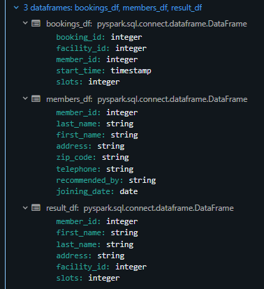
<br>
<br>

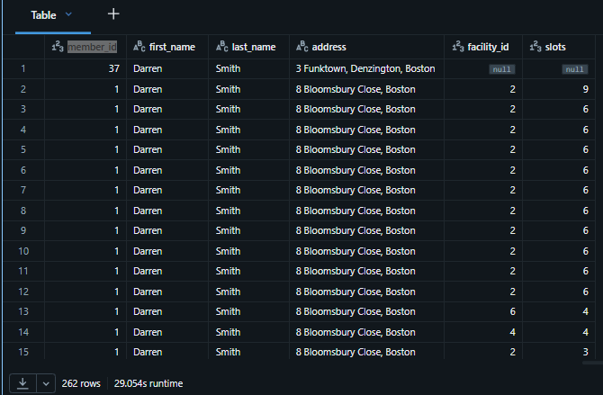
<br>
<br>


### Q2. Show me a bookings report for Darren Smith as the following.

```text
facility_name | slots | booking_amount | start_time | member_id | member_name | telephone | address
```

#### The report must meet the following criteria.
  1. Show the details of all persons named Darren Smith even if they have not made any bookings
  2. Sort the result by number of slots (highers first)
  3. List the person with no bookings at the top


```python
# import libraries
from pyspark.sql.functions import expr, col

# create dataframe from table
members_df = (
    # spark - session, table() - use table to create df
    spark.table("dev.spark_db.members")
        # filter the records by the required name
        .where("first_name='Darren' and last_name='Smith'")
)

# create dataframes from existing tables
bookings_df = spark.table("dev.spark_db.bookings")
facilities_df = spark.table("dev.spark_db.facilities")

# We will spearate the jobs: 1 make joins, 2 select columns and set ordering
# create joined dataframe
joined_df = (
    # set alias forsorted members_df dataframe
    members_df.alias("m")
        # use join() with used dataframe, condition with expression and set alias at this stage, expression and join type - left
        .join(bookings_df.alias("b"), expr("m.member_id = b.member_id"), "left")
        # we use another left join to save all members if facility_id is not present in the facility dataframe
        .join(facilities_df.alias("f"), expr("b.facility_id=f.facility_id"), "left")
)

# create result dataframe
results_df = (
    # use the joined dataframe, select the columns we need and set the ordering
    joined_df.selectExpr(
        "f.facility_name", "b.slots",
        "b.slots * f.member_cost as booking_amount",
        "b.start_time", "b.member_id",
        "concat_ws(' ', m.first_name, m.last_name)  as member_name",
        "m.telephone", "m.address"
    # desc_nulls_first() - null values first, desc_nulls_last() - null values last
    ).orderBy(col("slots").desc_nulls_first())    
)

# display the result dataframe
results_df.display()
```

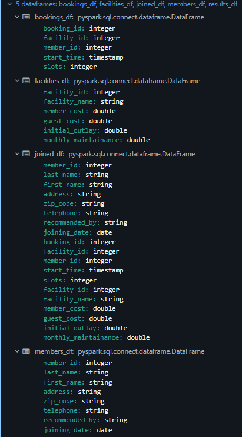
<br>


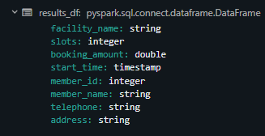
<br>
<br>

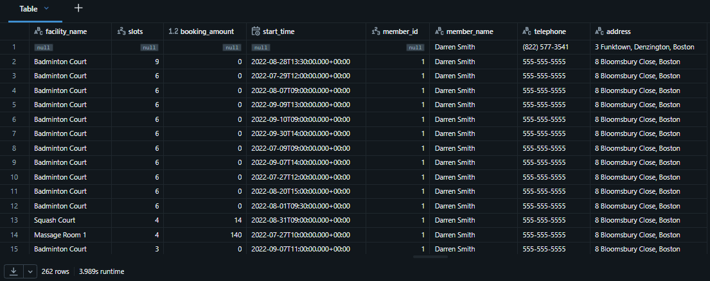
<br>
<br>


### Q3. Prepare a facility booking report as the following 

```text
facility_name | member_cost | gest_cost | start_time | slots
```

#### Ensure the following
  1. All club facilities must be listed in the report
  2. Consider only bookings for more than 10 slots

```python
from pyspark.sql.functions import expr

facilities_df = spark.table("dev.spark_db.facilities")
bookings_df = spark.table("dev.spark_db.bookings").filter("slots > 10")

result_df = (
    bookings_df.join(facilities_df, bookings_df.facility_id == facilities_df.facility_id, "right")
             .select(facilities_df.facility_name,
                    facilities_df.member_cost,
                    facilities_df.guest_cost,
                    bookings_df.start_time,
                    bookings_df.slots)
)

result_df.display()
```

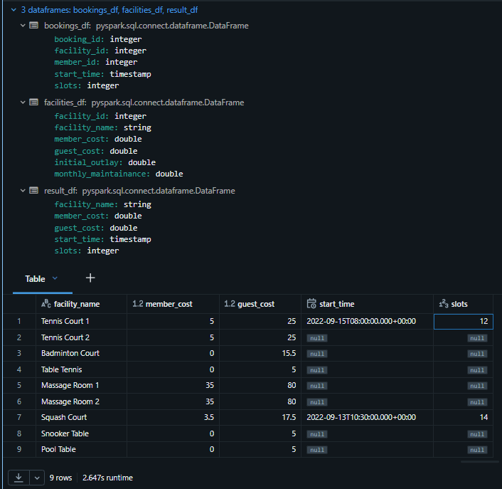
<br>
<br>


### Q4. Prepare a member bookings report as the following

```text
booking_id | facility_name | slots | first_name | last_name | address
```

#### Ensure the following
  1. Consider only regular memebrs (not guest) and direct members(not recomended by any other member)
  2. Consider only bookings for more than 8 hours
  3. Ensure all regular and direct members are listed even if they have no 8 hour bookings
  4. Ensure all 8 hour bookings are listed even if they are not made by regular and direct members
  5. Sort the report by slots and first name in ascending order

```python
from pyspark.sql.functions import expr

members_df = (
    spark.table("dev.spark_db.members")
        .filter("member_id != 0 and recommended_by is null")
        .alias("m")
)

bookings_df = (
    spark.table("dev.spark_db.bookings")
        .filter("slots > 8")
        .alias("b")
)

facilities_df = spark.table("dev.spark_db.facilities").alias("f")

full_join_df = members_df.join(bookings_df, expr("m.member_id == b.member_id"), "full")

result_df = (
    full_join_df.join(facilities_df, expr("b.facility_id == f.facility_id"), "left")
    .select("b.booking_id","f.facility_name","b.slots","m.first_name","m.last_name","m.address")
    .orderBy(expr("b.slots").asc_nulls_last(), expr("m.first_name").asc_nulls_last())
)

display(result_df)
```

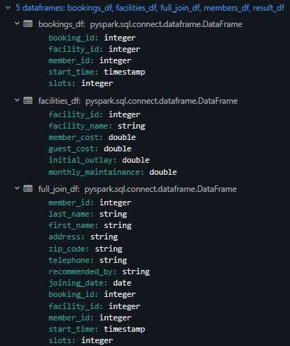
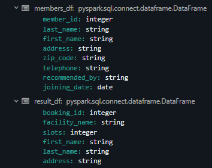
<br>
<br>

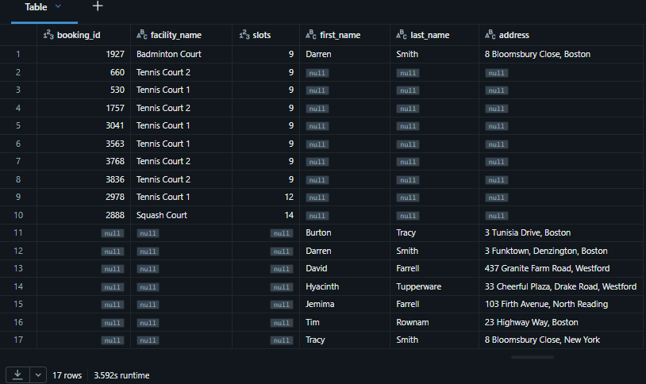
<br>
<br>


[⬆ Back to content](#content)


## 39. Lateral Join

[⬆ Back to content](#content)


We should have imported all required files in section 9. Setup Your Hands-On Environment by executing the spark_programming.dbc notebook.

Login to Databricks, connect to serverless cluster and open CH07-Spark Joins/ notebook


```python


```


<br>
<br>


```python


```


<br>
<br>


```python


```


<br>
<br>


```python


```


<br>
<br>


```python


```


<br>
<br>


[⬆ Back to content](#content)


## 40. Other Types of Joins

[⬆ Back to content](#content)


We should have imported all required files in section 9. Setup Your Hands-On Environment by executing the spark_programming.dbc notebook.

Login to Databricks, connect to serverless cluster and open CH07-Spark Joins/ notebook


```python


```


<br>
<br>


```python


```


<br>
<br>


```python


```


<br>
<br>


```python


```


<br>
<br>


```python


```


<br>
<br>


[⬆ Back to content](#content)


