# Section 8 Aggregations in Spark Dataframe Notes

## Content
41. [Simple Aggregation](#41-simple-aggregation)
42. [Grouping Aggregation](#42-grouping-aggregation)
43. [Multilevel Aggregation](#43-multilevel-aggregation)
44. [Windowing Aggregation](#44-windowing-aggregation)


```python


```


<br>
<br>


## 41. Simple Aggregation

[⬆ Back to content](#content)

We should have imported all required files in section 9. Setup Your Hands-On Environment by executing the spark_programming.dbc notebook.

Login to Databricks, connect to serverless cluster and open CH08-Spark Aggregates/01-Simple Aggregation notebook


### Introduction to Aggregation

Aggregation means calculating kind of a summary. Aggregation in Spark are implemented using functions. 

**Comonly used aggregate functions**

    1. count(*), count(expr), count(DISTINCT expr)      
    2. min(expr), max(expr), avg(expr), sum(expr)       

List of aggregation spark functins we can find here - https://spark.apache.org/docs/latest/api/python/reference/pyspark.sql/functions.html#aggregate-functions

We can also find Window functions which also are used in aggregations - https://spark.apache.org/docs/latest/api/python/reference/pyspark.sql/functions.html#window-functions

Often calculating aggregations requires preparing data ready for calculating aggregations. All the data engineering or lot of data engineering work has to be done to prepare the data in a desired format, or bring it into a desired table or data frame so that we can calculate the aggregation. All that is doing transformations of the data. And finally, we can do the aggregation on the transformed data.

**Types of Aggregation**

    1. Simple Aggregation
    2. Grouped Aggregation
    3. Multilevel Aggregation
    4. Window Aggregation

**Requirement - Analysis Data Set**     
Prepare club bookings dataset for analysis      
|booking_id|member_name|facility_name|start_time|booking_amount|


```python
# create bookings df from table
bookings_df = spark.table("dev.spark_db.bookings")
# create facilities df from table
facilities_df = spark.table("dev.spark_db.facilities")
# create members df from table
members_df = spark.table("dev.spark_db.members")

# craete join dataframe 
club_bookings_df = (
    bookings_df.join(facilities_df, "facility_id")
            # use left join for members and facilities connection
            .join(members_df, "member_id", "left")
            # use selectExpr() to filter the records
            .selectExpr("booking_id",
                        "case when member_id==0 then 'Guest Member' else concat_ws(' ', first_name, last_name) end as member_name",
                        "facility_name","start_time",
                        "case when member_id == 0 then slots * guest_cost else slots * member_cost end as booking_amount")            
)

# desplay the bookings df
club_bookings_df.display()
```

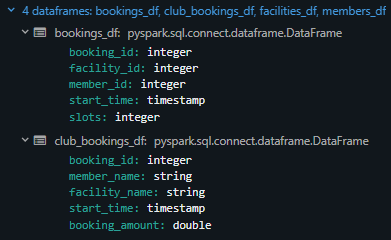
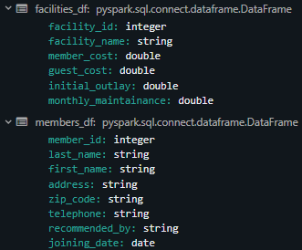
<br>
<br>

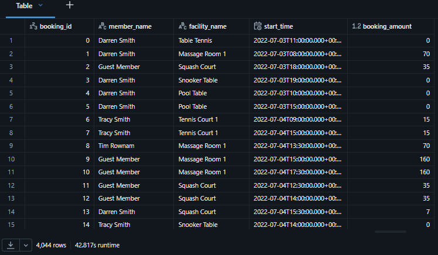
<br>
<br>


### 1. Calculate total earnings and average booking value.

#### 1.1 Using sql like expressions

```python
# create result df
result_df = (
    # user selectExpr() to do simple aggregations
    club_bookings_df.selectExpr("sum(booking_amount) as total_earning",
                                "avg(booking_amount) as avg_booking_value")
)

# display result df
result_df.display()
```

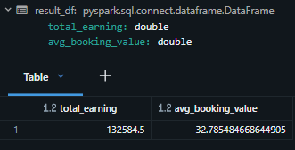
<br>
<br>


#### 1.2 Using column expressions


```python
# import used aggregation functions
from pyspark.sql.functions import sum, avg

# craete result df
result_df = (
    # use column expression to do the aggregations and set alias (names for each column)
    club_bookings_df.select(sum("booking_amount").alias("total_earning"),
                            avg("booking_amount").alias("avg_booking_value"))
)

# display the result dataframe
result_df.display()
```

We have the same answer as the previous example, but we are using differetn aggregation functions.

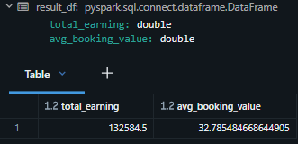
<br>
<br>


#### 1.3 Using aggregate transformation

Spark offers a new transformation called agg transformation. Agg transformation is designed specifically for calculating aggregates, and that is the standard way for calculating aggregates.


```python
# import required functions
from pyspark.sql.functions import sum, avg

# create result dataframe
result_df = (
    # use agg() function to do the aggregations and set alias
    club_bookings_df.agg(sum("booking_amount").alias("total_earning"),
                         avg("booking_amount").alias("avg_booking_value"))
)

# display the result df
result_df.display()
```

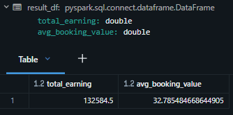
<br>
<br>


[⬆ Back to content](#content)


## 42. Grouping Aggregation

[⬆ Back to content](#content)

We should have imported all required files in section 9. Setup Your Hands-On Environment by executing the spark_programming.dbc notebook.

Login to Databricks, connect to serverless cluster and open CH08-Spark Aggregates/02-Grouped Aggregation notebook


**Requirement - Analysis Data Set**     
Prepare club bookings dataset for analysis      
|booking_id|member_name|facility_name|start_time|booking_amount|        


```python
# create base dataframes from tables
bookings_df = spark.table("dev.spark_db.bookings")
facilities_df = spark.table("dev.spark_db.facilities")
members_df = spark.table("dev.spark_db.members")

# create bookings end dataframe
club_bookings_df = (
    # use left join to find bookings for each member
    bookings_df.join(facilities_df, "facility_id")
            .join(members_df, "member_id", "left")
            # set columns for the end dataframe
            .selectExpr("booking_id",
                        # mark guest members, set booking members name column, facility name and start time of the booking
                        "case when member_id==0 then 'Guest Member' else concat_ws(' ', first_name, last_name) end as member_name",
                        "facility_name","start_time",
                        # set slots calcualtions for guest and regular members
                        "case when member_id == 0 then slots * guest_cost else slots * member_cost end as booking_amount")
)

# dispaly the end dataframe
club_bookings_df.display()
```

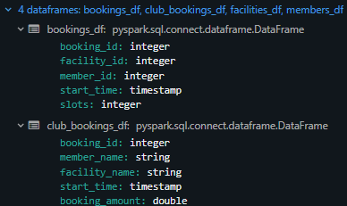
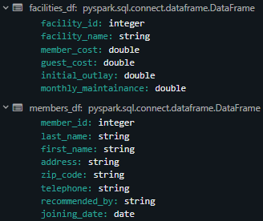
<br>
<br>

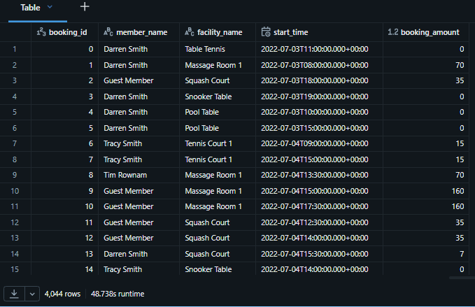
<br>
<br>


### Q1. Who are the top 5 members by total booking amount?

Prepare a report as the following:      
``` member_name | total_booking_amount Tim Rownam | 6480 Tim Boothe | 3644 Gerald Butters | 3343 Burton Tracy | 2953 David Jones | 2651 ```

#### 1.1 Try aggregation using select or selectExpr

```python
# import required function
from pyspark.sql.functions import expr

# craete result df
result_df = (
    # filetr out guest members
    club_bookings_df.where("member_name != 'Guest Member'")
            # group members by name
            .groupBy("member_name")
            # after groupBy() function we cannot use selectExpr() function. We must use agg() function
            # use agg() function to do aggregation for total member's bookings
            .agg(expr("sum(booking_amount) as total_booking_amount"))
)

# display the result df
result_df.display()
```

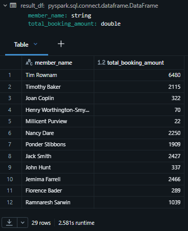
<br>
<br>


#### 1.2 Try using agg() transformation

```python
# import required functions
from pyspark.sql.functions import expr, col

# create result df
result_df = (
    # filter out guest members
    club_bookings_df.where("member_name != 'Guest Member'")
            # group members by name
            .groupBy("member_name")
            # aggregate total bookings by member
            .agg(expr("sum(booking_amount) as total_booking_amount"))
            # set descending order
            .orderBy(col("total_booking_amount").desc())
            # limit the first 5 rolls of the result
            .limit(5)
)

# display the result df
result_df.display()
```

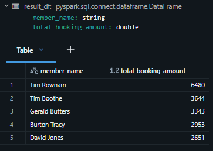
<br>
<br>


### Q2. Who are the members having total booking amount > 2500?

```python
# import required functions
from pyspark.sql.functions import expr, col

# create result df
result_df = (
    # filter our guest members
    club_bookings_df.where("member_name != 'Guest Member'")
            # group members by name
            .groupBy("member_name")
            # do sum aggregation and set result column name
            .agg(expr("sum(booking_amount) as total_booking_amount"))
            # we must apply filter on the aggregated data
            # filter records above 2500
            .where("total_booking_amount > 2500")
)

# display result df
result_df.display()
```


<br>
<br>


### Q3. Find member wise facility bookings for more than 2500?

|member_name| facility_name|total_booking_amount|       

|Tim Boothe|Massage Room 1|2660.0|      
|Tim Rownam|Massage Room 1|6160.0|      


```python
# import required functions
from pyspark.sql.functions import expr, col

# craete result df
result_df = (
    # filter out guest members
    club_bookings_df.where("member_name != 'Guest Member'")
            # group data by members bookings for specific facilities
            .groupBy("member_name", "facility_name")
            # use agg() function to calcualte sum of total member's bookings and specific facility
            .agg(expr("sum(booking_amount) as total_booking_amount"))
            # we must apply filter on the aggregated data
            # filter results above 2500
            .where("total_booking_amount > 2500")
)

# display result df
result_df.display()
```

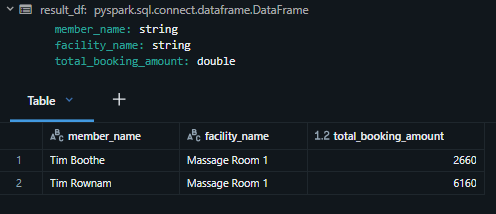
<br>
<br>


[⬆ Back to content](#content)


## 43. Multilevel Aggregation

[⬆ Back to content](#content)

We should have imported all required files in section 9. Setup Your Hands-On Environment by executing the spark_programming.dbc notebook.

Login to Databricks, connect to serverless cluster and open CH08-Spark Aggregates/03-Multilevel Aggregation notebook

## Multilevel Aggregates        

Multilevel aggregates allow summarizing data at several hierarchical levels.       
We have three variations of multilevel aggregates in Spark.

1. Rollup
2. Cube
3. Grouping Sets


### Requirement - Analysis Data Set     
Prepare club bookings dataset for analysis      
|booking_id|member_name|facility_name|start_time|booking_amount|

```python
# craete working dataframes from tables
bookings_df = spark.table("dev.spark_db.bookings")
facilities_df = spark.table("dev.spark_db.facilities")
members_df = spark.table("dev.spark_db.members")

# create club_booking dataframe
club_bookings_df = (
    # join bookings and facilities dfs by facility_id
    bookings_df.join(facilities_df, "facility_id")
            # left join the result of the first join with members df by member_id
            .join(members_df, "member_id", "left")
            # filter records of the result join with expression and cases
            .selectExpr("member_id", "booking_id",
                        "case when member_id==0 then 'Guest Member' else concat_ws(' ', first_name, last_name) end as member_name",
                        "facility_name","start_time",
                        "case when member_id == 0 then slots * guest_cost else slots * member_cost end as booking_amount")
)

# dispaly the result club_booking dataframe
club_bookings_df.display()
```

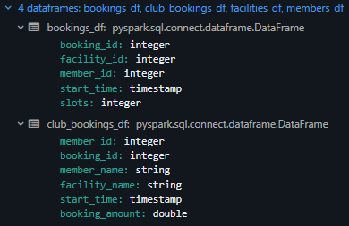
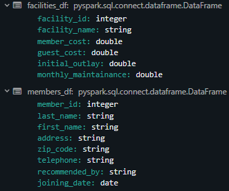
<br>
<br>

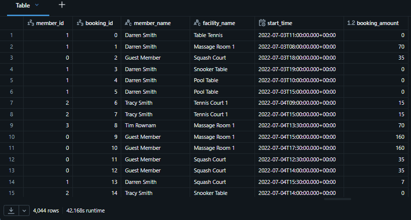
<br>
<br>


### Q1. Prepare a monthly revenue report for year 2022.

Also roll up the total for the month column.

 
|mnth|revenue|     
   
|7|23202.5|     
|8|46066.5|     
|9|63315.5|     
| |132584.5|     
   

```python
# import required functions
from pyspark.sql.functions import month, sum, col

# craete result df
result_df = (
    # 
    club_bookings_df.where("year(start_time) == 2022")
        .withColumn("mnth", month("start_time"))
        .rollup("mnth")
        .agg(sum("booking_amount").alias("revenue"))
        .orderBy(col("mnth").asc_nulls_last())
)

result_df.display()
```

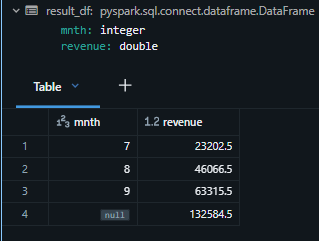
<br>
<br>


### Q2. Prepare a revenue report by revenue_from (Guest/Member) and facility_name for year 2022.

Also roll up the total for each group.


|revenue_from|facility_name|revenue|

|Guest|Badminton Court| 1906.5|     
|Guest| Massage Room 1|41600.0|     
|Guest|...............|.......|     
|Guest|...............|.......|     
|Guest|...........NULL|89096.5|     
|Member|Badminton Court|...0.0|     
|Member|Massage Room 1|30940.0|     
|Member|..............| ......|     
|Member|..............| ......|     
|Member|..........NULL|43488.0|     


```python
from pyspark.sql.functions import sum, col, expr

result_df = (
    club_bookings_df.where("year(start_time) == 2022")
        .withColumn("revenue_from", expr("case when member_id==0 then 'Guest' else 'Member' end"))
        .rollup("revenue_from", "facility_name")
        .agg(sum("booking_amount").alias("revenue"))
        .orderBy(col("revenue_from").asc_nulls_last(),
                 col("facility_name").asc_nulls_last())
)

result_df.display()
```

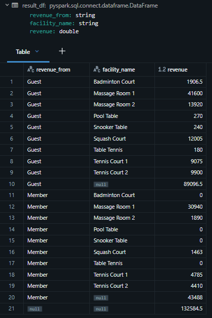
<br>
<br>


### Q3. Prepare a revenue report by revenue_from(Guest/Member) and facility_name for year 2022.

Also compute totals for all 4 dimensions of revenue_from and facility_name.

- (revenue_from, facility_name) : rollup
- (revenue_from, ) : rollup
- (facility_name, ) : not available in roolup
- ( , ) : grand total in rollup


```python
from pyspark.sql.functions import sum, col, expr

result_df = (
    club_bookings_df.where("year(start_time) == 2022")
        .withColumn("revenue_from", expr("case when member_id==0 then 'Guest' else 'Member' end"))
        .cube("revenue_from", "facility_name")
        .agg(sum("booking_amount").alias("revenue"))
        .orderBy(col("revenue_from").asc_nulls_last(),
                 col("facility_name").asc_nulls_last())
)

result_df.display()
```
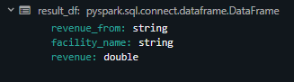
<br>
<br>

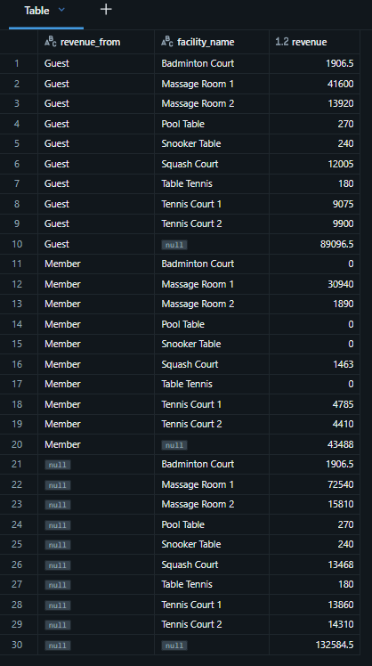
<br>
<br>


### Q4: Prepare a revenue report similar to the following. 
``` revenue_from | facility_name | revenue
Guest | Badminton Court | 1906.5 Guest | Massage Room 1 | 41600 Guest | Massage Room 2 | 13920 Guest | | 57426.5 Member | Badminton Court | 0 Member | Massage Room 1 | 30940 Member | Massage Room 2 | 1890 Member | | 32830 
``` 

Roll up the total for the facility_name only.


```python
from pyspark.sql.functions import sum, col, expr

result_df = (
    club_bookings_df.where("year(start_time) == 2022")
        .withColumn("revenue_from", expr("case when member_id==0 then 'Guest' else 'Member' end"))
        .groupingSets([("revenue_from","facility_name"), ("revenue_from", )], "revenue_from", "facility_name")
        .agg(sum("booking_amount").alias("revenue"))
        .orderBy(col("revenue_from").asc_nulls_last(),
                 col("facility_name").asc_nulls_last())
)

result_df.display()
```

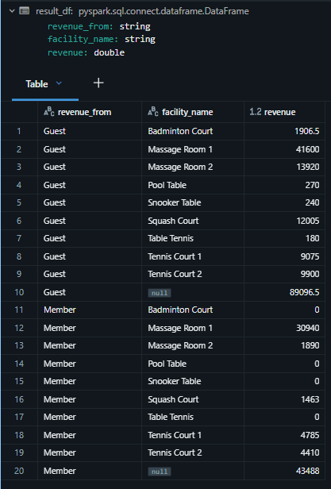
<br>
<br>


[⬆ Back to content](#content)


## 44. Windowing Aggregation

[⬆ Back to content](#content)

### Subheader


[⬆ Back to content](#content)


