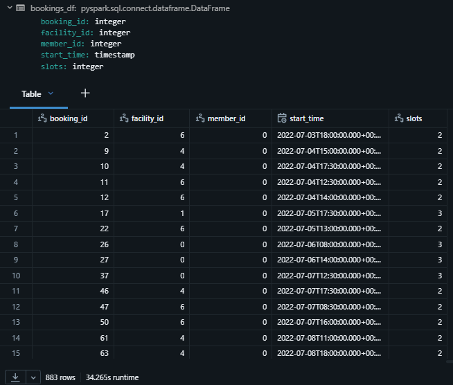
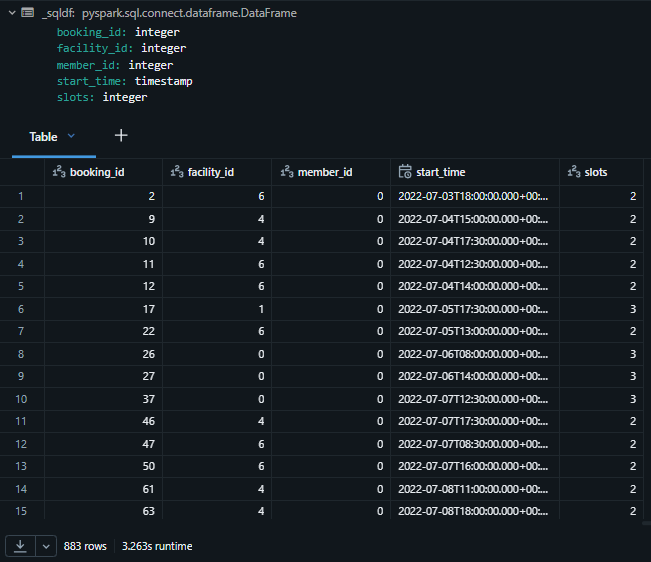

# Section 9 UDF and Unit Testing Notes

## Content
45. [User-Defined Functions](#45-user-defined-functions)
46. [Vectorized UDF](#46-vectorized-udf)
47. [User Defined Table Functions](#47-user-defined-table-functions)
48. [Unit Testing Spark Code](#48-unit-testing-spark-code)

filename.py

```python


```


<br>
<br>


## 45. User-Defined Functions

[⬆ Back to content](#content)

We should have imported all required files in section 9. Setup Your Hands-On Environment by executing the spark_programming.dbc notebook.

Login to Databricks, connect to serverless cluster and open CH09-UDF and Unit Testing/01-Introduction to UDF notebook

We need a function that implements some business rule or business logic. Spark cannot provide that because business rules and business logic are specific to the organization. That's why Spark offers capability to create User-Defined Functions or custom functions where we can implement whatever we want.

We can create a function which takes input, does some business logic on the input, and produces the result as per the business logic. So that's why we need User-Defined Functions. Now let's talk about what are the different types of functions we can create in Spark. We can create three types of functions: Python UDF or Scalar Python UDF, second type is Pandas Vectorized UDF, and third type is User-Defined Table Functions.

### Spark UDF
1. Scalar Python UDF - most basic ones
2. Pandas Vectorized UDF - advanced high-performing functions
3. UDTF - User Defined Table Functions - offers us a capability to return multiple records from the function. Return table-like structure or multiple rows from the function.

### Scalar Python UDF
1. User-defined functions
2. Take or return Python objects
3. Operate one row at a time
4. Serialized/Deserialized by Pickle or Arrow

for Python UDF, input and output are serialized and deserialized by Pickle or Arrow. Pickle is the default serialization for Python. So your Python function or UDF input and output values are serialized by Pickle by default, or you have an option to choose Arrow as your serialization. The serialization library which performs a little better compared to the Pickle.


### 1. How to define and use a Python UDF

### 1.1 Define a UDF        

Create a UDF with the following functionality

Input -> member_id      
Output -> Guest/Member      

```python
# import user definition function functionality
from pyspark.sql.functions import udf

# set function decorator and configure custom function
# returnType="string" - mandatory, we don't specify the input but just the output type
# optional - useArrow=True - use specific serialization/deserialization tool, Arrow is faster than Pickle
@udf(returnType="string", useArrow=True)
def member_type_udf(id: str):
    return 'Guest' if id==0 else 'Member'
```

Spark User-Defined Functions are defined for the current session, and they can be used in the current session only. They cannot be used across different sessions. It is not like that you define this User-Defined Function once and that's all, you can use it in different, different places, NO. Every time you want to use this, you have to make sure that it is defined in the same session.


### 1.2 Use a UDF in Dataframe Transformations

```python
# create member df from table
member_df = spark.table("dev.spark_db.members")

# create result df with tranformation of member df by adding a column "member_type" by using user defined function "member_type_udf"
# the user defined function "member_type_udf" takes member_id as a parameter and return the result in the column
result_df = member_df.withColumn("member_type", member_type_udf("member_id"))

# display the result df
result_df.limit(3).display()
```


<br>
<br>


### 1.3. Register UDF for use in Spark SQL

To use User DDefined Function is SQL, we need to register the function in the SQL session.

```python
spark.udf.register("member_type_udf", member_type_udf)
```


<br>
<br>


### 1.4 UDF from Spark SQL

```sql
-- use user defined function in SQL
select *, member_type_udf(member_id) as member_type
from dev.spark_db.members
limit 3
```


<br>
<br>


### 1.5 UDF in Expressions

```python
# import required libraries
from pyspark.sql.functions import expr

# create member df
member_df = spark.table("dev.spark_db.members")

# create result df and use expression with user defined function
result_df = member_df.withColumn("member_type", expr("member_type_udf(member_id)"))

# display result df
result_df.limit(3).display()
```


<br>
<br>


[⬆ Back to content](#content)


## 46. Vectorized UDF

[⬆ Back to content](#content)

**Pandas UDF (Vectorized UDF)**

1. User-defined functions       
2. Take or return Pandas Series/DataFrame       
3. Operate block by block (Vectorized)      
4. Serialized/Deserialized by Arrow     

Note: You must know Pandas to work with the data inside the function        

### 1. How to define and use a Pandas UDF

#### 1.1 Create a Pandas UDF with the following functionality

- Input -> member_id
- Output -> Guest/Member


```python
from pyspark.sql.functions import pandas_udf
import pandas as pd

@pandas_udf("string")
def member_type_pudf(id: pd.Series)-> pd.Series:
    return id.apply(lambda x: 'Guest' if x==0 else 'Member')
```

#### 1.2 Use a Pandas UDF in Dataframe Transformations

List all bookings made by guests

```python
bookings_df = spark.table("dev.spark_db.bookings")

bookings_df.where(member_type_pudf("member_id")=="Guest").display()
```


<br>
<br>


#### 1.3. Register Pandas UDF for use in Spark SQL

```python
spark.udf.register("get_member_type", member_type_pudf)
```


#### 1.4 Pandas UDF from Spark SQL

```sql
select * from dev.spark_db.bookings
where get_member_type(member_id)=="Guest"
```


<br>
<br>


#### 1.5 Pandas UDF in Expressions

```python
result_df = bookings_df.where("get_member_type(member_id)=='Guest'").display()
```


<br>
<br>


[⬆ Back to content](#content)


## 47. User Defined Table Functions

[⬆ Back to content](#content)

### Subheader


[⬆ Back to content](#content)


## 48. Unit Testing Spark Code

[⬆ Back to content](#content)

### Subheader


[⬆ Back to content](#content)


