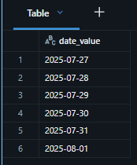
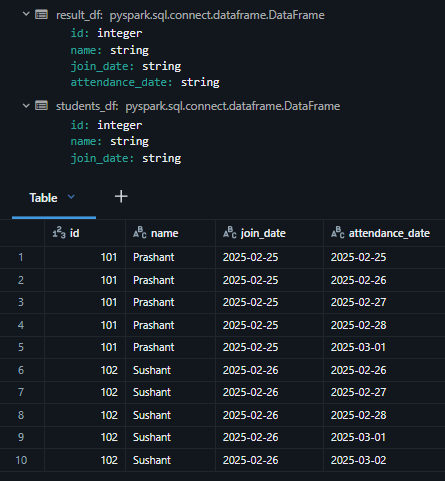
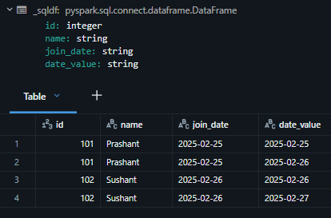

# Section 9 UDF and Unit Testing Notes

## Content
45. [User-Defined Functions](#45-user-defined-functions)
46. [Vectorized UDF](#46-vectorized-udf)
47. [User Defined Table Functions](#47-user-defined-table-functions)
48. [Unit Testing Spark Code](#48-unit-testing-spark-code)

filename.py

```python


```


<br>
<br>


## 45. User-Defined Functions

[⬆ Back to content](#content)

We should have imported all required files in section 9. Setup Your Hands-On Environment by executing the spark_programming.dbc notebook.

Login to Databricks, connect to serverless cluster and open CH09-UDF and Unit Testing/01-Introduction to UDF notebook

We need a function that implements some business rule or business logic. Spark cannot provide that because business rules and business logic are specific to the organization. That's why Spark offers capability to create User-Defined Functions or custom functions where we can implement whatever we want.

We can create a function which takes input, does some business logic on the input, and produces the result as per the business logic. So that's why we need User-Defined Functions. Now let's talk about what are the different types of functions we can create in Spark. We can create three types of functions: Python UDF or Scalar Python UDF, second type is Pandas Vectorized UDF, and third type is User-Defined Table Functions.

### Spark UDF
1. Scalar Python UDF - most basic ones
2. Pandas Vectorized UDF - advanced high-performing functions
3. UDTF - User Defined Table Functions - offers us a capability to return multiple records from the function. Return table-like structure or multiple rows from the function.

### Scalar Python UDF
1. User-defined functions
2. Take or return Python objects
3. Operate one row at a time
4. Serialized/Deserialized by Pickle or Arrow

for Python UDF, input and output are serialized and deserialized by Pickle or Arrow. Pickle is the default serialization for Python. So your Python function or UDF input and output values are serialized by Pickle by default, or you have an option to choose Arrow as your serialization. The serialization library which performs a little better compared to the Pickle.


### 1. How to define and use a Python UDF

### 1.1 Define a UDF        

Create a UDF with the following functionality

Input -> member_id      
Output -> Guest/Member      

```python
# import user definition function functionality
from pyspark.sql.functions import udf

# set function decorator and configure custom function
# returnType="string" - mandatory, we don't specify the input but just the output type
# optional - useArrow=True - use specific serialization/deserialization tool, Arrow is faster than Pickle
@udf(returnType="string", useArrow=True)
def member_type_udf(id: str):
    return 'Guest' if id==0 else 'Member'
```

Spark User-Defined Functions are defined for the current session, and they can be used in the current session only. They cannot be used across different sessions. It is not like that you define this User-Defined Function once and that's all, you can use it in different, different places, NO. Every time you want to use this, you have to make sure that it is defined in the same session.


### 1.2 Use a UDF in Dataframe Transformations

```python
# create member df from table
member_df = spark.table("dev.spark_db.members")

# create result df with tranformation of member df by adding a column "member_type" by using user defined function "member_type_udf"
# the user defined function "member_type_udf" takes member_id as a parameter and return the result in the column
result_df = member_df.withColumn("member_type", member_type_udf("member_id"))

# display the result df
result_df.limit(3).display()
```


<br>
<br>


### 1.3. Register UDF for use in Spark SQL

To use User DDefined Function is SQL, we need to register the function in the SQL session.

```python
spark.udf.register("member_type_udf", member_type_udf)
```


<br>
<br>


### 1.4 UDF from Spark SQL

```sql
-- use user defined function in SQL
select *, member_type_udf(member_id) as member_type
from dev.spark_db.members
limit 3
```


<br>
<br>


### 1.5 UDF in Expressions

```python
# import required libraries
from pyspark.sql.functions import expr

# create member df
member_df = spark.table("dev.spark_db.members")

# create result df and use expression with user defined function
result_df = member_df.withColumn("member_type", expr("member_type_udf(member_id)"))

# display result df
result_df.limit(3).display()
```


<br>
<br>


[⬆ Back to content](#content)


## 46. Vectorized UDF

[⬆ Back to content](#content)

**Pandas UDF (Vectorized UDF)**

Like Python UDF, Pandas UDF also, user defined functions. They take input, do the processing and return the result. But they are different compared to the Python UDF in two respects.      
- Pandas UDFs take or return Pandas series or Pandas data frame. Compare it with the Python UDF where every function call will get one ID, then next function call will get next ID. So far processing thousand records function is called 1,000 times. But if you write a Pandas UDF for the same purpose, 1,000 records can be processed in one function call because a Spark will pass 1,000 IDs at a time in an array to the Pandas UDF and you can process all 1,000 values in a single function call. So that makes it fast. So that's the first difference.
- They operate block by block - Block by block means you take a block of IDs or block of input means an array of input, process the entire array and then return the result as an array - the entire block. And this kind of operation is known as Vectorized Operation, so they perform better. Serialization and deserialization of input and output in Panda's UDF is by default arrow, because arrow is fast, it is better.

Recommendation is whenever you need to write a user defined function, use Pandas UDF or Vectorized UDF.

1. User-defined functions       
2. Take or return Pandas Series/DataFrame       
3. Operate block by block (Vectorized)      
4. Serialized/Deserialized by Arrow     

Note: You must know Pandas to work with the data inside the function        

### 1. How to define and use a Pandas UDF

#### 1.1 Create a Pandas UDF with the following functionality

- Input -> member_id
- Output -> Guest/Member


```python
# import required libraries
from pyspark.sql.functions import pandas_udf
import pandas as pd

# define pandas UDF
# f is always none, first parameter is the function itself that we will define afterwards.
# Second parameter is the return type - "string"
@pandas_udf("string")
def member_type_pudf(id: pd.Series)-> pd.Series:
    # processing the whole series
    return id.apply(lambda x: 'Guest' if x==0 else 'Member')
```

Pandas UDF is defined. Now how do I use it? It is a user defined function, so I can use it anywhere I can use a Spark function. to use a Spark function I can use my user defined function also at that place.


#### 1.2 Use a Pandas UDF in Dataframe Transformations

List all bookings made by guests

```python
# create bookings df from table
bookings_df = spark.table("dev.spark_db.bookings")

# use the defined function to filter guest members and siplay results
bookings_df.where(member_type_pudf("member_id")=="Guest").display()
```


<br>
<br>

So instead of writing that case statement wherever I want to check whether this ID represents a guest or a member, I can centralize the logic in one function and use everywhere that same function and if the logic changes in future I have to modify this function only and my rest of the code works as it is without any change. That's the reason we create functions for business logic.


#### 1.3. Register Pandas UDF for use in Spark SQL

```python
# register Pandas UDF under specific name
spark.udf.register("get_member_type", member_type_pudf)
```

#### 1.4 Pandas UDF from Spark SQL

```sql
select * from dev.spark_db.bookings
-- use the Pandas UDF in SQL
where get_member_type(member_id)=="Guest"
```


<br>
<br>


#### 1.5 Pandas UDF in Expressions

```python
# use Pandas UDF in expression
result_df = bookings_df.where("get_member_type(member_id)=='Guest'").display()
```


<br>
<br>

In typical case, we register the function name with its original name to avoid confusion. So that's all about Vectorized UDF and Vectorized UDFs are comparatively faster because in this kind of expression where I'm saying bookings dot where and I'm saying call this function with the member ID and check for the result as guest, behind the scene Spark will vectorize this operation. Vectorize this operation means Spark will take maybe 10,000 member IDs, pack it into an array, pass it to the function. Your function will evaluate all 10,000 values in one single function call and the result will be returned as an array of the results. 10,000 results in series and Spark will check it for those 1,000 records at once. So this thing behind the scene happens a lot of things to vectorize this operation that is taken care of by the Spark engine itself and these functions work faster because they cut down the number of function calls significantly.


[⬆ Back to content](#content)


## 47. User Defined Table Functions

[⬆ Back to content](#content)

### Python UDTF

1. User-defined function that returns a table
2. Take Python Objects as input
3. Operate one row at a time
4. Serialized/Deserialized by pickle or Arrow

### 1. How to define and use a Python UDTF

#### 1.1 Define a UDTF

Create a UDTF as the following.

- Input: start_date (ex: 2025-07-27), expand_days (ex: 5)
- Output: expand the given start_date to expand_days as below

+----------+        
|date_value|        
+----------+        
|2025-07-27|        
|2025-07-28|        
|2025-07-29|        
|2025-07-30|        
|2025-07-31|        
+----------+        


```python
# import required functions
from pyspark.sql.functions import udtf
from datetime import datetime, timedelta

# 
@udtf(returnType="date_value: string", useArrow=True)
class DateExploder:
    def eval(self, start_date: str, expand_days: int):
        current = datetime.strptime(start_date, "%Y-%m-%d")
        for i in range(expand_days):
            yield (current.strftime("%Y-%m-%d"), )
            current += timedelta(days=1)
```

```python
# import required libraries
from pyspark.sql.functions import lit

# filter and display results
DateExploder(lit("2025-07-27"), lit(6)).display()
```


<br>
<br>


#### 1.2 Use a UDTF in Dataframe Transformations

```python
data_schema = "id int, name string, join_date string"
data_list = [(101, "Prashant", "2025-02-25"),
             (102, "Sushant", "2025-02-26")]

students_df = spark.createDataFrame(data_list, data_schema).alias("s")

result_df = (
    students_df.lateralJoin(DateExploder("s.join_date", lit(5)))
        .selectExpr("id", "name", "join_date", "date_value as attendance_date")
)

result_df.display()
```



<br>
<br>


#### 1.3. Register UDTF for use in Spark SQL

```python
spark.udtf.register("date_exploder", DateExploder)
```

#### 1.4 UDTF from Spark SQL

```python
students_df.createOrReplaceTempView("students_view")
```

```sql
select *
from students_view, lateral date_exploder(join_date, 2)
```


<br>
<br>


[⬆ Back to content](#content)


## 48. Unit Testing Spark Code

[⬆ Back to content](#content)

### Subheader


[⬆ Back to content](#content)


