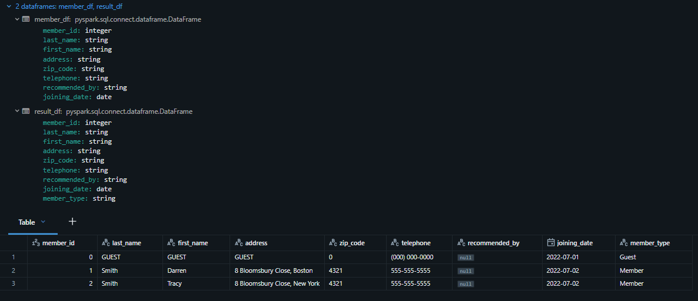
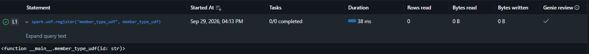
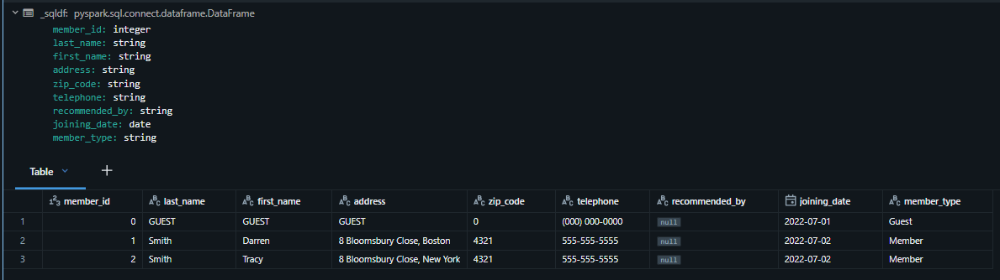
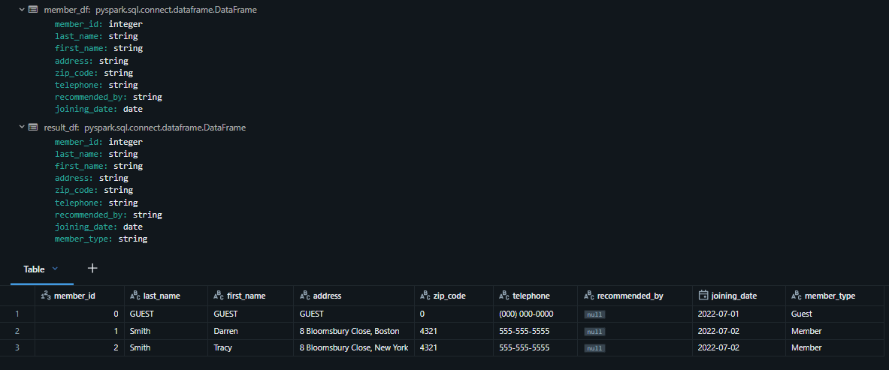

# Section 9 UDF and Unit Testing Notes

## Content
45. [User-Defined Functions](#45-user-defined-functions)
46. [Vectorized UDF](#46-vectorized-udf)
47. [User Defined Table Functions](#47-user-defined-table-functions)
48. [Unit Testing Spark Code](#48-unit-testing-spark-code)

filename.py

```python


```


<br>
<br>


## 45. User-Defined Functions

[⬆ Back to content](#content)

We should have imported all required files in section 9. Setup Your Hands-On Environment by executing the spark_programming.dbc notebook.

Login to Databricks, connect to serverless cluster and open CH09-UDF and Unit Testing/01-Introduction to UDF notebook


### Spark UDF
1. Scalar Python UDF
2. Pandas Vectorized UDF
3. UDTF

### Scalar Python UDF
1. User-defined functions
2. Take or return Python objects
3. Operate one row at a time
4. Serialized/Deserialized by pickle or Arrow


### 1. How to define and use a Python UDF

### 1.1 Define a UDF        
Create a UDF with the following functionality

Input -> member_id      
Output -> Guest/Member      

```python
from pyspark.sql.functions import udf

@udf(returnType="string", useArrow=True)
def member_type_udf(id: str):
    return 'Guest' if id==0 else 'Member'
```


### 1.2 Use a UDF in Dataframe Transformations

```python
member_df = spark.table("dev.spark_db.members")

result_df = member_df.withColumn("member_type", member_type_udf("member_id"))

result_df.limit(3).display()
```


<br>
<br>


### 1.3. Register UDF for use in Spark SQL

```python
spark.udf.register("member_type_udf", member_type_udf)
```


<br>
<br>


### 1.4 UDF from Spark SQL

```sql
select *, member_type_udf(member_id) as member_type
from dev.spark_db.members
limit 3
```


<br>
<br>


### 1.5 UDF in Expressions

```python
from pyspark.sql.functions import expr

member_df = spark.table("dev.spark_db.members")

result_df = member_df.withColumn("member_type", expr("member_type_udf(member_id)"))

result_df.limit(3).display()
```


<br>
<br>


[⬆ Back to content](#content)


## 46. Vectorized UDF

[⬆ Back to content](#content)

### Subheader


[⬆ Back to content](#content)


## 47. User Defined Table Functions

[⬆ Back to content](#content)

### Subheader


[⬆ Back to content](#content)


## 48. Unit Testing Spark Code

[⬆ Back to content](#content)

### Subheader


[⬆ Back to content](#content)


